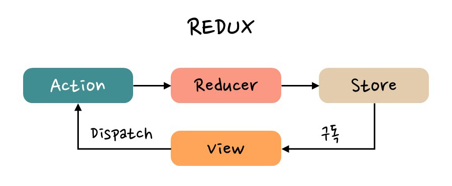
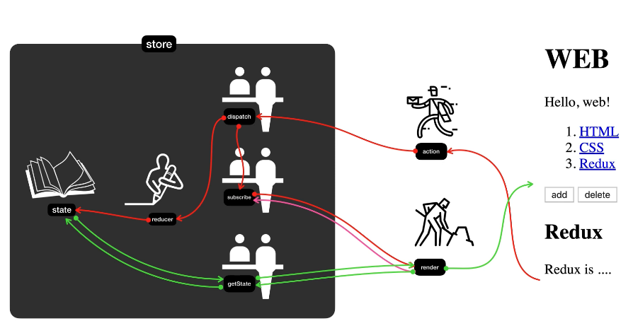

# 2024_01_22 TIL

# Redux

egoing Redux 강의

---

A predictable state container for JavaScript apps. 
소프트웨어를 개발할 때 우리를 위협하는 가장 큰 위험은 복잡성이다. 복잡성이 위험한 이유는 눈에 보이지 않기 때문.

리덕스는 애플리케이션의 복잡성을 획기적으로 낮춰서 코드의 예측 가능성을 높여주는 도구다.

---

### 🚨 Single Source of Truth

하나의 상태를 갖는다. 상태는 객체다. 하나의 객체 안에 애플리케이션에서 필요한 **모든 데이터를 욱여넣는다**. 이걸 통해
리덕스는 애플리케이션의 복잡성을 한번 낮춘다. 한곳에 데이터를 중앙 집중적으로 관리하면 여러 곳에 흩어져 있는 것보다 훨씬 더 데이터를 관리하기가 쉬워진다.

따라서 단 하나의 state를 유지하는 것을 통해서 애플리케이션의 복잡성을 낮춘다는 것이 첫 번째 contept이다.

---

### 🚨 State is read-only

상태는 너무나도 중요하기 때문에 애플리케이션의 상태를 직접 수정할 수 없다.

데이터를 쓰고싶다면 직접 쓰지 못한다. **dispatcher** 라는것을 통해, 또 **reducer** 라는 것을 통해서만 데이터에 수정을 가할 수 있다.

데이터를 가져갈 때도 getState 라는것을 통해 데이터를 가져갈 수 있다. 이렇게 되어있기 때문에 데이터를 외부에서 직접적으로 제어할 수 없도록 한다는 점을 통해 예기치 않게 state가 바뀌는 문제를 사전에 차단함으로써 애플리케이션을 보다 예측가능하게 만든다.

또, state의 값이 바뀔 때마다 각자 자신이 해야할 일을 하도록 말해준다. 각각의 애플리케이션은 서로에게 신경 쓸 필요 없이 자기 일만 하면 된다.

---

### 🚨 Changes are made with pure functions

상태 변경은 순수 함수인 리듀서를 통해 이루어진다. 리듀서는 그저 이전 상태와 액션을 받아 다음 상태를 반환하는 순수한 함수다. 이전 상태를 변경하는 대신 반드시 새로운 상태 객체를 생성해서 반환해야 한다.

---

### Redux Map

Redux의 핵심은 store다.

store는 정보가 저장되는 곳이다. 우리의 애플리케이션을 만들다 보면 생기는 정보들이 모두 store에 저장된다.

store 안에는 실제 정보가 state에 저장이 된다. 한가지 중요한 것은 절대로 state에 직접 접속하는것이 금지돼있고 불가능하다.

store를 만들 때 제일 먼저 해야할 점은 store를 만들면서 reducer라는 함수를 만들어서 공급해 줘야한다.(reducer가 redux에서 가장 어려움)

또 하나 중요한 점은 render다. Redux랑은 상관없이 우리의 코드다. 이것은 UI를 만들어주는 코드다.

그리고 store에 있는 state에 직접 접속하는것이 금지되어있기 때문에 앞단에 3가지의 중요한 함수들이 창구처럼 있다. 이 함수와 render가 서로 협력해서 애플리케이션을 만든다. 즉, render 함수는 언제나 state값을 참조하여 UI를 만드는 친구다.

store의 state값이 바뀔 때마다 render 함수를 호출할 수 있다면 좋을 것이다. 그러면 알아서 state의 값이 바뀔 때마다 UI가 바뀔것임. 이 때 사용하는 것이 구독이라는 뜻의 subscribe다.

submit 버튼을 눌렀을 때 dispatch에게 객체를 하나 전송하는데, 가장 중요한건 type을 전해준다. 그 객체를 액션이라고 한다. 액션이 dispatch에게 전달된다.

dispatch는 두 가지 일을 하는데 reducer를 호출해서 state의 값을 바꾼다. 그리고 그 작업이 끝나면 subscribe를 이용해서 render 함수를 호출해준다. 그러면 화면이 갱신된다. 
dispatch가 reducer를 호출할 때 현재의 state값과 action을 전달한다. 그리고 dispatch가 값을 리턴해주는데 이 때 값은 state의 새로운 값이 된다. 즉, reducer는 state를 입력값으로 받고 액션을 참조해서 새로운 state값을 만들어내서 리턴해주는 state를 가공하는 가공자이다.

reducer가 리턴하는값이 새로운 state가 되고 state가 변경되면 render가 다시 돼야한다. 그것을 dispatch가 subscribe에 등록되어있는 구독자들을 다 호출해준다. 그러면 render가 호출이 되면서 또 getState로 상태를 받아와서 새로운 UI를 만들어준다.

---

### store 생성

reducer의 역할은 dispatch에 의해 action이 들어오게 되면 reducer가 action값과 기존에 있던 state의 값을 참조해서 새로운 state값을 만들어주는 것 (은행으로 친다면 dispatch는 창구직원, reducer가 실제로 은행 장부에 기록하는 사람, state가 장부라고 생각할 수 있다.)

store를 처음으로 만들 때 store의 state값의 초기값이 필요하다. state의 값을 가져올 때는 getState()를 써야한다. reducer를 통해서 state의 값을 만들어줘야 하는데 상태 초기값을 리턴해줘야한다.

---

### reducer와 action을 이용해서 새로운 state 값 만들기

state값을 바꾸기 위해서는 action을 만들고 action을 dispatch에게 전송하면 dispatch가 리듀서를 호출하는데 이전의 state값과 action의 값을 동시에 준다. 그러면 reducer 함수가 분석해서 state의 최종값을 리턴해주면 된다.

store의 dispatch를 호출하게되면 store를 생성할 때 제공한 reducer를 호출하도록 약속되어있다. 이 때 이전의 state값과 전달된 action의 값을 인자로 준다. **dispatch 함수는 내부적으로 현재 Store의 상태를 가져와서 Reducer에게 전달한다. 따라서 Reducer는 이전 상태와 액션을 인자로 받아 새로운 상태를 계산하게 된다.** 그리고 Reducer가 리턴하는 값은 다음의 state값이다.

---

### state의 변화에 따라서 UI 반영하기

subscribe에 render를 등록하면 dispatch가 state의 값을 바꾸고난 다음에 호출하도록 약속돼있다.

> store.subscribe(blue)

이 코드는 redux store에 blue라는 함수를 구독하겠다는 의미로, store의 상태가 업데이트될 때마다 인자로 받은 blue 함수가 호출되도록 설정한다.
