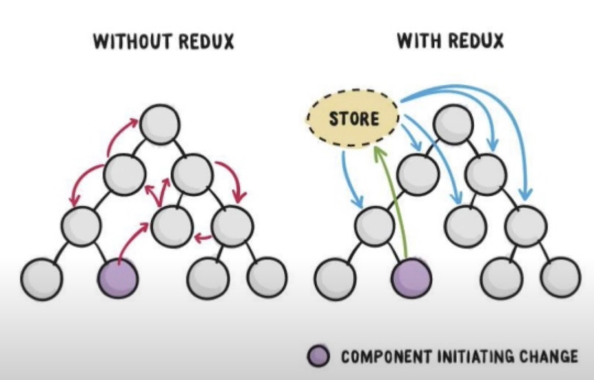
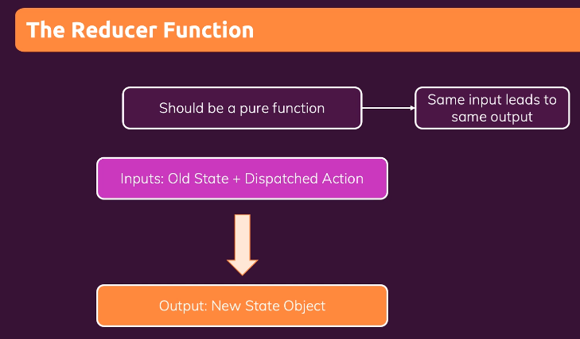

# 2024_01_23 TIL

#### Redux(createStore, subscribe, getState, dispatch)

#### React Redux(connect, useDispatch, useSelector)

#### Redux toolkit(configureStore, createSlice, createAsyncThunk)

# React-Redux

---

### Redux와 React 앱의 작업을 쉽게 하기 위해 redux 뿐만 아니라 두 번째 패키지를 설치해야한다.

> npm install redux react-redux

React는 컴포넌트를 만들어서 체계적이고 잘 정돈된 애플리케이션을 만들게 해주는 기술이다. Redux는 상태를 중앙에서 관리함으로써 데이터가 예측가능하도록 해주는 기술이다. 모두 개발의 복잡성을 낮춰주는 기술이다.


왼쪽은 리액트만 애플리케이션에 도입했을 때 데이터의 흐름이고<br>
오른쪽은 Redux를 도입했을 때 데이터의 흐름이다.

리덕스는 언론사다. 모든 정보는 리덕스가 가지고 있고 어떤 컴포넌트가 구성원들에게 전달하고 싶은 정보가 있으면 소문을 퍼뜨리는 대신에 리덕스라는 언론사에게 제보하고 리덕스는 전체 컴포넌트들에게 방송한다. 전체에게 하고싶은 말이 있으면 리덕스 스토어에 제보하면 된다. 하지만 안타깝게도 모든 문제가 해결되진 않는다. 방송은 그게 필요하지 않은 사람에게도 그 소식이 전달된다는 비효율성이 존재한다.

React와 Redux를 연결해주는 라이브러리인 React-Redux를 사용하면 그 소식이 필요한 컴포넌트 들에게만 방송을 전달할 수 있다.

#### React-Redux는 React와 Redux를 쉽게 연결해주는 공식 바인딩 라이브러리다. 이 라이브러리를 사용하면 React 컴포넌트에서 Redux Store에 쉽게 접근하고, 상태를 업데이트할 수 있다.

---

### 🚨 React용 Redux store 만들기

리덕스 관련 코드 파일을 스토어 폴더 안에 넣는다. (src 폴더 안에 store폴더 만들고 index.js 생성)

```JSX
const { createStore } = require("redux");

// src/store/index.js
const counterReducer = (state = { counter: 0 }, action) => {
  if (action.type === "increment") {
    return {
      counter: state.counter + 1,
    };
  }
  if (action.type === "decrement") {
    return {
      counter: state.counter - 1,
    };
  }
  return state;
};
const store = createStore(counterReducer);

//다른점
export default store;
```

예전에는 store에서 구독하고 파일 내부에서 dispatch 했는데 그건 지금 우리가 원하는게 아니다. 우리가 원하는건 **리액트 앱과 리덕스 스토어를 연결**하고 싶다. 그럼 앱의 컴포넌트가 dispatch하고 들을 수 있다.

#### 이것이 새로운 부분이다. 이를 위해 스토어를 export 한다.

이제 리액트 앱을 스토어에 연결한다.
그러기 위해서는 스토어를 리액트 앱에 제공해야 하는데 우리는 단 하나의 리덕스 스토어만 있다. 스토어를 한번만 제공하면 된다. 우리가 가진 유일한 store.

#### 근데 스토어를 제공한다는게 무슨 뜻일까??

---

### 🚨 스토어 제공하기

우리의 리덕스 저장소를 리액트 앱에 제공하기 위해 우리는 흔히 App 전체를 렌더링한 index.js 파일로 간다. 컴포넌트 트리의 최상단을 감싸야한다.

index.js에서 react-redux의 Provider를 import 해오고 **우리의 루트 컴포넌트인 App을 Provider로 감싸준다**. 그러면 **App의 모든 컴포넌트들은 리덕스에 액세스**할 수 있게 된다. 그런데 App을 Provier로 감싼다고 해서 리액트에게 알리게 되는건 아니다. **store를 import해서 Provider에 우리가 설정해야 하는 store prop이 있는데 여기에 store를 값으로서 설정**한다.

그러면 앱에 있는 모든 컴포넌트는 store에 접근할 수 있고 데이터를 받아올 수 있고 데이터에 대한 구독을 설정할 수도 있고 액션을 발송할 수도 있다.

```JSX
import React from "react";
import ReactDOM from "react-dom/client";

import "./index.css";
import App from "./App";
import { Provider } from "react-redux";
import store from "./store/index";

const root = ReactDOM.createRoot(document.getElementById("root"));
root.render(
  <Provider store={store}>
    <App />
  </Provider>
);
```

---

### 🚨 리액트 컴포넌트에서 리덕스 데이터 사용하기 (useSelector)

```JSX
function App() {
  return (
    <Counter />
  );
}
```

store를 App 컴포넌트가 아니라 App 컴포넌트의 자식 컴포넌트인 Counter 컴포넌트가 활용한다고 해보자.

#### ❗️useSelector & getState

**getState**는 Redux Store의 메서드로, Store의 현재 상태를 반환한다. 이 메서드는 주로 순수 JavaScript 환경에서 Redux를 사용할 때 사용된다.

반면에 **useSelector**는 React-Redux의 Hook으로, React 컴포넌트 내에서 Redux Store의 상태를 조회하는 데 사용된다. useSelector는 콜백 함수를 인자로 받아, 이 콜백 함수를 통해 원하는 상태 값을 선택할 수 있다.

따라서 useSelector와 getState는 비슷한 기능을 하지만, 사용 환경과 방식이 다르다.

useSelector를 사용하는 이유는 저장소가 관리하는 상태 부분을 우리가 자동으로 선택할 수 있기 때문이다.

#### ❗️connect

> 만약 우리가 클래스 기반 컴포넌트를 사용하고 함수형 컴포넌트를 사용하지 않을 경우에는 connect 함수를 사용할 수 있다. 이 함수는 우리의 클래스 컴포넌트를 감싸는 래퍼로 사용해서 그 클래스 컴포넌트를 저장소에 연결할 수 있다.

### ❗️useSelector

함수형 컴포넌트에서 우리는 useSelector를 사용해서 저장소가 관리하는 데이터에 액세스할 수 있다. 우리는 이걸 호출하고 이제 useSelector에 함수를 넣어줘야한다. 그 함수는 react-redux가 실행할 것이고 우리가 저장소에서 추출하려는 데이터 부분을 결정한다.

큰 애플리케이션에는 수많은 다양한 프로퍼티와 중첩된 객체 배열이 있는 더 복잡한 state를 갖게 될 것이다. 그렇기 때문에 상태 객체 전체에서 아주 작은 일부분만 쉽게 잘라내는 게 아주 중요하다. useSelector를 사용하면 그렇게 할 수 있다.

그러기 위해 우리는 useSelector에 함수를 넣어줘야 하는데 그 함수는 리덕스가 관리하는 상태를 받고 이어서 우리가 추출하려는 상태 부분을 리턴한다.

```JSX
// src/components/Counter.js
import { useSelector } from "react-redux";
import classes from "./Counter.module.css";

const Counter = () => {
  const counter = useSelector((state) => state.counter);
  const toggleCounterHandler = () => {};

  return (
    <main className={classes.counter}>
      <h1>Redux Counter</h1>
      <div className={classes.value}>{counter}</div>
      <button onClick={toggleCounterHandler}>Toggle Counter</button>
    </main>
  );
};

export default Counter;
```

#### ❗️useSelector 내의 함수는 react-redux가 실행한다. 그리고 실행될 때 리덕스의 상태를 매개변수로 받고 필요로 하는 상태 부분만 추출할 수 있다. 그러면 useSelector가 리턴한 값을 우리에게 준다.

#### ❗️그리고 우리가 useSelector를 사용할 때 react-redux는 해당 컴포넌트를 위해 리덕스 store에 자동으로 구독을 설정한다는게 중요하다. 그래서 우리의 컴포넌트는 리덕스 저장소에서 데이터가 변경될 떄마다 자동으로 업데이트되고 최신 카운터를 받게 된다. 그럼 자동으로 반응하게 되고 리덕스 store가 변경되면 해당 컴포넌트 함수가 재실행되고 우리는 항상 최신 상태를 가져올 수 있다. 이게 useSelector가 아주 유용한 훅인 이유다.

> react-redux의 useSelector는 redux의 getState와 subscribe의 기능을 결합한 것으로 볼 수 있다.

#### 우리의 컴포넌트가 언마운트 되거나 DOM에서 제거되면 react-redux도 자동으로 구독을 해제할 것이다. 이렇게 배후에서 구독을 관리해준다.

---

### 🚨 내부 컴포넌트에서 Action을 Dispatch 하기 (useDispatch)

이제 action을 보내기 위해 증가하고 감소하는 action을 보내주는 두 개의 버튼을 만들어보자.
이 두개의 버튼을 연결하여 하나로 카운터를 늘리거나 줄이도록 해보자. 그전에 action을 보내야 하는데 React 컴포넌트 내부에서 어떻게 작동할까? 우리가 사용할 수 있는 또다른 Hook이 있는데 useDispatch 훅이다.

#### ❗️ useDispatch

react-redux 라이브러리에서 제공하는 Hook중 하나로, Redux Store의 dispatch 메서드에 접근할 수 있게 해준다.

useDispatch를 사용하면 컴포넌트 내에서 Redux 액션을 디스패치할 수 있다. 이 Hook은 별도의 매개변수를 받지 않으며, 실행할 수 있는 dispatch function을 반환하는 역할을 한다. 따라서 useDispatch를 호출하면 디스패치 함수가 반환되고, 이 함수를 통해 액션을 디스패치할 수 있으므로

> const dispatch= useDispatch(); 라고 작성하는 것은 dispatch라는 이름의 변수에 디스패치 함수를 할당하는 것이다.

즉, 이 함수는 Redux Store에 대한 액션을 보낸다.

```JSX
import { useDispatch, useSelector } from "react-redux";
import classes from "./Counter.module.css";

const Counter = () => {
  const dispatch = useDispatch();
  const counter = useSelector((state) => state.counter);

  const incrementHandler = () => {
    dispatch({ type: "increment" });
  };
  const decrementHandler = () => {
    dispatch({ type: "decrement" });
  };

  const toggleCounterHandler = () => {};

  return (
    <main className={classes.counter}>
      <h1>Redux Counter</h1>
      <div className={classes.value}>{counter}</div>
      <div>
        <button onClick={incrementHandler}>Increment</button>
        <button onClick={decrementHandler}>Decrement</button>
      </div>
      <button onClick={toggleCounterHandler}>Toggle Counter</button>
    </main>
  );
};

export default Counter;
```

---

# Redux

### store & Reducer


저장소는 데이터를 관리한다. 그리고 관리하는 데이터는 결국 리듀서 함수에 의해 결정된다. 리듀서 함수가 새로운 상태 스냅샷을 생성한다. 리듀서는 액션이 도착할 때마다 새로운 상태 스냅샷을 뱉어낸다.

그리고 우리가 코드를 실행할 때 리듀서도 실행되고 기본 액션을 한다.(초기상태를 뱉어님)<br>
우리는 스토어를 생성했으면 다음으로 리듀서 함수를 추가해야한다.

리듀서 함수는 표준 자바스크립트 함수지만 리덕스 라이브러리에 의해 호출될 것이기 때문에 항상 2개의 파라미터를 받을 것이다.<br>

1. 기존의 상태
2. 발송된 액션

그리고 이 리듀서 함수는 어떤 결과를 리턴해야만 한다. 항상 **새로운 상태 객체를 리턴**해야한다. 그래서 리듀서 함수는 순수한 함수가 되어야 한다.
그건 동일한 입력, 즉 동일한 입력값을 넣으면 항상 정확히 같은 결과가 리턴되어야 한다. 그리고 그 함수 안에서는 어떠한 부수적인 효과도 없어야한다.(예를들어 http 요청을 하거나 뭔가를 로컬 저장소에 기록한다거나 fetch 하는 행위 등..) 대신 리듀서는 리덕스가 제공하는 입력을 취하고 예상된 리턴값인 새로운 상태 객체를 생성하는 순수한 함수가 되어야 한다.

**출력이 상태 객체인 이유는 왜냐면 대부분의 애플리케이션에서 상태는 하나의 값 이상을 의미하기 때문이다. 하지만 이론적으로는 어떠한 값 유형도 될 수 있다**. 상태는 단순한 숫자 또는 문자열이 될 수도있지만 실제로 대부분은 객체인 경우가 많다.

리듀서는 createStore()의 파라미터로 넘겨줘야한다. 그 이유는 **어떤 리듀서가 그 저장소를 변경하는지 저장소가 알아야 하기 때문**이다. 왜냐면 저장소가 작업하는건 리듀서이기 때문이다.

```JSX
const redux = require("redux");

const counterReducer = (state, action) => {
  return {
    counter: state.counter + 1,
  };
};

const store = redux.createStore(counterReducer);

```

---

### subscribe & action

이렇게 리듀서 함수와 저장소를 만들었으면 그 저장소를 구독할 누군가도 필요하다. 그리고 발송할 수 있는 액션도 필요하다.

구독자는 함수고 어떤 파라미터도 받지 않는다. 함수 안에서 우리는 저장소에 가서 **getState()**를 호출할 수 있다. getState()는 createStore()로 생성된 저장소에서 사용할 수 있는 메서드로 **최신 상태 스냅샷을 제공**한다.

#### 그러면 이 구독 함수는 상태가 변경될 때마다 트리거 될것이고 그러면 함수의 코드가 실행된다.(함수 안에 store.getState()가 있다면 계속 현재 최신상태를 받아올 것임.)

#### store의 subscribe() 메서드를 호출하고 그 안에 함수를 넣으면 리덕스는 store의 상태가 변경될 떄마다 안의 함수를 실행해 줄 것이다.

**store가 초기화될 때 리덕스는 리듀서를 처음으로 실행한다.** 문제는 그 시점에 상태가 정의되어있지 않다면 기존 상태가 없는 것이다. 그래서 우리는 리덕스의 기존 state 파라미터에 default state값을 넘겨줘야한다.
최초로 실행될 때 값이 있게 하고 그 다음에 실행될 때는 우리에게 기존의 상태가 있게 된다. 기본값은 사용되지 않을 것이다.

```JSX
const redux = require("redux");

const counterReducer = (state = { counter: 0 }, action) => {
  return {
    counter: state.counter + 1,
  };
};

const store = redux.createStore(counterReducer);
const counterSubscriber = () => {
  const latestState = store.getState();
  // 예상과 다르게 터미널에는 아무것도 출력되지 않는다
  console.log(latestState);
};
store.subscribe(counterSubscriber);

```

아무런 출력도 볼 수 없는 이유는 우리가 구독을 했지만 어떠한 액션도 아직 발송하지 않았기 때문이다. 물론

> const store= createStore(counterReducer);

이렇게 리덕스가 발송하는 초기화 액션이 있지만 그건 우리의 subscribe를 트리거하지 않는다.그러면 스토어의 초기상태를 받아보자.

```JSX
const store = redux.createStore(counterReducer);

// {counter: 1}
console.log(store.getState());

const counterSubscriber = () => {
  const latestState = store.getState();
  console.log(latestState);
};
store.subscribe(counterSubscriber);
```

왜 1이 출력될까? 기본값이 0이고 리듀서가 처음으로 실행될 때 counter를 1만큼 증가시키기 때문이다. 초기화 이후로 우리의 새 상태가 되는것이다.
이것 대신에 그냥 액션을 만들고 발송해보자.

#### store의 dispatch()는 액션을 발송하는 메서드다. 그 액션은 자바스크립트 객체고 식별자 역할을 하는 type 프로퍼티를 가진다.

```JSX
const redux = require("redux");

const counterReducer = (state = { counter: 0 }, action) => {
  return {
    counter: state.counter + 1,
  };
};

const store = redux.createStore(counterReducer);

const counterSubscriber = () => {
  const latestState = store.getState();
  // counter: 2
  console.log(latestState);
};
store.subscribe(counterSubscriber);
store.dispatch({ type: "increment" });
```

counter 값이 2가 나오는 이유는 초기화 이후 값은 1이고 이제 새로운 액션을 발송해서 그게 리듀서 함수를 다시 실행시켜서 counter값을 1 증가시킨것이다.

이게 리덕스의 핵심적인 작동 방식이다.

일반적으로 리덕스를 사용하는 목표는 리듀서 내부에서 액션마다 다른 일을 하도록 하는것이다. 그래서 두 번째 매개변수로 액션이 있는 것이다. **현재 상태를 받고 디스패치된 액션을 받으면 리듀서가 돌아가게한다**.

```JSX
const redux = require("redux");

const counterReducer = (state = { counter: 0 }, action) => {
  if (action.type === "increment") {
    return {
      counter: state.counter + 1,
    };
  }
  return state;
};

const store = redux.createStore(counterReducer);

const counterSubscriber = () => {
  const latestState = store.getState();
  // counter: 1
  console.log(latestState);
};
store.subscribe(counterSubscriber);
store.dispatch({ type: "increment" });
```
