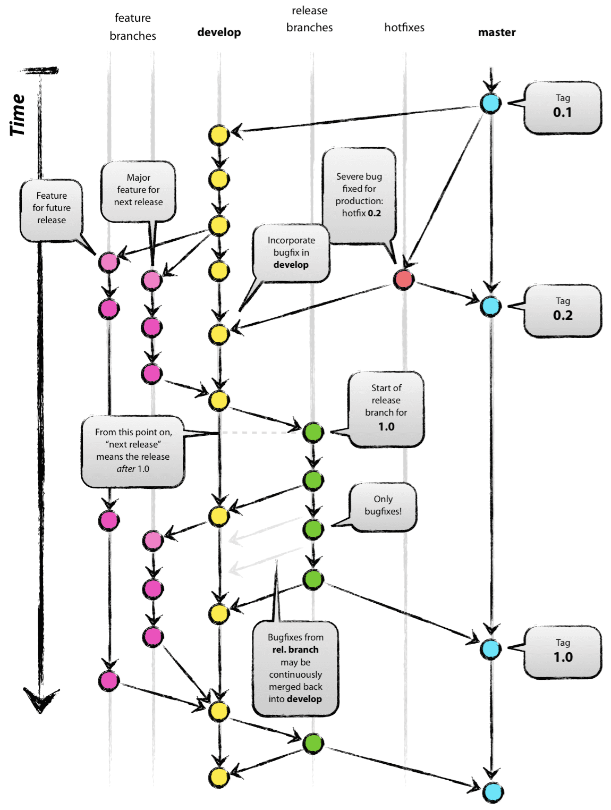

# 2024_01_31 TIL

### 패키지 매니저

패키지 매니저는 패키지를 설치, 업데이트, 수정, 삭제 하는 작업을 편리하고 안전하게 수행한다.

또한 많은 패키지들은 다른 패키지가 설치되어 있어야만 제대로 동작하는데 기존 패키지를 제대로 동작시키기 위해 필요한 다른 패키지를 의존성이라고 하는데 이러한 의존성을 관리해준다.

---

### 🚨 Git 브랜치 전략

main 브랜치는 출시되고 배포된 코드를 위한 브랜치이다.

브랜치 기능을 사용하면 다른 브랜치에 영향을 받지 않는 독립적인 환경에서 기능을 개발하거나 버그를 수정할 수 있다.(즉, 여러 기능을 여러 사람이 병렬적으로 개발 가능)

#### Git 브랜치 전략은 프로젝트의 Git 브랜치를 효과적으로 관리하기 위한 워크플로우이다.

직접 브랜치 전략을 만들어 사용해도 되겠지만, 세상에는 브랜치를 효과적으로 관리하기 위한 모범 사례들이 존재한다.
ex) Git Flow, Github Flow

---

### 🚨 Git Flow

#### master(main) 브랜치와 Develop 브랜치는 개발 프로세스 전반에 걸쳐 항상 유지되는 브랜치이다. 반면, Supporting 브랜치는 필요할 때마다 생성되고, 역할을 다하면 삭제된다. Supporting 브랜치 덕분에 팀이 병렬적으로 업무를 할 수 있게 된다.

#### ❗️master(main)

제품으로 출시될 수 있는 브랜치. 프로젝트 시작 시 생성되며, 개발 프로세스 전반에 걸쳐 유지된다. 배포된 각 버전을 Tag를 이용해 표시해둔다.

#### ❗️develop

다음 출시 버전을 개발하는 브랜치. 개발이 완료되면 Main 브랜치로 merge된다.

#### ❗️feature (Supporting 브랜치)

(하나의)기능을 개발하는 브랜치로, 개발이 완료되면 develop 브랜치로 병합된다. 머지할때 주의점은 Fast-Forward로 머지하지 않고, Merge Commit를 생성하며 머지를 해줘야 히스토리가 특정 기능 단위로 묶이게 된다. 
네이밍은 feature/branch-name 과 같은 형태로 생성한다.

#### ❗️release(Supporting 브랜치)

소프트웨어 배포를 준비하기 위한 브랜치이다. Develop 브랜치에서 생성하며, 버전 이름 등의 소소한 데이터를 수정하거나 배포전 사소한 버그를 수정하기 위해 사용된다. 이번 출시 버전을 준비하는 브랜치로, 작업이 완료되면 master(main)과 develop 브랜치로 병합된다. 
네이밍은 release/v1.1 과 같은 형태로 생성한다.

#### ❗️hotfix(Supporting 브랜치)

출시 버전에서 발생한 버그를 수정하는 브랜치. 이미 배포된 버전에 문제가 발생했을 때 이 브랜치를 사용하여 문제를 해결한다.
