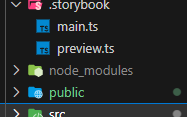

# 2024.02.02 TIL

## 🚨 Storybook

Storybook이란, React, Angular, Vue 등의 분리된 UI 컴포넌트를 체계적이고 효율적으로 구축할 수 있는 UI 컴포넌트 개발 도구다.<br>
(프론트엔드 개발에서 주로 사용되는 UI 컴포넌트 개발 도구)

이 도구는 UI 개발 환경이자 UI 컴포넌트를 위한 놀이터다. 개발자들이 컴포넌트를 독립적으로 만들고, 격리된 개발 환경에서 상호작용이 가능한 컴포넌트를 선보일 수 있도록 해준다.

#### ❗️스토리북의 기본 구성 단위= 스토리(Story)

- 하나의 UI 컴포넌트는 보통 하나 이상의 Story를 가지게 된다.
- 각 Story는 해당 UI 컴포넌트가 어떻게 사용될 수 있는지를 보여주는 하나의 예시

스토리북을 사용하면 UI 컴포넌트가 각각 독립적으로 어떻게 실제로 렌더링되는지 직접 시각적으로 테스트하면서 개발을 진행할 수 있다. 해당 UI 라이브러리를 사용하는 개발자 입장에서도 코드를 보지 않고도 미리 각 UI 컴포넌트를 체험해보고 사용할 수 있어서 매우 유용하다.

특히 Mockup 상태를 넣어줄 수 있어 상태 값에 따라 변경되는 디자인을 바로 확인할 수 있다.

---

### ❓ 그래서 왜 사용하는데?

#### 컴포넌트 기반 개발

- 기존에 스타일 작업을 할 때는 여러 상태에 따라 달라지는 컴포넌트들을 매번 확인하기 번거로웠다. 이 불편함을 해결해준다.<br>
  ex) 로그인을 한 상태에서만 보이는 아이콘, 로딩중일 때, hover했을 때, focus했을 때, input값이 유효할 때 등등..

- 다른 사람의 코드를 이해하는 데 드는 노력을 줄일 수 있다.
- 자연스럽게 컴포넌트 단위로 생각하면서 개발을 진행할 수 있다.
- 독립적인 환경에서의 UI 컴포넌트 개발(개발하는 웹과 따로 서버를 킬 수 있기 때문)
- 컴포넌트 재사용 증가

#### 디자이너와의 커뮤니케이션 도구

디자이너와 개발자의 끝없는 메신저 혹은 메일의 핑퐁을 줄여주고 Storybook이 우리의 훌륭한 대화 도구가 되어 줄 것이다. 멀리 떨어진 디자이너와 대화하려고 웹서버까지 띄워놓는 수고가 어렵다면, 그냥 정적인 페이지로 Storybook을 빌드 해주어도 된다. 물론 거리의 장벽을 완전히 메울 수는 없고, 메신저와 메일의 핑퐁은 여전하겠지만 그래도 대화의 공통 매개체가 존재한다면 서로가 설명해주기 더 쉽지 않을까..

---

#### Storybook 설치

> yarn이 설치되지 않았다면 npm install -g yarn

> yarn add global @storybook/cli
> npx sb init // 필요한 의존성을 자동 설치하고 package.json에 srcipts 실행 및 빌드 명령어도 추가해준다.

#### 선택: 스토리북을 실행했을 때 컴포넌트 테이블을 만들어준다. 컴포넌트의 props, type, 주석 등이 적혀 있어서 배라할 때 아주 유용함

> yarn add --dev react-docge
> n-typescript-loader

#### 실행

> yarn storybook // 6006포트

---

### Storybook 폴더구조


각 파일이 뭘 하는지 알아보자

- .storybook: Storybook 설정 파일들
- .storybook/main.js: stories를 위한 confgig 설정, 스토리북 자체의 구성 파일

```JSX
import type { StorybookConfig } from "@storybook/react-vite";
const config: StorybookConfig = {
  stories: ["../src/**/*.mdx", "../src/**/*.stories.@(js|jsx|ts|tsx)"],
  addons: [
    "@storybook/addon-links",
    "@storybook/addon-essentials",
    "@storybook/addon-interactions",
  ],
  framework: {
    name: "@storybook/react-vite",
    options: {},
  },
  docs: {
    autodocs: "tag",
  },
};
export default config;
```

- addon<br>
  Storybook의 플러그인 시스템. 공식 지원 addon 외에도 여러 오픈소스 addon을 register하여 기본 기능에 추가 기능을 붙일 수 있다.<br>
  반응형 개발을 위한 Viewport도 있으며, 라우팅을 위한 react-router도 존재한다. 아래에서 다룰 args의 변화로 실시간으로 컴포넌트를 수정하는 것은 공식적으로 storybook에서 지원하는 기본 controls addon이다.

- storybook/preview.ts: 모든 story들에 글로벌하게 적용될 포멧 세팅, 사용자가 작성하는 스토리의 구성 파일

```JSX
import type { Preview } from "@storybook/react";

const preview: Preview = {
  parameters: {
    actions: { argTypesRegex: "^on[A-Z].*" },
    controls: {
      matchers: {
        color: /(background|color)$/i,
        date: /Date$/,
      },
    },
  },
};

export default preview;
```

- src/stories: Storybook 예제 컴포넌트들

---

### Story 작성하기

#### 기본꼴

> <컴포넌트이름>.stories.js

```JSX
export default {
  title: //스토리북에 올릴 component폴더 계층 구조,
  component: // 스토리를 만들 컴포넌트 이름
}

export const 스토리이름 = () => 해당스토리에서 테스트할 인자가 담긴 컴포넌트
```

#### 속성

1. title: 스토리북에 올릴 component 폴더 계층 구조<br>
   ex) title: "Example/Button"은 Example 그룹의 Button 스토리

2. component: 스토리를 만들 컴포넌트 이름

3. args: 모든 스토리에 공통으로 전달된 props

4. argTypes: 각 Story args의 행동 방식 설정<br>
   backgroundColor: {control: "color"
   } => controls에서 선택한 컬러를 컴포넌트의 props로 전달하겠다는 의미

---

### 단점

- 토이 프로젝트나 규모가 작은 프로젝트의 경우에는 이점이 별로 없음
