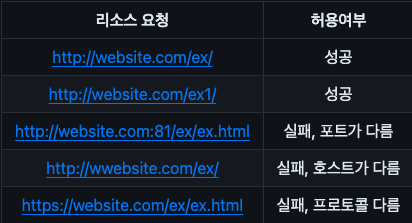

# 2024.02.04 TIL

## 🚨동일 출처 정책 (Same-Origin Policy)

어떠한 문서나 스크립트가 다른 프로토콜 / 포트 / 호스트 에 있는 리소스 사용하는 것을 제한하는 정책. 예를 들어, 다음과 같은 사이트에서 리소스를 다른 곳으로 요청한다고 하자.

 
위와 같이 호스트, 포트, 프로토콜 중 하나라도 다르면 동일 출처 정책이 적용되서 요청에 실패한다.

해결방법
document.domain
단편적인 방법으로, 동일한 도메인으로 설정함을 통해 SOP 정책을 피할 수 있다. 만약, 현재 도메인이http://store.company.com/index.html 이라면,

document.domain = "company.com";
과 같이 설정해서 http://company.com/index.html 에 요청을 보낼 수 있다. 단, 2개의 html 파일에 관련된 스크립트 파일에 모두 위와 같이 설정해줘야 하며 파이어폭스에서는 안된다는 제약사항이 있다. 또한 서버-클라이언트 통신에 쓰이는 방법이 아니라 클라이언트 상에서 출처가 다른 프레임(frame)들에 대해 쓰인다. 따라서, 이 방법으로 서버와 통신할 수는 없다.

CORS(Cross-Origin Resource Sharing)
HTTP 헤더를 사용하여 클라이언트와 서버로 하여금 서로에 대해 인지하고 한 출처에서 다른 출처의 자원을 사용할 수 있게 하는 메커니즘이다. 클라이언트가 서버에 HTTP 요청을 보낼 때 HTTP 헤더의 Origin 속성에 자동으로 값이 할당된다.

Origin: http://company.com
이 도메인에서 다른 출처의 자원을 사용하기 위해 ajax 요청을 했다고 하면 SOP 정책 때문에 에러가 발생한다. 따라서 이를 해결하기 위해, 서버의 HTTP 응답 헤더에 다음과 같이 요청을 허용하는 도메인을 명시한다.

Access-Control-Allow-Origin: http://company.com
window.postMessage
이것 또한 프레임에서 사용하는 개념으로, 페이지에서 프레임으로 문자열 값을 보낼 수 있고 받는 프레임에선 이벤트 핸들러를 통해서 받을 수 있다. 그렇게 중요한 방법은 아니기 때문에 더 자세한 내용은 MDN 공식문서 를 참고하도록 하자.

프록시 서버
프록시 서버는 클라이언트와 서버 사이에서 정보교환을 도와주는 서버이다. 리소스를 요청하고자 하는 서버의 Access-Control-Allow-Origin 속성을 수정할 수 없는 경우에 굉장히 유용하다. 프록시 서버가 실제 서버에 요청을 보내서 받아온 다음 그걸 Access-Control-Allow-Origin 설정을 적절히 하여 클라이언트에게 돌려주는 방법이다.

Apache나 Nginx와 같은 웹서버에서 프록시 기능을 활성화할 수 있고 CRA(Create-React-App)를 사용하고 있다면 package.json 의 proxy 값을 설정하여 프록시 서버 기능을 활성화할 수 있다. 단, 이 방법의 경우 서버를 한단계 더 거치기 때문에 기존의 요청보다 느리다는 단점이 있다.

JSONP(JSON with Padding)
CORS가 나오기 이전에 사용하던 방식으로, 

하지만 JSON 데이터의 포맷이

{
name: 'john',
age: 19
}
위와 같이 생겼기 때문에 다음과 같이 삽입된다.

이는 자바스크립트의 문법에 맞지 않고 애초에 요청을 한 이유가 데이터를 가공하기 위함이기 때문에 이걸 가공하는 콜백함수를 넘기는 방식이 바로 JSONP이다. 즉, 받은 JSON 데이터를 파라미터로 콜백함수에 넘겨서 실행하는 방식이다.

위와 같이 넘기며, 결국 태그에는 아래와 같이 나타난다.

최신 브라우저에서는 거의 사용 안하고 오래된 브라우저에서 사용하는데 보안문제가 있어서 CORS를 권장한다.
