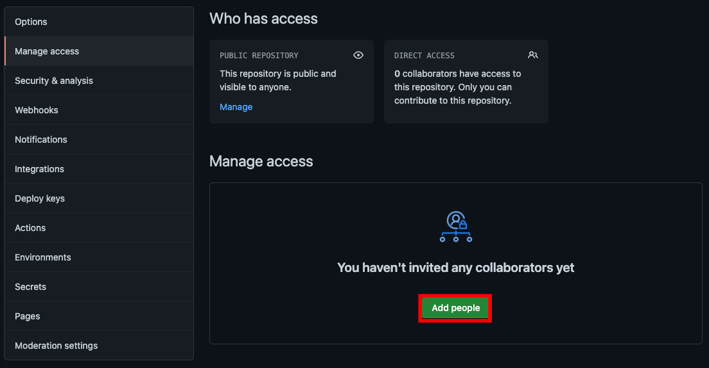
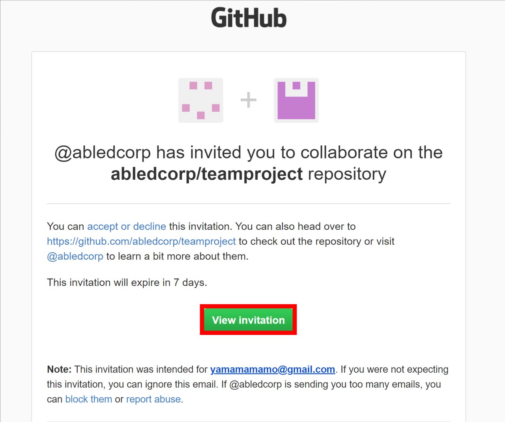
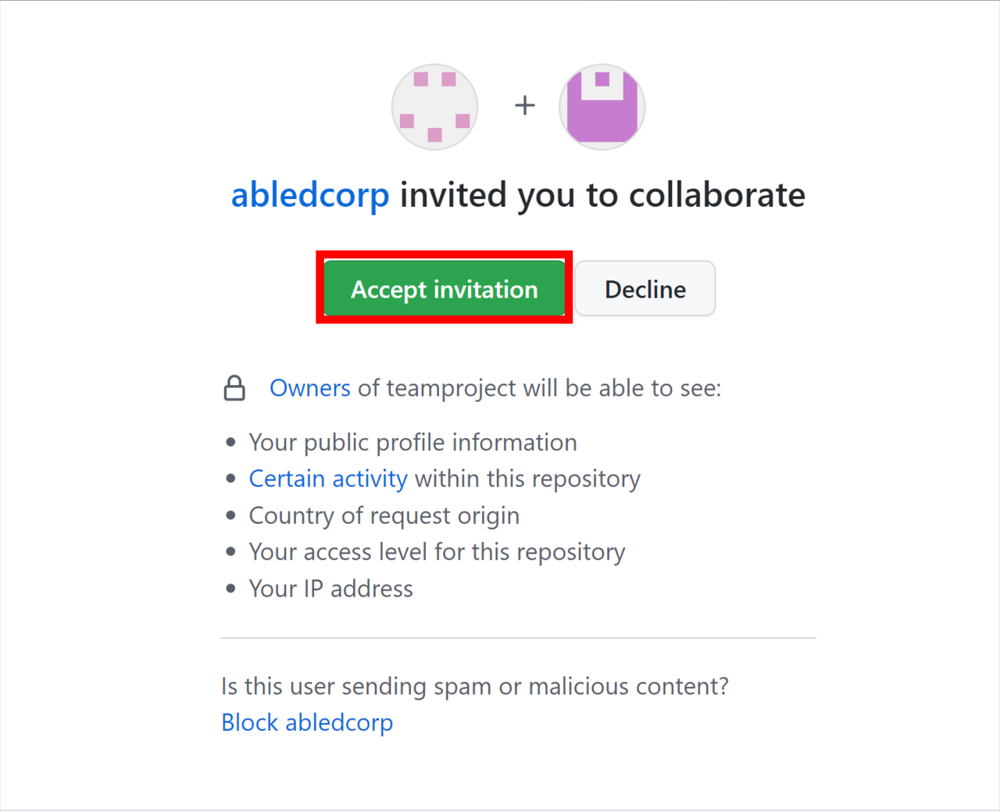
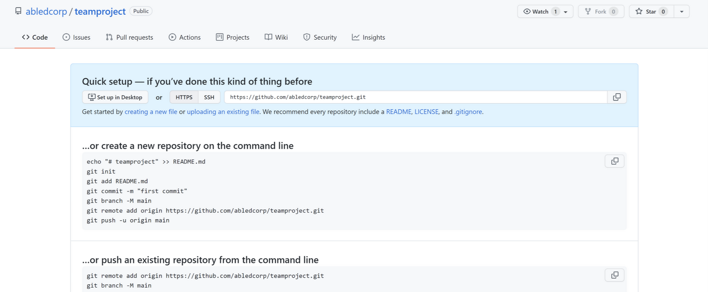
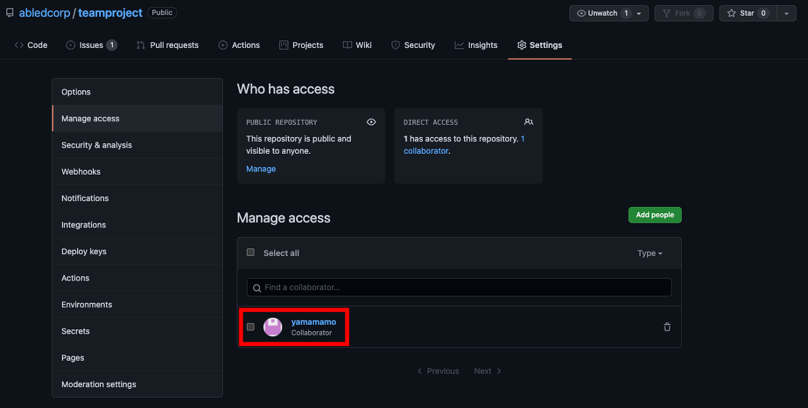
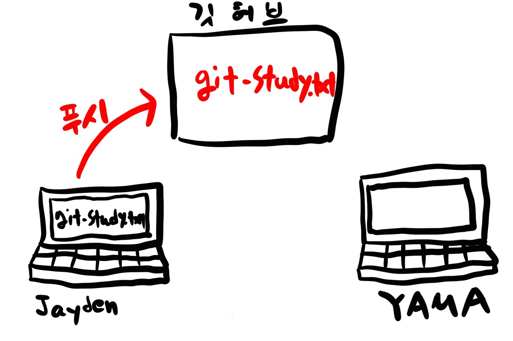
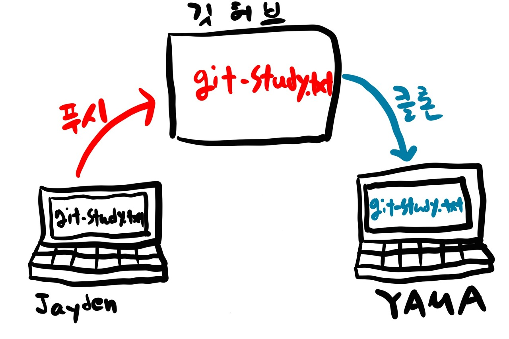

# 2024.02.06 TIL

## Git & GitHub 협업하기

깃허브의 원격 저장소를 이용하여 하나의 작업을 여러 사용자가 협업하기 위해선, 각자 지역 저장소에서 작업한 내용을 자유롭게 원격 저장소에서 공유할 수 있어야 한다.

### 🚨 01. 공동 작업자 추가하기

깃허브의 공개 저장소는 주소만 알면 누구든 접속하여 소스를 볼 수 있다. 또한 깃허브 회원이라면 누구나 오픈소스 프로젝트의 소스를 내려 받을수도 있다.<br>
하지만 **누구나 commit 하거나 push할 수는 없다.** 여러 사람이 협업을 한다면 승인된 공동 작업자만 commit할 수 있는 권한을 주어야 소스코드가 무분별하게 수정되는 것을 막아줄 수 있다.<br>
만약 '팀장', '팀원1', '팀원2' 세사람이 깃허브를 통해 협업한다고 가정했을 때 팀 작업을 하려면 팀원 중 누군가 원격 저장소를 만들고 나머지 팀원들을 공동 작업자로 추가해야한다.


#### 작업을 하려는 repository로 들어가서 Settings -> Collaborators -> Add people 를 누르면 username이나 email등을 이용하여 초대할 수 있다. 초대받은 팀원들은 협업자로 초대되었다는 메일과 깃허브 메세지를 받게 되는데, 깃허브 메세지 화면에서 Accept Invitation을 누르면 수락된다.




#### 사용자를 추가했으면 요청한 사용자의 메일에 메일이 전송되는데 View invitaion 버튼을 누르고 Accept invitation 버튼을 눌러준다.

---


Accept invitation 버튼을 누르면 아래의 이미지와 같이 에이블디의 teamproject 리포지토리 화면으로 이동하게 된다.

그리고 상대방이 초대에 수락하면 Manage access 화면에 공동작업자로 추가된 사람의 아이디를 볼 수 있고 아이디 아래에 "Collaborator"라고 표시되어있는 것을 볼 수 있다.

---

### 🚨 02. 협업 작업 환경 구성하기

#### ❗️ 이름 & 이메일 주소 지정

먼저 각 작업자의 컴퓨터에 로컬 리포지토리(지역 저장소)를 만들어야 한다. 그리고 공동작업에서 사용할 이름과 이메일 주소를 지정한다. 리포지토리마다 다른 이름이나 메일 주소를 사용하려면 --global 옵션을 빼고 이름과 메일 주소를 작성하도록 한다.<br>
아래의 명령은 로컬 리포지토리 이름을 abled-team으로 했을 때이다.

```zsh
$ cd~
$ git init repository-name
$ cd abled-team
$ git config user.name "사용자 이름"
$ git config user.email 메일주소
```

---

#### ❗️ commit & push

공동작업자 이름과 이메일 주소까지 다 지정했으면 깃허브 리포지토리에 첫 커밋과 푸시를 해본다.

```zsh
$ vi git-study.txt
$ git add git-study.txt
$ git commit -m "create git-study.txt"
```

커밋이 완료되었으면 로컬 리포지토리의 커밋을 깃허브 리포지토리(원격 저장소)에 푸시해야한다.<br>
그러기 위해선 먼저 깃허브 리포지토리의 주소를 복사한다. 그리고 터미널 창에서 깃의 origin에 복사한 주소를 지정한다.

그다음 git push 명령을 사용해 origin의 main 브랜치에 커밋을 올린다. 이 때 아래의 명령어와 같이 -u 옵션을 붙이면 다음부터 git push 명령만으로 깃허브 리포지토리의 master 브랜치에 커밋을 올릴 수 있다.

```jsx
// 현재 작업 중인 로컬 깃 저장소에 원격 리포지토리를 추가한다. 이 명령을 통해 로컬 저장소는 원격 리포지토리를 origin이라는 이름으로 참조하게 된다.
$ git remote add origin 복사한 깃허브 리포지토리 주소
// 현재 로컬 브랜치인 "master 또는 main" 브랜치의 변경 내용을 원격 리포지토리인 origin에 push한다.

// -u 옵션은 origin을 기본 원격 저장소로 설정하고 master 브랜치를 기본으로 설정한다. 이후에는 간단히 git push 만으로 변경 내용을 푸시할 수 있다.
$ git push -u origin master
```


push를 하고난 후의 상황은 그림과 같다.

---

#### ❗️ 다른 공동작업자 입장에서의 작업

YAMA의 입장에서 작업할 때 깃허브로 협업 시 공동 작업자는 자신의 작업을 진행하기 전에 git clone 명령을 사용해서 원격 저장소를 clone(복제)한다.

> 협업 중에 공동작업자는 일반적으로 git clone 명령어를 사용하여 원격 저장소를 한 번만 복제한다. 이렇게 하면 원격 저장소의 모든 내용이 로컬 컴퓨터로 복제되어 오고 이후에는 git pull을 사용하여 원격 저장소의 최신 변경 내용을 가져오거나 git push를 사용하여 자신의 변경 내용을 원격 저장소에 업로드할 수 있다.

#### 깃허브로 협업할 때 공동 작업자는 자신의 작업을 진행하기 전에 git clone 명령을 사용하여 원격 저장소를 clone(복제)한다.

```zsh
$ git clone 원격 저장소 주소
```

이후 클론이 잘 이루어 졌을것이다.

현재 상황을 이미지로 표현하면 다음과 같다.

이제 야마의 컴퓨터에 프로젝트를 클론했으니 야마의 컴퓨터에서도 작업을 해야한다.

### ⛔️주의사항

#### 깃허브에서 협업할 때는 여러 사람이 함께 파일을 수정하고 푸시하기 때문에 반드시 작업하기 전에 깃허브 리포지토리의 최신 커밋을 풀한 다음 자신의 커밋을 푸시해야한다.

❓ 왜 그럴까???
깃허브 리포지토리에 있는 최신 커밋 정보가 본인의 컴퓨터에 저장되어있지 않다면 오류가 발생한다. 이런 오류가 생기지 않게 하려면 **자신의 커밋을 푸시하기 전에 깃허브 리포지토리의 최신 커밋을 가져와야 한다.**

```JSX
// git pull 명령은 원격 저장소의 최신 커밋을 로컬 저장소에 합쳐준다
$ git pull
```

#### ❗️하나의 원격 저장소에 둘 이상의 컴퓨터를 연결해서 사용한다면 풀과 푸시를 습관화하는 것이 좋다. 그러면 어떤 컴퓨터에서 접속하든 항상 최신 소스를 유지할 수 있다.

---

### 🚨 03. 협업에서 브랜치 사용하기

협업을 하다보면 팀원들이 각자 다른 기능을 맡아 작업을 하는 경우가 많다. 팀원 1은 "기능 A"를 만들고 팀원 2는 "기능 B"를 만드는 것처럼 각자 다른 기능을 맡아 작업하게 된다.

이럴 때는 **각자의 작업이 maaster 브랜치에 있는 파일들과 섞이지 않도록 새 브랜치를 만들어서 프로젝트를 관리**한다.

우선 깃 풀을 해주어 최신 커밋 정보를 가져온다.

```zsh
$ git pull
```

새로운 기능을 구현하기 위해 로컬 리포지토리에 work-Jayden 브랜치를 만들고 이동한다.

```zsh
$ git branch work-Jayden
$ git switch work-Jayden
```

그러면 이제 jayden.txt 파일을 만든 후 아무 내용이나 작성한뒤 저장하고 커밋 메세지와 함께 커밋한다.

```zsh
$ vi jayden.txt
$ git add jayden.txt
$ git commit -m "create jayden.txt"
```

이후 깃허브 리포지토리에 work-Jayden 브랜치의 변경 내용을 원격 저장소인 origin에 푸시하는 깃 명령어를 작성한다.

```zsh
$ git push origin work-Jayden
```

이러면 깃허브에서도 새로운 브랜치가 잘 푸시된걸 확인할 수 있다.

---

### 🚨 04. pull request

#### ❗️ 푸시한 브랜치는 풀 리퀘스트를 통해 병합해야 원격 저장소에 반영된다.

### pull request는 일반적으로 새로운 기능이나 변경 내용을 main 또는 기본 브랜치에 통합할 때 사용된다. "b" 브랜치에서 작업중일 때는 pull request를 생성하지 않아도 된다.

통합 후에는 git pull을 통해 main 브랜치를 최신으로 업데이트 한다.

#### 깃허브에서 협업할 때는 보통 작업자마다 브랜치를 만들어서 진행하고, 작업 중간중간 풀 리퀘스트를 보내서 master 브랜치에 머지한다. 그래서 깃허브로 협업할 때는 다른 작업자의 변경 내용을 바로 반영하기 위해 항상 풀(pull)부터 한 다음 자신의 작업을 진행해야 한다.
