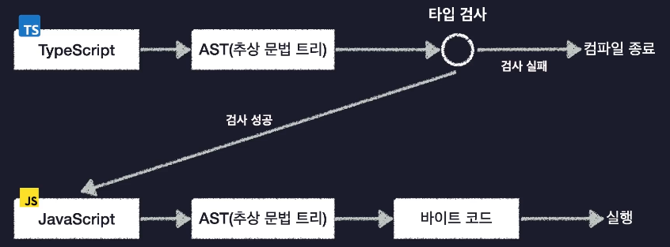

# 2024.02.07 TIL

## TypeScript


TypeScript는 JavaScript와 완전히 다른 언어는 아니다. 기존의 JavaScript를 더 안전하게 사용할 수 있도록 타입에 관련된 여러가지 기능들을 추가한 언어이다.

그래서 TypeScript는 쉽게 말해 JavaScript의 확장판이라 볼 수 있다.

우리가 원래 사용하던 자바스크립트 코드에서 타입을 정의하는 이런 타입스크립트만의 문법을 추가하면 타입스크립트 코드가 된다.

또한 자바스크립트의 기본 문법은 다 쓸 수 있다.

복잡한 대규모 어플리케이션을 자바스크립트로 개발하면 한가지 문제가 발생한다. 바로 자바스크립트가 너무 엄격하지 않다는 점이다. 자바스크립트는 애초에 간단한 프로그래밍을 개발하기 위해 만들어져 유연하므로 이제는 자바스크립트의 인기도 많아지고 복잡한 프로그램을 만드는데까지 활용되니까 오히려 이 유연함이 버그 발생 가능성을 높여 프로그램의 전체적인 안정성을 떨어뜨리는 단점이 됐다.

그래서 이런 자바스크립트의 문제점을 극복하기 위해 자바스크립트의 기존 문법들과 매력은 그대로 유지한 채 안정성만 추가로 확보한 언어인 TypeScript가 등장했다.

---

### 🚨 JavaScript의 한계점과 TypeScript

#### 타입 시스템

모든 프로그래밍 언어는 타입 시스템을 가지고 있다.
타입 시스템이란 언어에서 사용할 수 있는 여러가지 값들을 어떤 기준으로 묶어 타입으로 정할지 결정하고 또 코드의 타입을 언제 검사할지 그리고 어떻게 검사할지 등 프로그래밍 언어를 사용할 때 타입과 관련해서 지켜야하는 규칙들을 모아둔 체계이다.

정적 타입 시스템 언어들에서는 모든 변수에 일일이 타입을 다 정해야 하기 때문에 매우 귀찮고 작성해야 하는 코드의 양이 늘어난다. 우리가 그동한 작성해왔던 JS 코드에 모든 변수에 타입을 일일이 지정해줘야 한다고 생각하면 끔찍하다. 그렇다면 굳이 JS를 쓰지 않아도 될것이다.


그래서 TS는 좀 독특한 타입 시스템을 사용하는데, **자바스크립트의 동적 타입 시스템과 자바의 정적 타입 시스템을 혼합한 것 같은 독특한 타입 시스템을 사용**한다.

TypeScript는 이렇게 정적 타입 시스템처럼 안전하면서도 마치 동적인 타입 시스템처럼 모든 변수에 일일이 우리가 직접 타입을 명시하지 않아도 된다.


#### ❗️ 점진적 타입 시스템(Gradual Type System)

변수의 타입을 직접 정의하지 않아도 변수에 담기는 초기값을 기준으로 자동으로 알아서 타입을 추론한다.


#### ❗️ 결론적으로 TS의 이런 독특한 타입 시스템은 동적인 타입 시스템의 안전하지 않은 문제를 해결하면서도 정적인 타입 시스템의 귀찮음도 동시에 해결해주는 타입 시스템이다.

---

### 🚨 TypeScript 동작 원리

컴파일러는 어떤 과정을 거쳐 코드를 컴파일 할까?

컴파일러는 작성한 코드를 바로 바이트 코드로 변환하는게 아니라 AST(추상 문법 트리)라는 특별한 형태로 변환한다.
<br>

AST는 추상 문법 트리라는 뜻인데 해당 그림처럼 코드의 공백이나 주석, 탭 등의 코드 실행에 관계없는 요소들을 모두 제거하고 트리 형태의 자료 구조에 코드를 쪼개서 저장해놓은 형태이다.

이렇게 코드를 AST로 변환하고 나면 이제 마지막으로 컴파일러가 AST를 바이트 코드로 변환한다. 이렇게 변환이 된 바이트 코드를 컴퓨터가 실행한다. **우리가 알고 있는 대다수의 프로그래밍 언어는 이런 컴파일 과정을 거쳐 실행되게 된다.**

#### 이번에는 TypeScript는 어떤 과정을 거쳐 실행되는지 살펴보도록 하자

TS도 다른 언어와 마찬가지로 실행하려면 컴파일을 거쳐야 하는데 TS의 컴파일 과정은 좀 독특하게 이루어진다.


#### 1. 코드 -> AST

우선 다른 언어들과 동일하게 먼저 TypeScript 코드를 AST로 변환한다. 여기까지는 다른 언어들과 똑같다.

#### 2. 타입 검사(Type Checking)

그런데 그 다음에 AST를 바이트 코드로 변환하는게 아니라 AST를 보고 코드상에 타입 오류가 없는지 검사하는 타입 검사라는 작업을 수행한다.

만약 잘못된 코드를 작성해서 코드에 타입 오류가 있었다면 타입 검사 과정에서 실패하게 되고 컴파일이 중단된다.

#### 3. 검사 성공 -> AST를 자바스크립트로 변환

타입 오류가 없는 정상적인 코드라면 타입 검사를 성공적으로 통과하고 AST를 바이트 코드가 아니라 자바스클비트 코드로 변환한다. 그리고 컴파일이 종료된다.

#### 대부분의 언어를 컴파일하면 바이트 코드가 만들어지는데 TypeScript 코드를 컴파일하면 자바스크립트가 만들어지고 있다.


이렇게 TypeScript의 컴파일 결과로 만들어진 JavaScript 코드는 왼쪽 아래를 보면 되는데 Node.js나 웹브라우저 같은 걸로 실행하면 다시 앞서 살펴본 대다수의 언어들과 동일한 컴파일 과정을 다시 거쳐서 실행되게 된다.

여기서 중요하게 살펴봐야할 부분은 TS 코드의 컴파일 과정에 타입 검사가 포함되어 있기 때문에 **검사를 성공해서 생성된 자바스크립트 코드는 타입 오류가 발생할 가능성이 낮은 안전한 자바스크립트 코드라는 것이다.**

#### 타입과 관련된 코드들은 컴파일 결과 모두 사라진다.<br>(프로그램 실행 자체에는 영향을 미치지 않는다)

### 🚨 결론

결국 TypeScript는 AST 그리고 Type 검사 과정을 거쳐 Type 검사가 성공하면 JavaScript로 변환되는데 만약 코드에 오류가 있다면 컴파일 도중에 Type 검사 단계에서 실패하게 되므로 우리가 JavaScript를 보다 안전하게 사용하는 미리 한번 코드를 검사하는 용도로 사용된다고 볼 수 있다.

---

### 🚨 Hello TS World!

#### ❗️1. Node.js 프로젝트 초기화

> npm init

이 명령어를 사용하여 Node.js 프로젝트를 위한 package.json 파일을 생성할 수 있다. package.json은 Node.js 프로젝트의 메타 데이터와 의존성 관리를 위한 설정을 포함하는 파일이다. 이 때 사용자는 프로젝트의 이름, 버전, 설명, 진입점 파일, 테스트 명령, Git 저장소 URL 등을 설정할 수 있다.

#### ❗️2. typesnode 패키지 설치

> npm i @types/node

Node.js 환경에서 TypeScript를 사용할 때 타입 정의 파일을 제공하는 패키지이다. 이 패키지는 Node.js에서 사용되는 기본 내장 모듈들에 대한 TypeScript 타입 정의를 포함하고 있어 TypeScript로 Node.js 애플리케이션을 개발할 때 타입 안정성을 높이는데 도움이 된다.

그냥 컴파일 하는 과정에서 Node.js의 기본 기능, console.log 같은 것의 타입을 알아들을 수 없으므로 반드시 설치해줘야한다 라고 이해해주면 된다.

#### (Vite나 Create React App과 같은 도구를 사용하여 프로젝트를 생성할 때는 기본적으로 Node.js 내장 모듈에 대한 타입 정보가 이미 포함되어 있어서 별도의 설치가 필요하지 않다.)

#### ❗️3. TypeScript 컴파일러 설치

전역적으로 설치하면 로컬 컴퓨터의 모든 환경에서 해당 패키지를 사용할 수 있다.

> npm install typescript -g

TypeScript는 TypeScript 컴파일러를 통해 JavaScript코드로 변환된 다음에 그 코드를 Node나 브라우저로 실행시키는 방식으로 동작한다고 이전에 살펴봤었다.

#### TypeScript 패키지를 설치하면 TypeScript 컴파일러를 사용할 수 있다

> tsc -v

현재 TypeScript의 버전을 나타낸다

#### ❗️4. 코드 작성

// index.ts


> tsc index.ts

이 명령어를 입력하면 TypeScript 컴파일러가 index.ts 파일의 TypeScript 코드를 JavaScript 코드로 변환한다.

> node index.js

이 명령어를 입력하면 콘솔이 출력된다.

#### ❗️5. ts-node 설치

> sudo npm install ts-node -g

Node.js는 JavaScript 코드만 직접 실행할 수 있다. 하지만 TypeScript는 JavaScript의 확장이므로 Node.js에서 실행할 수 없다.

이 때 ts-node를 사용하면 TypeScript 파일을 직접 실행할 수 있다.

> ts-node index.ts

위와 같은 명령어를 입력하면 TypeScript 파일을 한번에 이런식으로 실행을 해줄 수 있다.

### "업데이트"

### 🛎️🛎️🛎️ ts-node -> tsx 🛎️🛎️🛎️

ts-node는 Node 20버전 이상에서는 더이상 동작하지 않는다. 따라서 tsx(TypeScript Execute)로 대체하여 이용하면 된다.

> sudo npm i -g tsx

> tsx index.ts

이러면 자바스크립트 파일을 생성하지 않고 한번에 타입스크립트 파일을 실행한다.

---

### 🚨 TypeScript 컴파일러 옵션 설정하기


TypeScript -> JavaScript 컴파일 과정에서 얼마나 엄격하게 타입 오류를 검사할 건지 또는 컴파일 결과 생성되는 자바스크립트 코드들의 버전은 어떻게 설정할 건지 지정하는 세부사항들을 **컴파일러 옵션**이라고 한다.

TypeScript 컴파일러 옵션은 Node.js 패키지 단위로 설정할 수 있다. 즉, 우리의 **프로젝트마다 설정할 수 있다**.

> tsc --init

### ❗️1.include 옵션

#### TypeScript 컴파일러의 설정 파일인 tsconfig.json을 생성하고 이 파일을 기반으로 TypeScript 프로젝트의 컴파일 옵션을 설정할 수 있다.

#### 1. TSC가 컴파일할 TypeScript 파일들의 범위와 위치를 알려주는 include 라는 옵션을 설정한다.

예를들어 src 폴더 아래에 있는 모든 TypeScript 파일을 동시에 한 번의 명령으로 컴파일 하도록 설정할 수 있다.


이렇게 설정하면 src라는 디렉터리 아래에 있는 모든 파일을 포함해서 한번에 컴파일하라고 범위를 지정해준다.

> tsc

이렇게 tsc를 입력만 해주면 src 디렉토리 안에 있는 모든 파일들을 컴파일 해준다

---

### ❗️target 옵션

TypeScript 코드를 컴파일해서 만들어지는 JavaScript 코드의 버전을 설정하는 옵션이다.

```json
{
  "compilerOptions": {
    "target": "es2015"
  }
}
```

다음과 같이 target 옵션을 설정할 수 있다.

include 옵션과 달리 target 옵션은 compilerOptions이라는 항목 안에 들어가있는것을 볼 수 있는데 이것은 TS -> JS 변환 과정이나 Type 검사 등의 상세한 옵션을 설정할 때에는 지금처럼 compilerOptions 이라는 항목 안에 옵션을 설정한다고 이해하면 된다.

---

### ❗️module 옵션

변환되는 자바스크립트 코드의 모듈 시스템을 설정할 수 있다.

자바스크립트의 모듈 시스템에는 대표적으로 CommonJS와 ESM이 있는데 CommonJS는 require 이런식으로 모듈을 불러오고 module.export로 모듈을 내보내고 ES모듈 시스템의 경우에는 import와 export default를 사용한다.

```json
{
  "compilerOptions": {
    "target": "ESNext",
    "module": "ESNext"
  },
  "include": ["src"]
}
```

이렇게 module 옵션을 사용하여 변환된 JavaScript 코드의 module 시스템을 우리가 직접 설정할 수 있다. 이 옵션도 되게 중요하다.

우리가 실제로 만드는 프로덕션이 무조건 ES Module 시스템이 지원이 되는 곳에서 동작하리라는 보장은 없기 때문이다.

---

### ❗️outDir 옵션

TypeScript 컴파일로가 컴파일된 JavaScript 파일을 출력할 디렉토리를 지정하는 옵션이다. 즉, 컴파일된 JavaScript 파일이 생성될 위치를 지정하는 것<br>

#### 기본적으로 TypeScript 컴파일러는 소스 파일과 같은 디렉토리에 JavaScript 파일을 생성한다.

```json
{
  "compilerOptions": {
    "target": "ESNext",
    "module": "ESNext",
    "outDir": "dist"
  },
  "include": ["src"]
}
```

이렇게 outDir 옵션을 이용하면 컴파일 결과로 생성되는 코드를 우리가 작성하는 코드 영역에서 분리할 수 있다.

---

### ❗️strict 옵션

TypeScript의 모든 엄격한 타입 검사 옵션을 활성화하는 설정이다. 이 옵션을 사용하면 프로그램의 정확성에 대한 강력한 보장을 얻을 수 있다. strict 옵션을 true로 설정하면, 아래와 같은 엄격한 모드 옵션들이 모두 활성화된다.

- noImplicitAny<br>
  암시적인 any 타입을 허용하지 않음.
- strictNullChecks<br>
  null 및 undefined를 엄격하게 검사함.
- strictFunctionTypes<br>
  함수 타입의 호환성을 엄격하게 검사함.
- strictPropertyInitialization<br>
  클래스의 모든 속성이 생성자에서 초기화되었는지 확인함
- strictBindCallApply<br>
  함수의 "bind", "call", "apply" 메서드의 호출을 엄격하게 검사함
- strictNullChecks<br>
  null 및 undefined를 엄격하게 검사함

이 옵션을 키면 최대한 타입 오류가 없게 하기 위해 엄격하게 코드의 타입을 검사하고 끄면 타입을 좀 유연하게 검사한다라고 생각하면 된다.

---

### ❗️moduleDetection 옵션

#### 💡모든 TypeScript 파일은 글로벌(전역) 모듈로 취급받기 때문에 파일이 다르더라도 중복된 변수를 선언하면 오류가 발생한다.

```ts
// index.ts
const a = 1;
```

```ts
// hello.ts
const a = 1;
```

이 두 파일에서 동일한 이름의 변수 a를 선언하면 오류가 발생한다. 그 이유는 TypeScript가 기본적으로 모든 파일을 같은 스코프 내에서 처리하기 때문이다. 즉, 두 파일은 동일한 전역 스코프를 공유하므로 한 파일에서 선언된 변수는 다른 파일에서도 접근 가능하다.

#### 이 문제를 해결하려면 각 파일을 별도의 모듈로 처리하도록 TypeScript에 지시해야 하는데 이를 위해 각 .ts 파일에 export 또는 import 문을 추가하면 된다.

#### 또 다른 방법으로는 tsconfig.json의 moduleDetection 옵션의 값을 force로 지정해주면 된다.

```json
{
  "compilerOptions": {
    "target": "ESNext",
    "module": "ESNext",
    "outDir": "dist",
    "strict": false,
    "moduleDetection": "force"
  },
  "include": ["src"]
}
```

tsc 명령어로 컴파일된 index.js의 코드를 보면

```js
const a = 1;
export {};
```

이런 식으로 되어있는것을 볼 수 있다.

---
