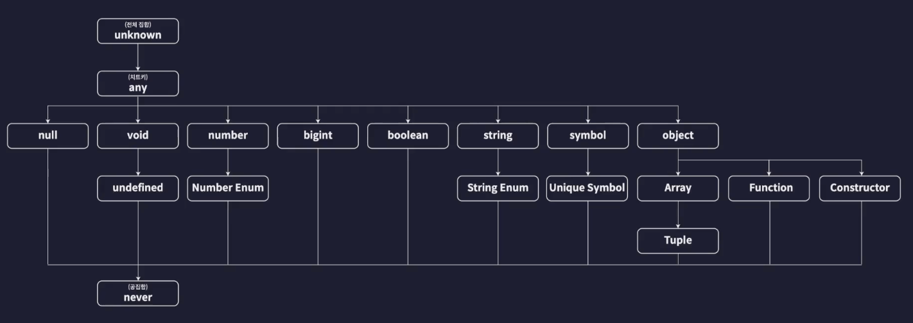

# 2024.02.08 TIL

## TypeScript

### 🚨 tsconfig.json 설정

include 옵션에서
"include": ["src"]: src 디렉토리를 컴파일에 포함
"include": ["src/**/*"]: src 디렉토리와 그 하위의 모든 디렉토리 및 파일을 컴파일에 포함하라는 의미

---

### 🚨 기본 타입


이 그림은 TypeScript가 제공하는 여러 개의 기본 타입들을 계층에 따라 분류한 타입 계층도, 타입 트리이다.

---

### 🚨 원시 타입

원시 타입은 동시에 딱 하나의 값만 저장할 수 있는 타입들을 말한다.

#### 타입 주석(Type Annotation)

변수, 매개변수, 함수 반환값 등에 타입 정보를 명시적으로 지정하는 것을 말한다.

타입 주석은 콜론( : )을 사용하여 변수나 매개변수의 이름 뒤에 타입을 명시한다.

#### ❗️TypeScript에서 제공하는 기본적인 원시 타입 5가지

```ts
// number
let num1: number = 123;
let num2: number = -123;
let num3: number = 0.123;
let num4: number = -0.123;
let num5: number = Infinity;
let num6: number = -Infinity;
let num7: number = NaN;

// string
let str1: string = "hello";
let str2: string = "hello";
let str3: string = `hello`;
let str4: string = `hello ${num1}`;

// boolean
let bool1: boolean = true;
let bool2: boolean = false;

// null
let null1: null = null;

// undefined
let unde1: undefined = undefined;
```

여기서 한가지 생각해 볼 법한 주제가 있다. 보통 JavaScript에서는 numA: number 같은 변수를 하나 만들었다고 하더라도 지금 당장 마땅히 넣을 값이 없을 때는 잠깐 null을 넣어두기도 하는데 TypeScript에서는 이런게 허용되지 않는다. null이라는 값은 null 타입이 별도로 존재하고 number 타입 안에 포함되는 값은 아니기 때문에 허용되지 않는다.

진짜 넣을 값이 없어서 잠깐 null 이라도 넣어야 하는 상황이 존재할 수도 있다.

이럴 때에는 컴파일러 옵션을 조절하면 가능하다.

#### tsconfig.json에서 strictNullChecks 옵션을 false로 지정해주면 된다.

```json
{
  "compilerOptions": {
    "target": "ESNext",
    "module": "ESNext",
    "outDir": "dist",
    "strict": true,
    "strictNullChecks": false,
    "moduleDetection": "force"
  },
  "include": ["src"]
}
```

우리가 개발하고 있는 상황에 따라 변수에 null값을 입시로 넣어야하는 상황이 많다면 strictNullChecks 옵션을 꺼주고 개발할 수도 있다.

### 💡 리터럴 타입

TypeScript의 리터럴 타입은 **특정 값에 더 엄격한 타입을 지정하는 방법**으로, 문자열과 숫자 두 가지 리터럴 타입이 존재한다. 이를 사용하면 **문자열이나 숫자에 정확한 값을 지정할 수 있다**.

```ts
// 리터럴 타입
let numA: 10 | 20 = 10;
numA = 20;
numA = 30; // 에러

let srtA: "hello" = "hello";
```

---

### 🚨배열과 튜플

### 배열

TypeScript에서 배열을 정의하는 방법은 크게 두 가지이다.

1. 타입[]<br>
   이 방법은 배열의 요소 타입 뒤에 []를 붙여서 사용한다.

```ts
let numbers: number[] = [1, 2, 3, 4, 5];

let fruits: string[] = ["apple", "orange", "banana"];
```

2. Array<타입><br>
   이 방법은 Array 제네릭을 사용하여 배열을 정의한다.

```ts
let numbers: Array<number> = [1, 2, 3, 4, 5];
let fruits: Array<string> = ["apple", "orange", "banana"];
```

보통 1번 방식이 2번 방식에 비해 간단하기 때문에 주로 1번 방식을 사용하여 배열을 정의한다.

#### ❗️만약 배열에 들어가는 요소의 타입이 다양하다면?

**A: 유니온 타입을 사용하여 배열을 정의할 수 있다**

유니온(Union) 타입은 | 연산자를 사용하여 정의하는데 두 개 이상의 타입을 하나로 합친 것을 말한다.

```ts
// 배열의 요소가 string 타입이거나 number 타입일 수 있음
let multiArr: (string | number)[] = [1, "hello"];
```

#### ❗️다차원 배열을 정의하고 싶으면?

**A: 배열 타입을 중첩하여 사용하면 된다**

```ts
let matrix: number[][] = [
  [1, 2, 3],
  [4, 5, 6],
  [7, 8, 9],
];
```

3차원 배열이나 그 이상의 차원을 가진 배열도 비슷한 방식으로 정의할 수 있다.

```ts
let threeDimArray: number[][][] = [
  [
    [1, 2],
    [3, 4],
  ],
  [
    [5, 6],
    [7, 8],
  ],
];
```

---

### 튜플

튜플은 JavaScript에는 없고 TypeScript에서만 특별히 제공되는 타입이다.

**튜플이란? 길이와 타입이 고정된 배열을 말한다**

TypeScript에서 튜플(Tuple)은 배열의 한 종류로, 배열의 각 요소가 특정 타입을 가지도록 정의할 수 있는 데이터 타입이다. 이는 코드의 안정성을 높이고 예상치 못한 오류를 방지하는 데 도움이 된다.

```ts
let tuple: [string, number] = ["hello", 42];
```

순서를 바꾼다거나 길이가 다르다면 오류가 생긴다. 튜플은 별도의 자료형이라고 보긴 어렵고 사실은 그냥 배열이다.

튜플은 언제 유용하게 사용할 수 있을까?<br>
배열을 사용할 때 인덱스별로 다른 값을 넣어야 하는데 인덱스의 순서와 위치가 헷갈릴 수 있다. 이럴 때 튜플을 사용하면 쉽게 해결할 수 있다.

---

### 🚨 객체

```ts
// object
let user: object = {
  id: 1,
  name: "이정환",
};

// 오류 발생
// 오류메세지: object 타입의 id property가 없다.
user.id;
```

분명히 user 객체에 id와 name 프로퍼티를 정의를 했는데 왜 없다고 할까?

#### ❗️TypeScript의 object라는 type은 이 값이 객체다 라는 정보 외에는 아무런 정보도 없는 타입이기 때문에 객체에 프로퍼티나 메서드가 어떤게 있는지 알 수 없다.

그러면 어떻게 해야할까?<br>
우리가 원하는건 객체 모양을 정확히 타입으로 딱 만들고 싶은 것이다. 이럴 때는 object 타입을 사용하는 게 아니라 객체 리터럴 타입을 사용해야 한다. 객체 리터럴 타입은 중괄호를 이용해 객체의 타입을 정의하는 방식이다.

```ts
// object
let user: {
  id: number;
  name: string;
} = {
  id: 1,
  name: "이정환",
};

user.id;
```

#### ❗️만약 객체의 한 프로퍼티가 있어도 되고 없어도 되는 프로퍼티라면 어떻게 타입 정의를 해줘야 할까?

```ts
// object
let user: {
  // 이렇게 프로퍼티 뒤에 물음표를 붙이면 있어도 되고 없어도 된다는 뜻이다
  // 이를 선택적 프로퍼티 or optional property 라고 한다
  id?: number;
  name: string;
} = {
  id: 1,
  name: "이정환",
};

user = {
  name: "홍길동",
};
```

#### ❗️프로퍼티의 값을 바꾸지 못하게 하고 싶다면?

프로퍼티 앞에 readonly 라는 키워드를 붙여서 읽기 전용 프로퍼티로 만들어주면 된다.

```ts
let config: {
  readonly apiKey: string;
} = {
  apiKey: "MY API KEY",
};

//에러
config.apiKey = "hacked";
```

---

### 🚨 타입 별칭과 인덱스 시그니처

### 타입 별칭(type alias)

```ts
// 타입 별칭
let user: {
  id: number;
  name: string;
  nickname: string;
  birth: string;
  bio: string;
  location: string;
} = {
  id: 1,
  name: "이정환",
  nickname: "winterlood",
  birth: "1997.01.07",
  bio: "안녕하세요",
  location: "부천시",
};

// 타입 별칭
let user2: {
  id: number;
  name: string;
  nickname: string;
  birth: string;
  bio: string;
  location: string;
} = {
  id: 2,
  name: "이정환",
  nickname: "winterlood",
  birth: "1997.01.07",
  bio: "안녕하세요",
  location: "부천시",
};
```

이 코드들은 바람직하지 않다 아무리 타입을 정의하는 코드라도 중복이 발생하는건 좋을 리 없다. 이럴 때에는 타입을 마치 변수처럼 정의해서 사용할 수 있는 타입 별칭 이라는 것을 사용하면 좋다.

**타입 별칭을 만들면 코드의 중복을 제거할 수 있다.**

#### ❗️type 키워드를 사용하여 타입 별칭을 정의할 수 있다

```ts
// 타입 별칭

type User = {
  id: number;
  name: string;
  nickname: string;
  birth: string;
  bio: string;
  location: string;
};

let user: User = {
  id: 1,
  name: "이정환",
  nickname: "winterlood",
  birth: "1997.01.07",
  bio: "안녕하세요",
  location: "부천시",
};

let user2: User = {
  id: 2,
  name: "이정환",
  nickname: "winterlood",
  birth: "1997.01.07",
  bio: "안녕하세요",
  location: "부천시",
};
```

#### ⛔️주의사항

#### 타입별칭을 사용할 때 타입 별칭은 마치 우리가 let 키워드로 선언하는 변수처럼 동일한 스코프에 같은 이름으로 타입 별칭을 선언하면 오류가 발생한다

---

### 🚨 인덱스 시그니처(객체 타입의 정의를 더 유연하게)

```ts
// 인덱스 시그니처
type CountryCodes = {
  Korea: string;
  UnitedState: string;
  UnitedKingdom: string;
};
let countryCodes = {
  Korea: "ko",
  UnitedState: "us",
  UnitedKingdom: "uk",
};
```

현재 CountryCodes에는 세개의 나라밖에 없지만 만약 여기에 200개에 가까운 모든 국가들의 코드를 다 넣어야 한다면 타입 별칭에도 모든 프로퍼티의 키를 다 넣어줘야한다. 끔찍하다..

이럴 때는 객체의 프로퍼티와 밸류에 타입 관련된 규칙을 보면 된다. 프로퍼티의 키들을 한번 보면 키는 전부 다 스트링 타입이다. 밸류도 다 국가 코드 문자열이기 때문에 다 스트링 타입이다.

#### ❗️인덱스 시그니처는 key와 value의 규칙을 기준으로 객체의 type을 정의할 수 있는 문법이다.

```ts
// 인덱스 시그니처
type CountryCodes = {
  [country: string]: string;
};
let countryCodes: CountryCodes = {
  Korea: "ko",
  UnitedState: "us",
  UnitedKingdom: "uk",
};
```

```ts
type CountryNumberCodes = {
  [country: string]: number;
};
let countryNumberCodes: CountryNumberCodes = {
  Korea: 410,
  UnitedState: 840,
  UnitedKingdom: 826,
};
```

```ts
type CountryNumberCodes = {
  [country: string]: number;
};
let countryNumberCodes: CountryNumberCodes = {};
```

위처럼 코드를 작성해도 괜찮다. 오류가 발생하지 않는 이유는 인덱스 시그니처 타입은 해당 규칙을 위반하지만 않으면 모든 객체를 허용하는 타입이다.

---

### 🚨 Enum(열거형) 타입

role이라는 역할이 있고 0번이 관리자, 1번이 일반유저, 2번이 게스트라고 해보자

```ts
// enum 타입
// 여러가지 값들에 각각 이름을 부여해 열거해두고 사용하는 타입
const user1 = {
  name: "이정환",
  role: 0,
};
const user2 = {
  name: "홍길동",
  role: 1,
};
const user3 = {
  name: "아무개",
  role: 2,
};
```

근데 시간이 지나고 개발하다보면 0번이 관리자인지 1번이 관리자인지 까먹을 수도 있다.
이럴 때 실수를 방지하기 위해 TypeScript enum 타입이 생긴 것이다.

```ts
// 숫자 할당을 제거해도 차례대로 0, 1, 2가 할당된다
// 숫자 할당을 처음에 10으로 잡으면 나머지는 +1씩 할당이 된다
enum Role {
  ADMIN = 0,
  USER = 1,
  GUEST = 2,
}

const user1 = {
  name: "이정환",
  role: Role.ADMIN,
};
const user2 = {
  name: "홍길동",
  role: Role.USER,
};
const user3 = {
  name: "아무개",
  role: Role.GUEST,
};
console.log(user1, user2, user3);
```

이렇게 enum을 활용하면 숫자로 역할 같은 값들을 분류할 경우에 프로그래머들이 헷갈리지 않도록 잘 분류할 수 있도록 해준다.

위처럼 한 enum을 숫자형 enum이라고 한다.

#### 이런 숫자형 enum 말고도 enum 멤버에 문자열 값을 할당할 수도 있다.

```ts
enum Language {
  korean = "ko",
  english = "en",
}

const user1 = {
  name: "이정환",
  role: Role.ADMIN,
  language: Language.korean,
};
```

#### enum은 특이하게도 컴파일 결과 사라지지 않는다

tsc로 컴파일한 결과인 js파일을 살펴보면

```js
var Role;
(function (Role) {
  Role[(Role["ADMIN"] = 0)] = "ADMIN";
  Role[(Role["USER"] = 1)] = "USER";
  Role[(Role["GUEST"] = 2)] = "GUEST";
})(Role || (Role = {}));
var Language;
(function (Language) {
  Language["korean"] = "ko";
  Language["english"] = "en";
})(Language || (Language = {}));
```

이런 코드가 생성되는걸 확인할 수 있다.

---

### 🚨 Any 타입과 Unknown 타입

### any 타입

```ts
let anyVar = 10;
// 오류발생. TypeScript는 변수의 타입을 지정하지 않아도 기본적으로 초기화하는 값을 기준으로 변수의 type을 자동 추론하기 때문에..
anyVar = "hello";
```

```ts
let anyVar: any = 10;
anyVar = "hello";
```

TypeScript에서 any는 가장 유연한 타입이다. any 타입의 변수는 어떤 종류의 값도 가질 수 있으며, 타입 체크를 통과한다.

any 타입은 TypeScript의 타입 체크를 회피하는 특별한 경우에 사용된다. 예를들어 기존 JavaScript의 코드를 TypeScript로 마이그레이션하거나, 타입 정보가 없는 라이브러리를 사용하는 경우에 any 타입이 필요할 수 있다.

### unknown

TypeScript에서 unknown 타입은 가능한 모든 타입의 값을 나타내는 타입이다. any 타입과 비슷하게 보일 수 있지만, unknown은 더 안전한 타입이다.

unknown 타입의 변수에는 모든 종류의 값이 할당될 수 있다.

```ts
let unknownVar: unknown;
unknownVar = "";
unknownVar = 1;
unknownVar = () => {};
```

만약에 우리가 변수에 어떤 타입이 들어올지 모르겠다고 하는 경우에는 Any를 쓰던 Unknown을 쓰던 다 괜찮다. 하지만 Unknown은 any 타입과는 다르게 모든 값을 저장할 수는 있지만 반대로는 안된다.

```ts
let value: unknown;
let value1: unknown = value; // OK
let value2: any = value; // OK
let value3: boolean = value; // Error
let value4: number = value; // Error
let value5: string = value; // Error
let value6: object = value; // Error
let value7: any[] = value; // Error
```

따라서 unknown 타입의 변수를 직접적으로 사용하려면 먼저 타입을 확인해야한다. 이를 type 정제 또는 type 좁히기라고 한다.

```ts
let value: unknown;

if (typeof value === "string") {
  console.log(value.toLocaleLowerCase()); // OK
}

if (typeof value === "number") {
  console.log(value.toFixed(2)); // OK
}
```

따라서 unknown은 any 보다 안전한 대안으로, 가능한 한 any 대신 unknown을 사용하는 것이 TypeScript의 타입 안정성을 높이는데 도움이 된다.

---

### 🚨 Void 타입과 Never 타입

### void

TypeScript에서 void는 특별한 타입으로, 함수가 아무런 값을 반환하지 않을 때 주로 사용된다.

```ts
function logMessage(message: string): void {
  console.log(message);
}
```

또한 void 타입의 변수는 undefined 또는 null만 할당할 수 있다

```ts
let unusable: void = undefined;
```

그냥 일반적으로 void 타입의 변수를 사용하는 것은 유용하지 않다. void 타입은 주로 함수의 반환 타입으로 사용되며, 함수가 명시적으로 값을 반환하지 않을 때 사용된다.

#### 근데 우리는 아무것도 없음을 나타내는 값이 undefined이나 null이라고 배웠다. 그런데 굳이 이렇게 반환값이 없는 함수의 반환값 타입을 정의할 때 void 타입까지 추가로 만드는 이유가 뭘까?

A: 그 이유는 만약에 함수의 반환값을 undefined로 설정을 하면 오류가 발생하기 때문이다. 이렇게 정의하면 진짜 이 함수한테 undefined라는 값을 반환하게 만들어야 한다.

반환값 타입을 null로 해도 안된다. 진짜 null을 반환해야한다.

따라서 진짜 null이나 undefined를 반환하기 위해 return문을 또 써줘야 하기 떄문에 리턴문을 사용하고 싶지 않은 함수의 반환값 타입으로는 void를 사용한다.

### never

never는 특별한 타입으로, 함수가 절대로 반환되지 않을 때 사용된다. 예를들어 함수가 항상 오류를 던지거나, 무한 루프에 빠지는 경우에 never 타입을 사용할 수 있다.

```ts
function throwError(message: string): never {
  throw new Error(message);
}

function infiniteLoop(): never {
  while (true) {}
}
```
