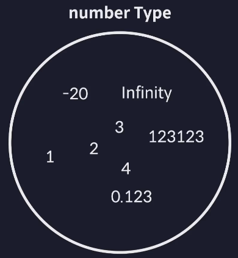
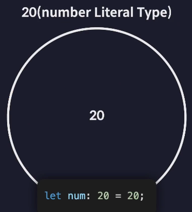
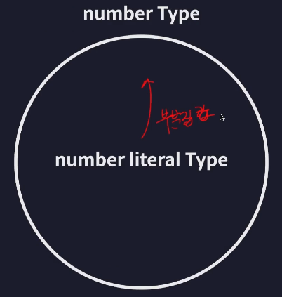
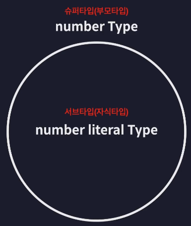
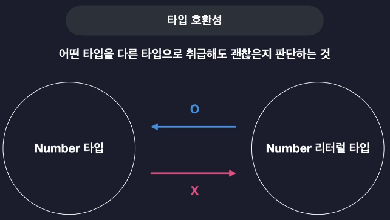
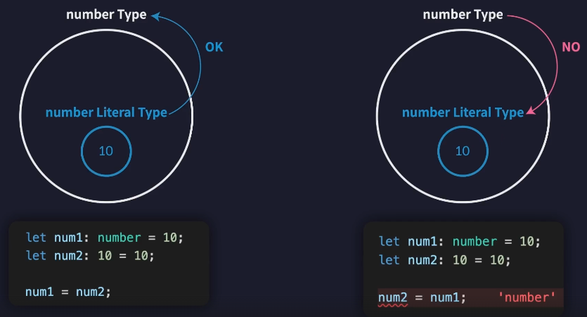
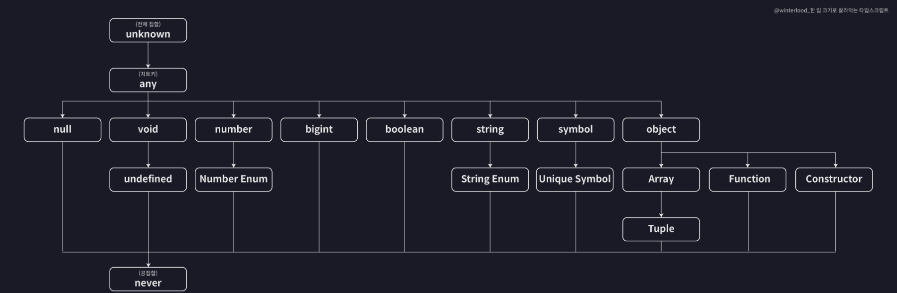

# 2024.02.09 TIL

## TypeScript

### 🚨 TypeScript 이해하기

TypeScript를 이해한다는 것은?

1. 어떤 기준으로 타입을 정의하는지
2. 어떤 기준으로 타입간의 관계를 정의하는지
3. 어떤 기준으로 타입의 오류를 검사하는지

이런 타입스크립트의 구체적인 원리와 동작 방식을 살펴보는 것이다.

---

### 🚨 타입은 집합이다

#### ❗️결론부터 말하면 TypeScript가 말하는 타입은 집합이다.



위의 사진처럼 -20, 1, 2, 0.123 같은 여러가지 숫자들을 모아놓은 집합을 TypeScript에서는 number Typed이라고 이름을 붙여서 부른다.

결론적으로 동일한 속성과 특징들을 갖는 여러 개의 값들을 모아둔 집합이라고 이해할 수 있다.

이번에는 넘버 타입이 아닌 넘버 리터럴 타입에 대해서도 생각해보자



리터럴 타입을 변수의 타입으로 정의를 하면 이제 이 변수는 20이라는 값 밖에는 담을 수 없다.
그러면 이 20이라는 넘버 리터럴 타입을 집합으로 생각해보면 딱 20이라는 값 하나만 포함하는 아주 작은 단위의 집합이라고 생각할 수 있다.



그런데 넘버 리터럴 타입이라는 집합 안에 있는 20이라는 값은 number type에도 속하는 값이다. 숫자니까. 따라서 이런 20도 모두 number 타입의 **부분집합**이다.



#### 이렇게 값의 집합인 타입들은 서로 포함하거나 포함되는 관계를 갖는다.

이렇듯 TypeScript가 말하는 타입이라는건 결국 값들을 포함하고 있는 집합이며 그렇기 때문에 서로 타입들끼리 부모와 자식 관계를 맺으며 결국 모든 타입들의 관계를 놓고 보면 이런 타입 계층도로 만들어서 표현할 수 있다.

---

### 🚨 타입 호환성



TypeScript의 타입들이 서로 집합이고 계층을 이룬다는 정보를 알고 있으면 이런 타입 간의 호환성이라는 것에 대해 이해할 수 있다.

```ts
let num1: number = 10;
let num2: 10 = 10;

num1 = num2;
```

이 코드가 가능한 이유는 넘버 리터럴이 넘버 타입에도 다 포함되는 값이니까 호환이 되기 때문이다. 그런데 반대로는 안된다.

> num2= num1 // 오류

이렇게 더 큰 타입의 값을 더 작은 타입의 변수에 할당하는것은 안된다



---

### 🚨 타입 계층도와 함께 기본타입 살펴보기



---

### ❗️unknown 타입

TypeScript에 존재하는 많은 모든 타입들의 슈퍼 타입이다. 집합으로 이야기해보자면 unknown 타입이라는 집합 안에 많은 타입들이 다 포함된다라고 볼 수 있다. 따라서 전체 집합이다.

```ts
// unknown 타입

function unknownExam() {
  // up캐스팅
  let a: unknown = 1;
  let b: unknown = "hello";
  let c: unknown = true;
  let d: unknown = null;
  let e: unknown = undefined;

  let unknownVar: unknown;
  // down 캐스팅
  let num: number = unknownVar;
  let str: string = unknownVar;
  let bool: boolean = unknownVar;
}
```

number 타입의 변수에 unknown 값을 넣겠다는건 number 타입에 unknwon 타입을 다운캐스팅 시키겠다는 뜻이다. 안된다.

---

### ❗️never 타입

never 타입을 타입 계층도에서 보면 가장 아래에 위치해 있다.

그래서 네버타입은 모든 타입의 서브 타입이다.(모든 집합의 부분 집합(공집합))

```ts
// never 타입
function neverExam() {
  function neverFunc(): never {
    while (true) {}
  }
  // never 타입은 모든 타입의 서브 타입이기 때문에 가능
  let num: number = neverFunc();
  let str: string = neverFunc();
  let bool: boolean = neverFunc();
}

// 다운캐스팅은 안되므로 불가능
let never1: never = 10;
let never2: never = "string";
let never3: never = true;
```

never 타입은 어떤 값도 저장되어서는 안되는 변수의 타입으로 활용하면 아주 좋다

---

### ❗️void 타입

리턴문 자체가 없는 함수에 반환값 타입을 명시하는데 사용된다.

모든 타입의 슈퍼 타입인 unknown이나 모든 타입의 서브 타입인 never와는 다르게 중간에 있다. 그런데 한가지 주의할 점은 undefined 타입의 super 타입이라는 것이다.

```ts
// void 타입
function voidExam() {
  function voidFunc(): void {
    console.log("hi");
  }
  // 가능
  let voidVar: void = undefined;
}
```

---

### ❗️any 타입

#### 타입 계층도를 다 무시하는 치트키 타입

타입 계층도 상에는 unknown 타입의 서브 타입이다. 결론부터 말하면 이 any 타입은 치트키 타입이다. 그래서 any 타입은 타입 계층도를 완벽히 무시한다.

any타입은 모든 타입의 super 타입에 위치하기도 하고 반대로 any 탕비은 모든 타입의 서브 타입으로도 위치하기도 한다. **never만 빼고**

---

### 🚨 객체 타입의 호환성

```ts
// 객체 타입의 호환성
// 어떤 객체 타입을 다른 객체 타입으로 취급해도 괜찮은가?

type Animal = {
  name: string;
  color: string;
};

type Dog = {
  name: string;
  color: string;
  breed: string;
};

let animal: Animal = {
  name: "기린",
  color: "yellow",
};

let dog: Dog = {
  name: "돌돌이",
  color: "brown",
  breed: "진도",
};
// animal 타입이 dog 타입의 슈퍼타입, dog타입은 animal 타입의 서브타입
animal = dog;
// 오류 발생
dog = animal;
```

이렇듯 객체 타입들도 기본 탕비들처럼 서로 슈퍼 서브 타입 관계를 갖는다.

어떤 기준으로 이런 관계를 가지냐면 객체타입들은 프로퍼티를 기준으로 이런 관계를 가진다.

객체의 타입을 정의하는 방법을 살펴볼 때 TypeScript는 프로퍼티를 기준으로 타입을 정의하는 **구조적 타입 시스템**을 따른다.

```ts
type Book = {
  name: string;
  price: number;
};
type ProgrammingBook = {
  name: string;
  price: number;
  skill: string;
};

let book: Book;
let programmingBook: ProgrammingBook = {
  name: "한 입 크기로 잘라먹는 리액트",
  price: 33000,
  skill: "reactjs",
};

book = programmingBook;

// 오류발생
let book2: Book = {
  name: "한 입 크기로 잘라먹는 리액트",
  price: 33000,
  skill: "reactjs",
};
```

Book 타입에 programmingBook이라는 서브 타입을 넣는건 업캐스팅이니까 가능하다고 했는데 book2를 초기화할 때 프로그래밍 Book 타입의 객체를 넣으려고 하니까 이건 안된다.

이건 왜 그러냐면 **초과 프로퍼티 검사라는 TypeScript의 특수한 기능**이 발동돼서 그렇다.

초과 프로퍼티 검사라는건 변수를 초기화할 때 초기화하는 값으로 객체 리터럴을 사용하면 발동하는 검사인데, 실제 타입에는 정의해놓지 않은 프로퍼티를 작성하면 안되도록 막는 검사다.

그래서 객체 타입의 변수를 초기화할 때는 **객체 리터럴**을 사용할거면 객체 타입에 정의된 프로퍼티만 넣을 수 있도록 해야한다.

결론: 객체 변수를 초기화하거나 매개변수에 전달할 때는 객체 리터럴을 사용하려면 반드시 정의된 프로퍼티만 사용해야 한다.

---

### 🚨 대수 타입

#### 대수 타입(Algebraic type)은 여러 개의 타입을 합성해서 만드는 타입을 말한다.

#### 기본적인 타입 외에도 합집합, 교집합을 활용하여 Union, Intersection 타입이 생성 가능하다.

### ❗️합집합 타입 (Union type)

```ts
// 합집합 - Union 타입
let a: string | number | boolean;
a = 1;
a = "hello";

let arr: (number | string | boolean)[] = [1, "hello", true];
```

union 타입을 만들 때 | 기호를 이용해서 추가할 수 있는 타입의 개수는 무한개이다.

```ts
type Dog = {
  name: string;
  color: string;
};
type Person = {
  name: string;
  language: string;
};
type Union1 = Dog | Person;

let union1: Union1 = {
  name: "",
  color: "",
};
let union2: Union1 = {
  name: "",
  language: "",
};
let union3: Union1 = {
  name: "",
  color: "",
  language: "",
};
// 오류 발생
let union4: Union1 = {
  name: "",
};
```

union 1,2,3는 Dog와 Person을 벤다이어그램으로 그려봤을 때 합집합 범주 안에 다 들어간다.

그런데 union4는 Dog에도 Person에도 끼지 못한다. 그니까 합집합 범주 밖에 있는 얘 이므로 오류 발생

### ❗️교집합 타입 (Intersection type)

```ts
type Dog = {
  name: string;
  color: string;
};
type Person = {
  name: string;
  language: string;
};

type Intersection = Dog & Person;

let intersection: Intersection = {
  name: "",
  color: "",
  language: "",
};
```

#### 교집합 타입은 여러 타입이 공통적으로 가지고 있는 속성뿐만 아니라 각 타입이 가지고 있는 모든 속성을 합친 새로운 타입을 만들어낸다.

🛎️ 따라서 name 뿐만 아니라 color, language의 프로퍼티까지 함께 가지고 있어야 한다.

---

### 🚨 타입 추론(Type Inference)

#### 타입 추론은 코드를 작성하는 동안 컴파일러가 자동으로 변수나 표현식의 타입을 결정하는 기능을 말한다. 이는 개발자가 모든 변수에 명시적으로 타입을 지정하지 않아도 타입스크립트 컴파일러가 코드를 분석하여 적절한 타입을 추론하게 된다.

타입추론을 잘 이용하면 굳이 타입을 일일이 변수에 정의하지 않아도 되어 타이핑 할 양이 줄어들기 때문에 코드가 간결해지고 생산성도 올라간다

TypeScript가 정확히 어떤 상황에 자동으로 type을 잘 추론하는지 또 어떤 원리로 type을 추론하는 것인지 살펴보자!

#### ❗️변수의 초기값

```ts
// 일반적으로 변수를 선언하고 초기화하는 상황에서 알아서 자동으로 타입을 잘 추론함
let a = 10;
let b = "hello";
let c = {
  id: 1,
  name: "이정환",
  profile: {
    nickname: "winterlood",
  },
  urls: ["https://winterlood.com"],
};
let { id, name, profile } = c;
let [one, two, three] = [1, "hello", true];
```

TypeScript는 초기값을 기준으로 변수를 추론하기 때문에 변수에 복잡한 객체를 저장해도 타입을 잘 추론하는 것을 볼 수 있다.

```ts
// 함수의 반환값 타입도 자동으로 잘 추론해준다
function func() {
  return "hello";
}
```

함수의 반환값 타입을 추론할 때는 초기화하는 값이 아닌 return문 다음에 오는 반환값으로 추론한다.

TypeScript에서 육안으로 코드를 봤을 때 어떤 변수의 타입을 추론할 정보가 있으면 추론이 되는 것이고 추론할 정보가 없으면 추론이 안된다.

#### ❗️이제 단순한 type 추론이 아닌 우리의 생각과는 조금 다르게 추론되는 상황도 살펴보자

```ts
// 변수를 선언하고 초기값을 지정해주지 않으면 암묵적인 any 타입으로 추론된다.
let d;
d = 10;
d.toFixed();

d = "hello";
d.toUpperCase();
```

이런 경우네는 변수에 들어가는 값에 따라서 any 타입이 계속해서 진화하게된다.

#### 암묵적인 any 타입은 명시적으로 any 타입을 지정한것과는 동작이 다르다.

명시적으로 지정하면 진화없이 계속 any 타입이다.

```ts
const a = 10;
const str = "hello";
```

const 키워드 변수를 초기화 시켜주면 let과 달리 타입이 그냥 그 값을 갖는 number literal로 추론이 된다. 왜냐하면 const는 어처피 상수이기 때문에 10이라는 값 외에는 담을 수 없기 때문이다.

```ts
let arr = [1, "string"];
```

여러가지 타입의 요소를 저장하는 배열의 타입은 스트링과 넘버의 유니온 타입을 갖는 배열 타입으로 추론된다. 이것도 1이라는 값의 type과 string 타입도 만족해야하므로 union 타입으로 자동으로 추론해준다.

#### 초기값을 배열처럼 다양한 타입을 담을 수 있는 값으로 초기화를 해주면 타입 추론이 될 때 최적의 공통타입을 추론해준다.

---

### 🚨 타입 단언(type assertion)

```ts
type Person = {
  name: string;
  age: number;
};

let person: Person = {};
person.name = "이정환";
person.age = 27;
```

이렇게 빈 객체로만 변수의 값을 초기화 해놓고 나중에 person.name과 age의 프로퍼티 값을 초기화해주고 싶으면 어떻게 해야할까?

```ts
type Person = {
  name: string;
  age: number;
};

let person = {};
person.name = "이정환";
person.age = 27;
```

type 정의를 해놔서 문제가 되는것 같아서 Person 타입을 person 변수에서 빼버리면 이번에는 person.name과 person.age 줄에서 에러가 난다.

그 이유는 person 변수의 타입이 초기화 값인 빈 객체를 기준값으로 추론되어버리기 때문에 person 변수의 타입이 빈 객체가 되어버리고 name과 age 프로퍼티가 없다는 경고가 나오게 된다.

이렇게 우리의 의도와 다르게 변수의 타입이 추론되어버려져서 원하는 기능을 만들기 어려울 때 초기화 값의 타입을 단언해준다.

TypeScript의 타입 단언은 개발자가 해당 타입에 대해 확신이 있을 때 사용하는 타입 지정 방식인데 이는 TypeScript를 컴파일 할 때 특별히 타입을 체크하지 않고 데이터의 구조도 신경 쓰지 않는다.

#### 타입 단언은 as라는 키워드를 사용하여 수행할 수 있다.

```ts
type Person = {
  name: string;
  age: number;
};

let person = {} as Person;
person.name = "이정환";
person.age = 27;
```

타입 단언은 주의해서 사용해야 한다. TypeScript의 타입 체크 기능을 우회하기 때문에 잘못하면 실행 시점에서 예상치 못한 에러를 발생시킬 수 있다.

---

### ❗️타입 단언의 조건

타입 단언에도 조건이 있다.

값 as 타입 형식의 단언식을 A as B로 표현했을 때 아래의 두가지 조건중 한가지를 반드시 만족해야 한다.

- A가 B의 슈퍼타입이다
- A가 B의 서브타입이다

```ts
type Dog = {
  name: string;
  color: string;
};

let dog = {
  name: "돌돌이",
  color: "brown",
  breed: "진도",
} as Dog;
```

```ts
let num = 10 as never;
let num2 = 10 as unknown;
// 오류 발생
let num3 = 10 as string;
```

---

### ❗️as const 단언

TypeScript에서 as const는 특별한 종류의 타입 단언으로 객체나 배열을 불변하게 만들거나 리터럴 값을 그 값 자체의 타입으로 추론하게 만든다.

as const를 사용하면 TypeScript는 객체의 모든 필드를 readonly로 만들고, 배열 또한 readonly로 만든다. 이는 객체나 배열의 값이 변경되는 것을 방지하며 타입 추론을 더 정확하게 이루어지게 한다.

```ts
let array = [1, 2, 3] as const;

let cat = {
  name: "야옹이",
  color: "yellow",
} as const;
// 프로퍼티값 수정 불가능
cat.name = "";
```

그래서 이런 const 단언을 이용하면 프로퍼티가 굉장히 많은 객체를 초기화할 때도 일일이 타입을 정의해서 readonly를 부일 필요가 없이 뒤에 as const 단언을 해주면 모든 프로퍼티를 readonly로 만들 수 있다.

---

### ❗️Non Null 단언

Non Null 단언은 지금까지 살펴본 값 as 타입 형태를 따르지 않는 단언이다. 값 뒤에 느낌표(!) 를 붙여주면 이 값이 undefined이거나 null이 아닐것으로 단언할 수 있다.

```ts
type Post = {
  title: string;
  author?: string;
};

let post: Post = {
  title: "게시글1",
};

const len: number = post.author!.length;
```

#### 타입 단언은 실제 값을 그 타입으로 바꾸는 업캐스팅, 다운캐스팅이 아니다. 그냥 TypeScript 컴파일러의 눈을 잠깐 가리는, 믿도록 만드는 것이다.

---

### 🚨 타입 좁히기

조건문 등을 이용해 넓은 타입에서 좁은 타입으로 타입을 상황에 따라 좁히는 방법을 말한다.

다음과 같은 함수가 하나 있다고 가정해보자

```ts
function func(value: number | string) {}
```

이때 매개변수 value의 타입이 number 또는 string이므로 함수 내부에서 다음과 같이 value가 number 타입이거나 string 타입일 것으로 기대하고 메서드를 사용하려고 하면 오류가 발생한다.

```ts
function func(value: number | string) {
  value.toFixed(); // 오류
  value.toUpperCase(); // 오류
}
```

만약 value가 number 타입일거라고 기대하고 toFixed() 메서드를 사용하고 싶으면 다음과 같이 조건문을 이용해 value 타입이 number 타입임을 보장해줘야 한다.

```ts
function func(value: number | string) {
  if (typeof value === "number") {
    console.log(value.toFixed());
  }
}
```

또 똑같이 value가 string 타입일거라고 기대하고 toUpperCase 메서드를 사용하고 싶으면 다음과 같이 조건문을 이용해 value의 타입이 string 타입임을 보장해 주어야 한다.

```ts
function func(value: number | string) {
  if (typeof value === "number") {
    console.log(value.toFixed());
  } else if (typeof value === "string") {
    console.log(value.toUpperCase());
  }
}
```

이렇게 조건문을 이용해 조건문 내부에서 변수가 특정 타입임을 보장하면 해당 조건문 내부에서는 변수의 타입이 보장된 타입으로 좁혀진다.

따라서 첫번째 조건문 내부에서는 value의 타입이 number 타입이 되고, 두 번째 조건문 내부에서는 value의 타입이 string 타입이 된다. 이를 타입 좁히기 라고 표현한다.

#### ❗️if(typeof === ... )처럼 조건문과 함께 사용해 타입을 좁히는 이런 표현들을 "타입 가드"라고 부른다. 정리하면 타입 가드를 이용해 타입을 좁혀 사용할 수 있다.

---

### ❗️instanceof 타입가드

instanceof를 이용하면 내장 클래스 타입을 보장할 수 있는 타입가드를 만들 수 있다.

```ts
function func(value: number | string | Date | null) {
  if (typeof value === "number") {
    console.log(value.toFixed());
  } else if (typeof value === "string") {
    console.log(value.toUpperCase());
  } else if (value instanceof Date) {
    console.log(value.getTime());
  }
}
```

instanceof는 내장 클래스 또는 직접 만든 클래스에만 사용이 가능한 연산이다. 따라서 우리가 직접 만든 타입과 함께 사용할 수 없다.

---

### ❗️in 타입 가드

우리가 직접 만든 타입과 함께 사용하려면 다음과 같이 in 연산자를 이용해야 한다.

```ts
type Person = {
  name: string;
  age: number;
};

function func(value: number | string | Date | null | Person) {
  if (typeof value === "number") {
    console.log(value.toFixed());
  } else if (typeof value === "string") {
    console.log(value.toUpperCase());
  } else if (value instanceof Date) {
    console.log(value.getTime());
  } else if (value && "age" in value) {
    console.log(`${value.name}은 ${value.age}살 입니다`);
  }
}
```

---

### 🚨 서로소 유니온 타입

서로소: 여러 개의 수들 사이에 1 이외의 공약수가 없음을 이르는 말

서로소 유니온 타입은 교집합이 없는 타입들 즉, 서로소 관계에 있는 타입들을 모아 만든 유니온 타입을 말한다.

다음과 같은 간단한 회원관리 프로그램이 있다고 가정해보자

```ts
type Admin = {
  name: string;
  kickCount: number;
};

type Member = {
  name: string;
  point: number;
};

type Guest = {
  name: string;
  visitCount: number;
};

type User = Admin | Member | Guest;

function login(user: User) {
  if ("kickCount" in user) {
    // Admin
    console.log(`${user.name}님 현재까지 ${user.kickCount}명 추방했습니다`);
  } else if ("point" in user) {
    // Member
    console.log(`${user.name}님 현재까지 ${user.point}모았습니다`);
  } else {
    // Guest
    console.log(`${user.name}님 현재까지 ${user.visitCount}번 오셨습니다`);
  }
}
```

회원의 역할 분류에 따라 3개의 타입을 각각 정의했고 이 3개의 타입의 합집합 타입인 User 타입도 만들어준다.

login 함수는 User 타입의 매개변수 user를 받아 회원의 역할에 따라 각각 다른 기능을 수행하도록 한다.

하지만 이렇게 코드를 작성하면 조건식만 보고 어떤 타입으로 좁혀지는지 파악하기 어렵다. 결과적으로 직관적이지 못한 코드다.

이럴 때에는 다음과 같이 각 타입에 태그 프로퍼티를 추가 정의해주면 된다.

```ts
type Admin = {
  tag: "ADMIN";
  name: string;
  kickCount: number;
};

type Member = {
  tag: "MEMBER";
  name: string;
  point: number;
};

type Guest = {
  tag: "GUEST";
  name: string;
  visitCount: number;
};

(...)
```

tag 프로퍼티를 리터럴 타입으로 정의하면 각각의 타입은 프로퍼티의 값이 서로 다르므로 서로 겹치는 부분이 없으므로 서로소 타입이 된다.

이렇게 서로 겹치는 부분이 없는 타입들로만 만든 유니온 타입을 서로소 유니온 타입이라고 하며, 이는 각 타입을 명확하게 구분할 수 있게 해주며 타입 가드를 사용하여 안전하게 타입을 체크할 수 있게 한다.

그럼 이제 login 함수의 타입 가드를 다음과 같이 더 직관적으로 작성할 수 있게 된다.

```ts
(...)

function login(user: User) {
  if (user.tag === "ADMIN") {
    console.log(`${user.name}님 현재까지 ${user.kickCount}명 추방했습니다`);
  } else if (user.tag === "MEMBER") {
    console.log(`${user.name}님 현재까지 ${user.point}모았습니다`);
  } else {
    console.log(`${user.name}님 현재까지 ${user.visitCount}번 오셨습니다`);
  }
}
```

또는 switch를 이용해 더 직관적으로 변경할 수도 있다.

```ts
function login(user: User) {
  switch (user.tag) {
    case "ADMIN": {
      console.log(`${user.name}님 현재까지 ${user.kickCount}명 추방했습니다`);
      break;
    }
    case "MEMBER": {
      console.log(`${user.name}님 현재까지 ${user.point}모았습니다`);
      break;
    }
    case "GUEST": {
      console.log(`${user.name}님 현재까지 ${user.visitCount}번 오셨습니다`);
      break;
    }
  }
}
```
