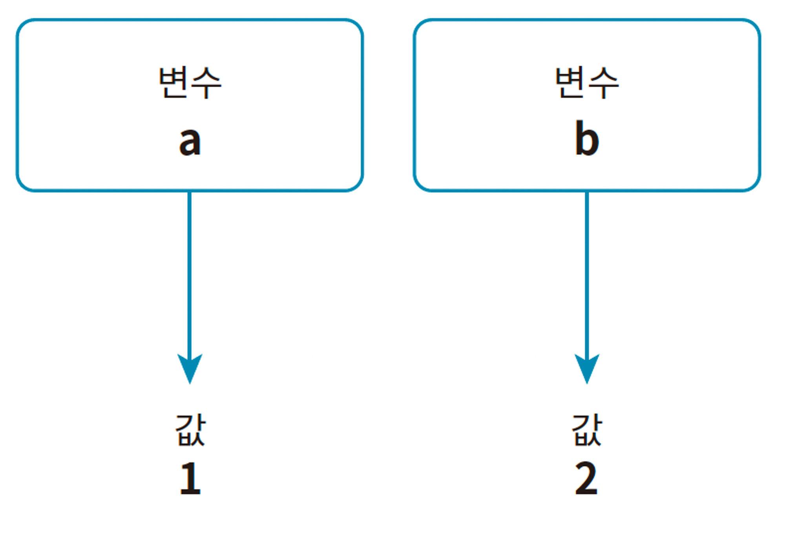
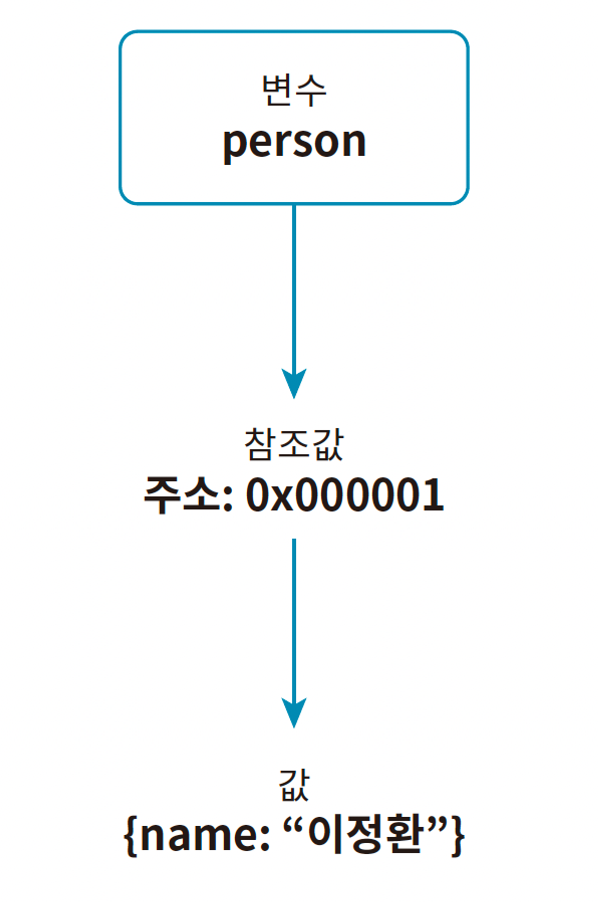
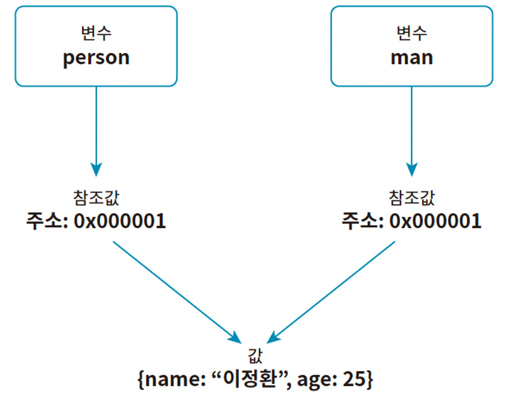
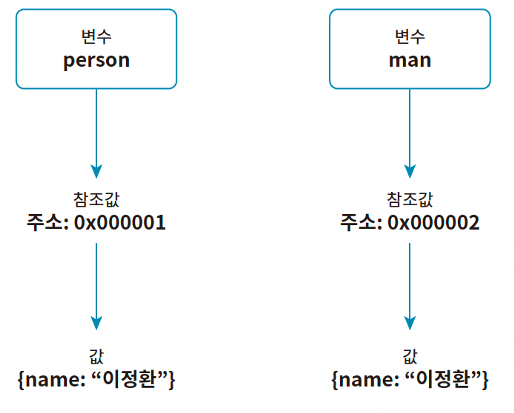

# 2024.02.10 TIL

## JavaScript

### 🚨 객체 자료형 자세히 살펴보기

자바스크립트에서 원시 자료형을 제외한 모든 자료형은 객체 자료형이다. 배열과 함수는 객체 자료형이다.

### ❗️배열과 함수가 객체인 이유

자바스크립트의 원시 자료형을 제외한 모든 자료형은 객체 자료형이다. 따라서 논리적으로 배열과 함수 역시 객체 자료형이다.

배열은 인덱스로 연속적인 값을 저장하는 데 특화된 자료형이다. 자바스크립트의 배열은 객체 자료형에 몇 가지 기능을 추가해 다른 언어의 배열처럼 동작하는 **특수한 객체**라고 할 수 있다. 따라서 자바스크립트의 배열에는 일반 객체에 있는 프로퍼티와 메서드가 있다.

#### length 프로퍼티

```js
const arr1 = [1, 2, 3];
console.log(arr1.length); // ① 3

const arr2 = [1, 2, 3, 4];
console.log(arr2.length); // ② 4
```

또한 배열은 객체이므로 배열 조작을 위한 메서드가 있다.

```js
const arr = [1, 2, 3];

arr.push(4);
console.log(arr); // [1, 2, 3, 4]
```

push 메서드는 배열 마지막 요소 뒤에 값을 추가하는 메서드다.

이렇듯 자바스크립트의 배열은 객체여서 이를 쉽게 다루도록 도와주는 유용한 프로퍼티와 메서드가 여럿 있다.

자바스크립트의 함수 또한 객체다. 그리고 함수는 값으로 취급된다. 이러한 특징 때문에 함수를 값으로 저장하는 함수 표현식이 가능하고, 다른 함수에 인수로 전달할 수 있다.

자바스크립트의 배열에 길이를 저장하는 length 프로퍼티가 있듯이, 함수에도 함수의 이름을 저장하는 name 프로퍼티가 있다.

```js
function myFunction() {
  console.log("hi");
}

console.log(myFunction.name); // myFunction
```

함수의 name 프로퍼티는 해당 함수의 이름을 저장한다.

---

### 🚨 객체와 참조

원시 자료형은 하나의 값을 저장하지만 함수와 배열 같은 객체 자료형은 여러 개의 값을 저장한다. 원시 자료형은 값을 크기가 일정한 공간에 저장한다. 그러나 객체 자료형은 값이 동적으로 늘어나거나 줄어들기 때문에 일정한 크기의 공간에 저장할 수 없다.

객체 자료형은 값의 크기가 유동적으로 변하기 때문에 자바스크립트는 참조(Reference)라는 기능을 이용한다. 참조란 실제로 값을 저장하는 것이 아니라 값을 저장한 곳의 주소만 저장하는 방식이다.

#### ❗️원시 자료형과 객체 자료형의 저장 방식 비교

원시 자료형은 값을 변수에 저장할 때 값 그대로 저장한다.

```js
let numA = 1;
let numB = 2;
```

이 코드를 그림으로 표현하면 다음과 같다.

반면 객체 자료형 즉, 참조 자료형은 값을 위 사진처럼 저장하지 않는다.

```js
let person = {
  name: "이정환",
};
```

이 코드를 그림으로 표현하면 다음과 같다.


객체는 컴퓨터의 메모리 어딘가에 저장되고, 변수 person은 객체를 참조할 수 있는 주소값을 저장한다. 이를 참조값이라고 한다.

다음 코드와 같이 객체를 복사하면 변수에는 참조값이 저장되고 실제 객체의 값은 복사되지 않는다. 즉, 두 변수는 동일한 참조값을 가지며, 하나의 객체를 동시에 참조하는 형태가 된다.

```js
let person = {
  name: "이정환",
};

let man = person;
```


변수 man에 저장된 객체에 새 프로퍼티를 추가하고, person, man 둘 다 출력하면 동일한 결과가 나온다.

```js
let person = {
  name: "이정환",
};

let man = person;
man.age = 25;

console.log(person); // {name: "이정환", age: 25}
console.log(man); // {name: "이정환", age: 25}
```

콘솔의 결과가 이렇게 되는 이유는 변수 man과 person이 참조하는 객체가 같기 때문이다.

이렇듯 객체 자료형은 원시 자료형과 다르게 참조 형식으로 변수를 저장한다.


---

### 🚨 참조에 의한 비교

객체 자료형과 원시 자료형은 저장 방식이 다르기 때문에 값을 비교하는 방법도 다르다. 다음은 동일한 값을 원시 자료형으로 저장한 두 변수를 비교하는 예시다.

```js
let numA = 1;
let numB = 1;
console.log(numA === numB); // true
```

변수 numA와 numB에 저장한 값은 값도 자료형도 모두 같으므로 비교 결과는 참이다.

다음은 동일한 값을 객체 자료형으로 저장한 두 변수를 비교한 예시다.

```js
let person = {
  name: "이정환",
};

let man = {
  name: "이정환",
};

console.log(person === man); // false
```

변수 person과 man에 저장한 객체는 서로 완벽하게 같은데 두 값을 비교해보면 false를 반환한다. 이는 객체 자료형을 비교할 때는 값이 아닌 참조값을 비교하기 때문이다. 객체는 생성될 때 고유한 참조값을 갖는다. 변수 person과 man에 저장된 참조값을 서로 다르다. 따라서 객체 person과 man은 내부적으로 값이 같지만 각각 별개의 객체이다.


### ⚠️ 객체를 비교할 때는 값이 아닌 참조값을 비교한다. 이를 "참조에 의한 비교"라고 한다.

배열이나 함수도 객체이므로 당연히 동일한 결과가 나타난다.

```js
let arr1 = [1, 2, 3];
let arr2 = [1, 2, 3];

console.log(arr1 === arr2); // false

let func1 = () => {
  console.log("func");
};

let func2 = () => {
  console.log("func");
};

console.log(func1 === func2); // false
```
