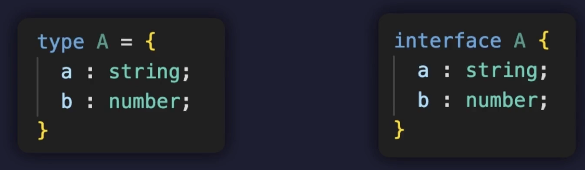

# 2024.02.15 TIL

### 🗂️ package.json

package.json 파일은 Node.js 프로젝트의 정보와 패키지의 의존성을 관리하는 데 사용된다. npm init 명령을 실행하면 package.json 파일을 생성할 수 있다.

#### package.json 파일이 생성되고 작성된 후에 npm i 명령을 실행하면, package.json 파일에 명시된 모든 의존성 패키지들이 설치된다. 이 명령은 node_modules 라는 폴더를 생성하고, 그 안에 필요한 모든 패키지를 설치한다.

따라서 package.json 파일만 있다면, npm i 명령을 통해 누구나 동일한 개발환경을 빠르게 구축하고 사용할 수 있다.

#### "npm i" 는 "npm init"과 다르다.

- npm init<br>:
  이 명령어는 새로운 Node.js 프로젝트를 시작할 때 사용된다. 이 명령어를 실행하면 프로젝트의 기본 정보를 입력할 수 있고 이 과정을 완료하면 package.json 파일이 생성된다. 이 파일은 의존성 관리에 핵심적인 역할을 한다.

- npm i 또는 npm install<br>:
  이 명령어는 프로젝트에 필요한 모듈을 설치하는 데 사용된다. package.json에 명시된 모든 의존성을 설치하려면 단순히 npm install 또는 npm i를 실행하면 된다. 이 명령은 프로젝트를 처음 시작할 때나 다른 개발자와 협업할 때 아주 유용하다.

---

## TypeScript

### 🚨 인터페이스

인터페이스란 타입별칭과 동일하게 타입의 이름을 지어주는 문법이다.


타입 별칭으로 만든 이런 A 타입을 인터페이스로 만들면 이런 형태로 만들 수 있다.

인터페이스라는 뜻은 우리말로 "상호간에 약속된 규칙" 이다. 그래서 이 객체는 이런 형태를 가져야 해 같은 일종의 약속 또는 규칙을 만들어주는 문법이라고 생각하면 된다.

#### ❗️인터페이스는 객체 타입을 정의하는 데 특화된 문법이다.

#### 그렇기 때문에 인터페이스는 타입 별칭에서는 제공하지 않는 상속이나 합침 등의 객체 타입을 다루는 여러가지 특수한 기능들을 제공한다.

결론적으로 인터페이스를 잘 이용하면 앞으로 객체 타입 정의를 할 때 훨씬 편하고 효율적이고 다양한 방법으로 정의할 수 있다.

---

인터페이스란 타입 별칭과 동일하게 타입에 이름을 지어주는 또다른 문법이라고 했다.

예를들어 간단한 Person 객체의 타입을 정의한다면 다음과 같이 할 수 있다.

```ts
interface Person {
  name: string;
  age: number;
}
```

이렇게 정의한 인터페이스를 타입 주석과 함께 사용해 변수의 타입을 정의할 수 있다.

```ts
const person: Person = {
  name: "이정환",
  age: 27,
};
```

이렇듯 인터페이스는 타입 별칭과 문법만 조금 다를 뿐 기본적인 기능은 거의 같다고 볼 수 있다.

---

### ❗️선택적 프로퍼티

인터페이스에서도 동일한 방법으로 선택적 프로퍼티 설정이 가능하다.

```ts
interface Person {
  name: string;
  age?: number;
}

const person: Person = {
  name: "이정환",
  // age: 27,
};
```

---

### ❗️읽기 전용 프로퍼티

읽기 전용 프로퍼티 또한 동일한 방법으로 설정 가능하다.

```ts
interface Person {
  readonly name: string;
  age?: number;
}

const person: Person = {
  name: "이정환",
  // age: 27,
};

person.name = "홍길동"; // ❌
```

#### as const는 TypeScript에서 객체의 모든 속성을 readonly로 만드는 데 사용되는 문법이다. 근데 이 문법은 인터페이스에는 적용되지 않는다.

#### 인터페이스의 모든 속성을 readonly로 만들려면, 각 속성 앞에 readonly 키워드를 추가해야 한다.

---

### ❗️메서드 타입 정의하기

다음과 같이 메서드의 타입을 정의하는 것 또한 가능하다.

```ts
interface Person {
  readonly name: string;
  age?: number;
  sayHi: () => void;;
}
```

함수 타입 표현식을 이용해 sayHi 메서드의 타입을 정의했다.

함수 타입 표현식 말고 다음과 같이 호출 시그니쳐를 이용해 메서드의 타입을 정의할 수도 있다.

```ts
interface Person {
  readonly name: string;
  age?: number;
  sayHi(): void;
}
```

### ❗️메서드 오버로딩

함수 타입 표현식으로 메서드의 타입을 정의하면 메서드의 오버로딩 구현이 불가능하다.

```ts
interface Person {
  readonly name: string;
  age?: number;
  sayHi: () => void;
  sayHi: (a: number, b: number) => void; // ❌
}
```

#### 하지만 호출 시그니처를 이용해 메서드의 타입을 정의하면 오버로딩 구현이 가능하다.

```ts
interface Person {
  readonly name: string;
  age?: number;
  sayHi(): void;
  sayHi(a: number): void;
  sayHi(a: number, b: number): void;
}
```

---

### ❗️주의할점 1

인터페이스는 대부분의 상황에 타입 별칭과 동일하게 동작하지만 몇가지 차이점이 존재한다. 타입 별칭에서는 다음과 같이 Union이나 Intersection 타입을 정의할 수 있었던 반면 인터페이스에서는 할 수 없다.

```ts
type Type1 = number | string;
type Type2 = number & string;

interface Person {
  name: string;
  age: number;
} | number // ❌
```

따라서 인터페이스로 만든 타입을 Union 또는 Intersection으로 이용해야 한다면 다음과 같이 타입 별칭과 함께 사용하거나 타입 주석에서 직접 사용해야 한다.

---

### 🚨인터페이스 확장하기

인터페이스 확장이란 하나의 인터페이스를 다른 인터페이스들이 상속받아 중복된 프로퍼티를 정의하지 않도록 도와주는 문법이다.

```ts
interface Animal {
  name: string;
  age: number;
}

interface Dog {
  name: string;
  age: number;
  isBark: boolean;
}

interface Cat {
  name: string;
  age: number;
  isScratch: boolean;
}

interface Chicken {
  name: string;
  age: number;
  isFly: boolean;
}
```

다음과 같이 3개의 타입이 정의되어있다고 가정해보자.

각 타입들을 자세히 살펴보면 Animal 타입을 기반으로 Dog, Cat, Chicken이 각각의 추가적인 프로퍼티를 갖고 있는 형태임을 알 수 있다. 추가로 name 그리고 age 프로퍼티가 모든 타입에 중복해서 정의되어 있다.

#### ❗️중복 코드는 언제나 좋지 않다.

만약 다음과 같이 Animal 타입의 프로퍼티가 변경된다면

```ts
interface Animal {
  name: string;
  ages: number; // 수정
}
```

이를 기반으로 하는 나머지 타입들도 다음과 같이 다 수정되어야 할 것이다.

```ts
interface Dog {
  name: string;
  ages: number; // 수정
  isBark: boolean;
}

interface Cat {
  name: string;
  ages: number; // 수정
  isScratch: boolean;
}

interface Chicken {
  name: string;
  ages: number; // 수정
  isFly: boolean;
}
```

이렇게 특정 인터페이스를 기반으로 여러개의 인터페이스가 파생되는 경우 중복 코드가 발생할 수 있는데 이럴 때에는 인터페이스의 확장 기능을 이용하면 좋다.

확장은 다음과 같이 사용한다.

```ts
interface Animal {
  name: string;
  color: string;
}

interface Dog extends Animal {
  breed: string;
}

interface Cat extends Animal {
  isScratch: boolean;
}

interface Chicken extends Animal {
  isFly: boolean;
}
```

> interface 타입이름 extends 확장*할*타입이름

이 형태로 extends 뒤에 확장할 타입의 이름을 정의하면 해당 타입에 정의된 모든 프로퍼티를 다 가지고 오게 된다. 따라서 Dog, Cat, Chicken 타입은 모두 Animal 타입을 확장하는 타입이기 때문에 name, color 프로퍼티를 갖게 된다.

```ts
interface Animal {
  name: string;
  color: string;
}

interface Dog extends Animal {
  breed: string;
}

(...)

const dog: Dog = {
  name: "돌돌이",
  color: "brown",
  breed: "진도",
};
```

이 때 확장 대상 타입인 Animal은 Dog 타입의 슈퍼타입이 된다.

---

### ❗️프로퍼티 재정의하기

다음과 같이 확장과 동시에 프로퍼티의 타입을 재정의 하는 것 또한 가능하다.

```ts
interface Animal {
  name: string;
  color: string;
}

interface Dog extends Animal {
  name: "doldol"; // 타입 재 정의
  breed: string;
}
```

Dog 타입은 Animal 타입을 확장하며 동시에 name 프로퍼티의 타입을 String 타입에서 "doldol" 이라는 String Literal 타입으로 재정의 했다. 이렇게 확장받는 타입에서 프로퍼티의 타입을 재정의할 수 있다.

#### ⚠️ 한가지 주의할 점은 프로퍼티를 재정의할 때 원본의 타입을 A, 재정의된 타입을 B라고 하면 반드시 A가 B의 슈퍼 타입이 되도록 재정의 해야 한다.

따라서 아래와 같이 name을 Number 타입으로 재정의 하는 것은 불가능하다.

```ts
interface Animal {
  name: string;
  color: string;
}

interface Dog extends Animal {
  name: number; // ❌
  breed: string;
}
```

그 이유는 Dog 타입이 Animal 타입을 확장한다는 것은 Animal 타입의 서브타입이 된다는 의미인데 name 프로퍼티를 number 타입으로 재정의 해버리면 이제는 Dog는 Animal의 서브 타입이 아니게 된다.

---

#### ❗️타입 별칭을 확장하기

참고로 인터페이스는 인터페이스 뿐만 아니라 타입 별칭으로 정의된 객체도 확장할 수 있다.

```ts
type Animal = {
  name: string;
  color: string;
};

interface Dog extends Animal {
  breed: string;
}
```

---

#### ❗️다중 확장

또 여러개의 인터페이스를 확장하는 것 또한 가능하다.

```ts
interface DogCat extends Dog, Cat {}

const dogCat: DogCat = {
  name: "",
  color: "",
  breed: "",
  isScratch: true,
};
```

---

### 🚨 인터페이스 합치기

### ❗️선언 합침

타입 별칭은 동일한 스코프 내에 중복된 이름으로 선언할 수 없는 반면 인터페이스는 가능하다.

```ts
type Person = {
  name: string;
};

type Person = { ❌
  age: number;
};
```

```ts
interface Person {
  name: string;
}

interface Person {
  // ✅
  age: number;
}
```

이렇게 되는 이유는

#### 💡중복된 이름의 인터페이스 선언은 결국 모두 하나로 합쳐진다.

따라서 위 코드에 선언한 Person 인터페이스들은 결국 합쳐져 다음과 같은 인터페이스가 된다.

```ts
interface Person {
  name: string;
  age: number;
}
```

이렇게 동일한 이름의 인터페이스들이 합쳐지는 것을 선언 합침 이라고 부른다 따라서 다음과 같이 사용할 수 있다.

```ts
interface Person {
  name: string;
}

interface Person {
  age: number;
}

const person: Person = {
  name: "이정환",
  age: 27,
};
```

---

### ❗️주의할 점

만약 다음과 같이 동일한 인터페이스들이 동일한 이름의 프로퍼티를 서로 다른 타입으로 정의한다면 오류가 발생한다.

```ts
interface Person {
  name: string;
}

interface Person {
  name: number;
  age: number;
}
```

첫 번째 Person에서는 name 프로퍼티의 타입을 string으로 두 번째 Person에서는 name 프로퍼티의 타입을 number 타입으로 정의했다.

이렇게 동일한 프로퍼티의 타입을 다르게 정의한 상황을 "충돌" 이라고 표현하며 선언 합침에서 이런 충돌은 허용되지 않는다.

---

---

### 🚨 클래스

### 🚨 JavaScript의 클래스

클래스는 동일한 모양의 객체를 더 쉽게 생성하도록 도와주는 문법이다. 예를들어 학생을 객체로 표현한다면 다음과 같이 할 수 있다.

```js
let studentA = {
  name: "이정환",
  grade: "A+",
  age: 27,
  study() {
    console.log("열심히 공부 함");
  },
  introduce() {
    console.log("안녕하세요!");
  },
};
```

만약 이때 한명의 학생이 더 필요하다면 형태가 유사한 코드를 한번 더 써서 새로운 변수를 만들어야 하는데 프로퍼티의 값만 조금씩 다를 뿐이지 동일한 모양의 객체라고 볼 수 있다.

이렇게 동일한 모양의 객체를 여러개 생성해야 하면 어쩔 수 없이 중복 코드가 발생하게 되는데 이럴 때 자바스크립트의 class 문법을 사용하면 도움이 된다.

---

#### ❗️클래스 선언하기

클래스 선언은 다음과 같이 이루어진다

```js
class Student {}
```

클래스는 그냥 객체를 생성하는 틀이다. 붕어빵이 객체라면 붕어빵 기계는 클래스라고 볼 수 있다.

클래스를 선언했다면 다음으로는 필드를 선언해야 한다. 필드란 이 클래스가 생성할 객체가 갖는 프로퍼티를 의미한다.

```js
class Student {
  // 필드
  name;
  age;
  grade;
}
```

필드를 선언했다면 다음으로는 생성자를 선언한다. 생성자는 특수한 메서드로 실질적으로 객체를 생성하는 함수이다.

```js
class Student {
  // 필드
  name;
  age;
  grade;

  // 생성자
  constructor(name, grade, age) {
    this.name = name;
    this.grade = grade;
    this.age = age;
  }
}
```

생성자에서는 매개변수로 프로퍼티 값을 받아 this.프로퍼티의 값으로 할당한다. 이때 this는 객체이며 현재 만들고 있는 객체를 의미한다. 따라서 이 생성자 메서드는 현재 만들고 있는 객체의 name, grade, age 프로퍼티의 값을 매개변수로 전달받은 값으로 설정하는 역할을 한다.

이렇게 생성자를 만들어 주었다면 이제 **클래스를 호출하여 객체를 생성**할 수 있다.

```js
const studentB = new Student("홍길동", "A+", 27);
```

클래스를 이용해 새로운 객체를 생성할 때에는 new 클래스이름 형태로 클래스의 생성자 함수를 호출한다.

그러면 결과적으로 다음과 같이 생긴 객체를 생성한다.

```js
{name: "홍길동", grade: "A+", age: 27}
```

다음으로 클래스가 생성할 객체의 메서드도 설정해주자.

```js
class Student {
  // 필드
  name;
  grade;
  age;

  // 생성자
  constructor(name, grade, age) {
    this.name = name;
    this.grade = grade;
    this.age = age;
  }

  // 메서드
  study() {
    console.log("열심히 공부 함");
  }

  introduce() {
    console.log(`안녕하세요!`);
  }
}

let studentB = new Student("홍길동", "A+", 27);

studentB.study(); // 열심히 공부 함
studentB.introduce(); // 안녕하세요!
```

---

#### ❗️this 활용하기

앞서 클래스 내부에서 this는 현재 만들고 있는 객체를 의미한다고 했다. 따라서 메서드에 다음과 같이 this를 활용해 객체 프로퍼티의 값을 활용하는 것 또한 가능하다.

```js
class Student {
  (...)

  introduce() {
    console.log(`안녕하세요 ${this.name} 입니다!`);
  }
}

let studentB = new Student("홍길동", "A+", 27);

studentB.introduce(); // 안녕하세요 이정환 입니다!
```

---

#### ❗️상속

만약 앞서 만든 Student 클래스를 기반으로 추가적인 필드와 메서드를 갖는 클래스를 선언하고 싶다면 다음과 같이 상속을 이용하면 된다.

```js
class StudentDeveloper extends Student {}
```

StudentDeveloper 클래스는 Student 클래스를 확장(상속)한다. 이 확장은 앞서 살펴본 인터페이스의 확장과 기본적으로 비슷하다. 따라서 Student 클래스에 정의된 모든 필드와 메서드를 자동으로 갖게 된다.

StudentDeveloper 클래스만의 새로운 필드나 메서드도 다음과 같이 정의할 수 있다.

```js
class StudentDeveloper extends Student {
  // 필드
  favoriteSkill;

  // 생성자
  constructor(name, grade, age, favoriteSkill) {
    this.favoriteSkill = favoriteSkill;
  }

  // 메서드
  programming() {
    console.log(`${this.favoriteSkill}로 프로그래밍 함`);
  }
}
```

#### 💡 그런데 이떄 StudentDeveloper 클래스에서 Student 클래스의 생성자를 함께 호출해줘야한다.

그렇지 않으면 생성되는 객체의 name, grade, age 값이 제대로 설정되지 않는다. 따라서 다음과 같이 super 라는 메서드를 호출한다.

#### ❗️super()

```js
class StudentDeveloper extends Student {
  // 필드
  favoriteSkill;

  // 생성자
  constructor(name, grade, age, favoriteSkill) {
    super(name, grade, age);
    this.favoriteSkill = favoriteSkill;
  }

  // 메서드
  programming() {
    console.log(`${this.favoriteSkill}로 프로그래밍 함`);
  }
}
```

#### super를 호출하고 인수로 name, grade, age를 전달하면 슈퍼클래스의 생성자를 호출한다. 따라서 this.name, this.grade, this.age의 값을 설정하게 된다.

---

### 🚨 TypeScript의 클래스

#### 💡 TypeScript에서 인터페이스와 클래스는 모두 타입으로 취급된다.

타입스크립트에서는 클래스의 필드(프로퍼티)를 선언할 때 타입 주석으로 타입을 함께 정의해주어야 한다. 그렇지 않으면 함수 매개변수와 동일하게 암시적 any 타입으로 추론되는데 엄격한 타입 검사 모드일 때에는 오류가 발생하게 된다.

추가로 **생성자에서 각 필드의 값을 초기화 하지 않을 경우 초기값도 함께 명시**해주어야한다.

```ts
class Employee {
  // 필드
  name: string = "";
  age: number = 0;
  position: string = "";

  // 메서드
  work() {
    console.log("일함");
  }
}
```

만약 아래와 같이 생성자 함수에서 필드의 값들을 잘 초기화 해준다면 필드 선언시 초기값은 생략해도 된다.

```ts
class Employee {
  // 필드
  name: string = "";
  age: number = 0;
  position: string = "";

  // 생성자
  constructor(name: string, age: number, position: string) {
    this.name = name;
    this.age = age;
    this.position = position;
  }

  // 메서드
  work() {
    console.log("일함");
  }
}
```

이때 만약 이 클래스가 생성하는 객체의 특정 프로퍼티를 선택적 프로퍼티로 만들고 싶다면 다음과 같이 필드의 이름 뒤에 물음표를 붙여주면 된다.

```ts
class Employee {
  // 필드
  name: string = "";
  age: number = 0;
  position?: string = "";

  // 생성자
  constructor(name: string, age: number, position: string) {
    this.name = name;
    this.age = age;
    this.position = position;
  }

  // 메서드
  work() {
    console.log("일함");
  }
}
```

---

### ❗️클래스는 타입이다

TypeScript의 클래스는 타입으로도 사용할 수 있다. 클래스를 타입으로 사용하면 해당 클래스가 생성하는 객체의 타입과 동일한 타입이 된다.

```ts
class Employee {
  (...)
}

const employeeC: Employee = {
  name: "",
  age: 0,
  position: "",
  work() {},
};
```

변수 employeeC의 타입을 Employee 클래스로 정의했다. 따라서 이 변수는 name, age, position 프로퍼티와 work 메서드를 갖는 객체 타입으로 정의된다.

---

### ❗️상속

TypeScript에서 클래스의 상속을 이용할 때에는 파생 클래스에서 생성자를 정의 했다면 반드시 **super 메서드를 호출해 슈퍼 클래스의 생성자를 호출**해야한다. 호출 위치는 생성자의 최상단이어야만 한다.

---

### 🚨 접근 제어자

접근제어자 (Access Modifier)는 TypeScript에서만 제공되는 기능으로 클래스의 특정 필드나 메서드를 접근할 수 있는 범위를 설정하는 기능이다.

#### 💡 TypeScript에서는 다음과 같은 3개의 접근 제어자를 사용할 수 있다.

- public: 모든 범위에서 접근 가능
- private: 클래스 내부에서만 접근 가능
- protected: 클래스 내부 또는 파생 클래스 내부에서만 접근 가능

---

### ❗️pulblic

공공의 라는 뜻으로 어디서든지 이 프로퍼티에 접근할 수 있음을 의미한다. 앞서 만들었던 클래스와 같이 필드의 접근 제어자를 지정하지 않으면 기본적으로 public 접근 제어자를 갖게 된다.

```ts
class Employee {
  // 필드
  name: string; // 자동으로 public
  age: number; // 자동으로 public
  position: string; // 자동으로 public

  // 생성자
  constructor(name: string, age: number, position: string) {
    this.name = name;
    this.age = age;
    this.position = position;
  }

  // 메서드
  work() {
    console.log("일함");
  }
}

const employee = new Employee("이정환", 27, "devloper");

employee.name = "홍길동";
employee.age = 30;
employee.position = "디자이너";
```

다음과 같이 public 접근 제어자를 직접 명시하는것도 가능하다.

```ts
class Employee {
  // 필드
  public name: string;
  public age: number;
  public position: string;

  ...
}

const employee = new Employee("이정환", 27, "devloper");

employee.name = "홍길동";
employee.age = 30;
employee.position = "디자이너";
```

---

### ❗️private

private는 제한된, 사적인 이라는 뜻으로 특정 필드나 메서드의 접근 제어자를 private로 설정하면 클래스 내부에서만 이 필드에 접근할 수 있다.

```ts
class Employee {
  // 필드
  private name: string; // private 접근 제어자 설정
  public age: number;
  public position: string;

  ...

  // 메서드
  work() {
    console.log(`${this.name}이 일함`); // 여기서는 접근 가능
  }
}

const employee = new Employee("이정환", 27, "devloper");

employee.name = "홍길동"; // ❌ 오류
employee.age = 30;
employee.position = "디자이너";
```

name 필드를 private로 설정했으므로 클래스 외부에서는 접근이 불가능하다. 그러나 클래스 내부에서는 work()메서드 처럼 접근이 자유롭게 가능하다.

---

### ❗️protected

protected 접근제어자는 private와 public의 중간으로 클래스 외부에서는 접근이 안되지만 클래스 내부와 파생 클래스에서 접근이 가능하도록 설정하는 접근 제어자다.

```ts
class Employee {
  // 필드
  private name: string; // private 접근 제어자 설정
  protected age: number;
  public position: string;

  ...

  // 메서드
  work() {
    console.log(`${this.name}이 일함`); // 여기서는 접근 가능
  }
}

class ExecutiveOfficer extends Employee {
 // 메서드
  func() {
    this.name; // ❌ 오류
    this.age; // ✅ 가능
  }
}

const employee = new Employee("이정환", 27, "devloper");

employee.name = "홍길동"; // ❌ 오류
employee.age = 30; // ❌ 오류
employee.position = "디자이너";
```

Employee 클래스를 확장(상속)하는 파생 클래스 ExcutiveOfficer를 선언한 다음 메서드 func()를 만든다. 이 메서드에서는 name과 age에 접근하는데 이때 name은 private로 접근이 불가능하지만 protected인 age는 파생클래스에서 접근이 가능하다. 그러나 클래스 외부에서는 접근이 불가능하다.

---

### ❗️필드 생략하기

클래스에서 말하는 필드는 객체지향 프로그래밍에서 객체의 프로퍼티라고 생각하면 된다.

접근 제어자는 다음과 같이 **생성자의 매개변수**에도 설정할 수 있다.

```ts
class Employee {
  // 필드
  private name: string; // ❌
  protected age: number; // ❌
  public position: string; // ❌

  // 생성자
  constructor(
    private name: string,
    protected age: number,
    public position: string
  ) {
    this.name = name;
    this.age = age;
    this.position = position;
  }

  // 메서드
  work() {
    console.log(`${this.name} 일함`);
  }
}
```

#### 하지만 생성자에 접근 제어자를 설정하면 동일한 이름의 필드를 선언하지 못한다. 그 이유는 생성자 매개변수에 name, age, position처럼 접근 제어자가 설정되면 자동으로 필드도 함께 선언되기 때문이다. 따라서 동일한 이름으로 필드를 중복 선언할 수 없게 된다.

따라서 아래와 같이 중복된 필드 선언을 모두 제거해 주어야 한다.

```ts
class Employee {
  // 생성자
  constructor(
    private name: string,
    protected age: number,
    public position: string
  ) {
    this.name = name;
    this.age = age;
    this.position = position;
  }

  // 메서드
  work() {
    console.log(`${this.name} 일함`);
  }
}
```

#### 또 다음과 같이 접근 제어자가 설정된 매개변수들은 this.필드= 매개변수가 자동으로 수행된다. 따라서 위 코드의 name, age, position은 모두 this 객체의 프로퍼티 값으로 자동 설정되기 때문에 다음과 같이 생성자 내부의 코드를 제거해도 된다.

```ts
class Employee {
  // 생성자
  constructor(
    private name: string,
    protected age: number,
    public position: string
  ) {}

  // 메서드
  work() {
    console.log(`${this.name} 일함`);
  }
}
```

그러므로 TypeScript에서 클래스를 사용할 때에는 보통 생성자 매개변수에 접근 제어자를 설정하여 선언과 생성자 내부 코드를 생략하는것이 훨씬 간결하고 빠르게 코드를 작성할 수 있어 좋다.

---

### 🚨 인터페이스와 클래스

TypeScript에서 인터페이스는 클래스의 설계도 역할을 할 수 있다.

쉽게 말해 인터페이스를 이용해 클래스에 어떤 필드들이 존재하고, 어떤 메서드가 존재하는지 정의할 수 있다.

```ts
/**
 * 인터페이스와 클래스
 */

interface CharacterInterface {
  name: string;
  moveSpeed: number;
  move(): void;
}

class Character implements CharacterInterface {
  constructor(
    public name: string,
    public moveSpeed: number,
    private extra: string
  ) {}

  move(): void {
    console.log(`${this.moveSpeed} 속도로 이동!`);
  }
}
```

### ❗️implements

TypeScript에서 implements 키워드는 클래스가 특정 인터페이스를 준수하도록 강제하는 역할을 한다.

인터페이스는 특정 객체가 가져야 할 구조를 정의하는데, implements 키워드를 사용하여 클래스가 이 인터페이스를 구현하도록 할 수 있다.
