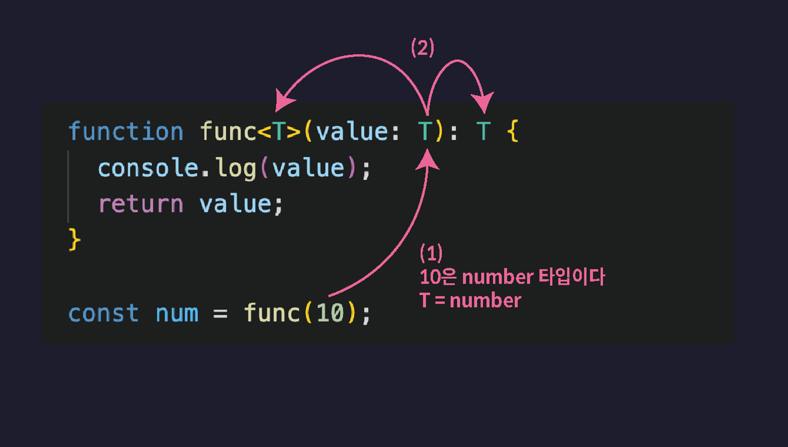
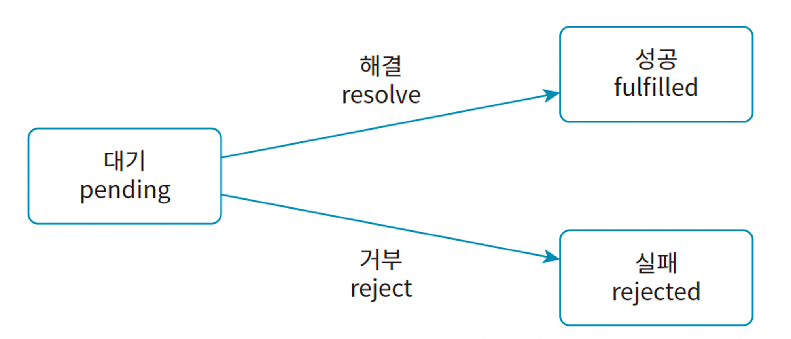
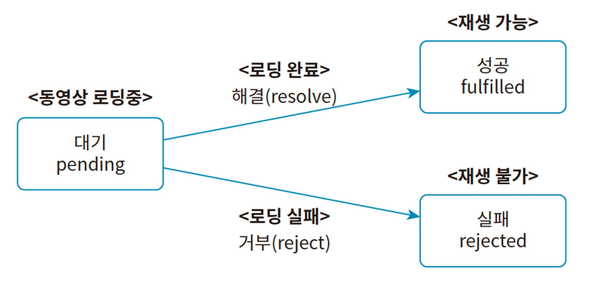

# 2024.02.16 TIL

## TypeScript

## 📚 제네릭

제네릭이란 함수나 인터페이스, 타입 별칭, 클래스 등을 다양한 타입과 함께 동작하도록 만들어주는 TypeScript의 놀라운 기능 중 하나이다.

### ❗️제네릭이 필요한 상황 (제네릭 등장 배경)

아래와 같이 다양한 타입의 매개변수를 받고 해당 매개변수를 그대로 반환하는 함수가 하나 필요하다고 해보자.

```ts
function func(value: any) {
  return value;
}

let num = func(10);
// any 타입

let str = func("string");
// any 타입
```

다양한 타입의 매개변수를 제공받아야 하기 때문에 매개변수 value의 타입을 일단 any 타입으로 해 두었다. 물론 unknown으로 정의해도 괜찮다.

이 함수는 인수로 전달한 값을 그냥 그대로 반환하는 함수다. 그런데 현재 num과 str의 타입은 any 타입이 된다. func 함수의 반환값 타입이 return 문을 기준으로 추론되었기 때문이다.

이렇게 함수 호출 결과를 저장하는 num, str 등의 변수가 any 타입으로 추론되면 다음과 같은 문제점이 발생한다.

```ts
function func(value: any) {
  return value;
}

let num = func(10);
let str = func("string");

num.toUpperCase();
```

num에는 분명 number 타입의 값 10이 저장되어 있을 것이 분명한데 any 타입으로 추론되어 버렸기 때문에 toUpperCase 등의 String 타입의 메서드를 사용해도 TypeScript가 오류를 감지하지 못한다. 이 코드를 결국 실제로 실행하면 런타임 오류를 발생시키는 아주 위험한 상태가 된다.

그러면 아래와 같이 매개변수의 타입을 any 말고 unknown 타입으로 정의해보자.

```ts
function func(value: unknown) {
  return value;
}

let num = func(10);
// unknown 타입

let str = func("string");
// unknown 타입

num.toUpperCase(); // ❌
num.toFixed(); // ❌
```

그러면 toUpperCase 같은 메서드 호출은 방지할 수 있지만 toFixed 같은 number 타입의 메서드 호출도 함께 오류로 판단하게 된다.

따라서 이 값을 사용하려면 아래와 같이 비효율적으로 타입 좁히기를 이용해야 한다.

```ts
function func(value: unknown) {
  return value;
}

let num = func(10);
// unknown 타입

let str = func("string");
// unknown 타입

if (typeof num === "number") {
  num.toFixed();
}
```

내가 원하는건 그냥 인수로 number 타입의 값을 전달하면 반환 타입이 number가 되고, 인수로 string 타입의 값을 전달하면 반환값이 타입도 string 타입이 되었으면 좋겠다. 그런데 지금까지 배운 typeScript의 문법으로는 이 문제를 해결할 수 없다.

이럴 때 바로 제네릭을 이용해야 한다. func 함수를 제네릭 함수로 만들면 이 문제를 간단히 해결할 수 있다.

---

### 🚨 제네릭(Generic) 함수

제네릭: 일반적인 or 포괄적인

따라서 제네릭 함수는 일반적인 함수 또는 포괄적인 함수 정도로 해석할 수 있다. 이게 무슨 말일까?

제네릭과 그 의미가 거의 비슷한 단어인 제네럴(General)은 영어권에서 종합 병원을 이야기할 때 사용되는 병원인데 종합 병원을 제너럴 호스피탈이라 부른다.

#### 따라서 제네릭 함수는 두루두루 모든 타입의 값을 다 적용할 수 있는 그런 범용적인 함수다.

아래와 같이 제네릭 함수를 선언할 수 있다.

```ts
function func<T>(value: T): T {
  return value;
}

let num = func(10);
// number 타입
```

함수 이름 뒤에 꺽쇠를 열고 타입을 담는 변수인 타입 변수 T를 선언한다. 그리고 매개변수와 반환값의 타입을 이 타입변수 T로 설정한다.

T에 어떤 타입이 할당될 지는 함수가 호출될 때 결정한다. func(10)처럼 number 타입의 값을 인수로 전달하면 매개변수 value에 number 타입의 값이 저장되면서 T가 number 타입으로 추론된다. 이때 T가 number 타입으로 추론된다. 그럼 이떄의 func 함수의 반환값 타입또한 number 타입이 된다.


제네릭 함수를 호출할 때 아래과 같이 타입 변수에 할당할 타입을 직접 명시하는 것도 가능하다.

```ts
function func<T>(value: T): T {
  return value;
}

let arr = func<[number, number, number]>([1, 2, 3]);
```

1. T에 [number, number, number] 튜플 타입이 할당됨
2. 매개변수 value와 반환값 타입이 모두 튜플 타입

만약 위 코드에서 타입 변수에 할당할 타입을 튜플 타입으로 설정하지 않아다면 T가 number[] 타입으로 추론되었을 것이다. TypeScript는 타입을 추론할 때 항상 일반적이고 더 범용적인 타입으로 추론하기 때문이다.

이렇듯 타입 변수에 할당하고 싶은 특정 타입이 존재한다면 함수 호출과 함께 꺽쇠를 열고 직접 명시해 주는게 좋다. 그렇지 않은 대다수의 상황에서는 알아서 잘 추론된다.

---

### 🚨 타입 변수 응용하기

제네릭 타입 변수를 더 잘 활용하는 방법

### ❗️2개의 타입 변수가 필요한 상황이라면

다음과 같이 T, U 처럼 2개의 타입 변수를 사용해도 된다.

```ts
// T는 string, U는 number 타입으로 추론됨
function swap<T, U>(a: T, b: U) {
  return [b, a];
}

const [a, b] = swap("1", 2);
```

---

### ❗️다양한 배열 타입을 인수로 받는 제네릭 함수를 만들어야 한다면?

```ts
function returnFirstValue<T>(data: T[]) {
  return data[0];
}

let num = returnFirstValue([0, 1, 2]);
// number

let str = returnFirstValue([1, "hello", "mynameis"]);
// number | string
```

함수 매개변수 data의 타입을 T[]로 설정했기 때문에 배열이 아닌 값은 인수로 전달할 수 없게 된다. 배열을 인수로 전달하면 T는 배열의 요소 타입으로 할당된다.

첫 번째 호출에서는 인수로 number[] 타입의 값을 전달했으므로 이때의 T는 number 타입으로 추론된다. 이때의 함수 반환값 타입은 number 타입이 된다.

두번째 호출에서는 인수로 (string|number)[] 타입의 값을 전달했으므로 이떄의 T는 string|number 타입으로 추론된다. 이떄의 함수 반환값 타입은 string|number 타입이 된다.

---

### ❗️반환값의 타입을 배열의 첫번째 요소의 타입이 되도록 하려면?

다음과 같이 튜플 타입과 나머지 파라미터를 이용하면 된다.

```ts
function returnFirstValue<T>(data: [T, ...unknown[]]) {
  return data[0];
}

let str = returnFirstValue([1, "hello", "mynameis"]);
// number
```

함수 매개변수의 타입을 정의할 때 튜플 타입을 이용해 첫번째 요소의 타입은 T 그리고 나머지 요소의 타입은 ...unknown[]으로 길이도 타입도 상관없도록 정의한다.

---

### 🚨 제네릭 인터페이스, 제네릭 타입 별칭

제네릭은 인터페이스에도 적용할 수 있다. 다음과 같이 인터페이스에 타입 변수를 선언해 사용하면 된다.

```ts
interface KeyPair<K, V> {
  key: K;
  value: V;
}
```

키페어를 저장하는 객체의 타입을 제네릭 인터페이스로 정의했다. 다음과 같이 변수의 타입으로 정의하여 사용할 수 있다.

```ts
let keyPair: KeyPair<string, number> = {
  key: "key",
  value: 0,
};

let keyPair2: KeyPair<boolean, string[]> = {
  key: true,
  value: ["1"],
};
```

변수 keyPair의 타입으로 KeyPair<string, number>를 정의했는데 그 결과 K에는 string, V에는 number 타입이 각각 할당되어 key 프로퍼티는 string 타입이고 value 프로퍼티는 number 타입인 객체 타입이 된다. 따라서 값으로 해당 타입의 객체를 저장한다.

변수 keyPair2의 타입으로 KeyPair<boolean, string[]>을 정의했다. 그 결과 K에는 boolean, V에는 string[] 타입이 각각 할당되어 key 프로퍼티는 boolean 타입이고 value 프로퍼티는 string[] 타입인 객체 타입이 된다. 따라서 값으로 해당 타입의 객체를 저장한다.

---

### ⚡️ 주의사항 ⚡️

#### TypeScript에서 제네릭 인터페이스를 사용할 때는 반드시 꺽쇠 <> 안에 타입을 지정해 주어야 한다. 이는 인터페이스가 타입 추론을 할 수 있는 여지가 없기 때문에(인터페이스는 객체의 구조를 정의하는 역할을 하므로 인터페이스 자체가 값을 가지지 않으므로 타입을 추론할 수 있는 여지가 없다. 반면 함수나 변수는 값을 가지므로 TypeScript 컴파일러는 이 값들을 분석하여 타입을 추론할 수 있다.) 타입을 지정하지 않으면 예상치 못한 동작이 발생할 수 있다.

다음과 같이 Point라는 제네릭 인터페이스를 정의한다고 해보자.

#### 제네릭 인터페이스

```ts
interface Point<X, Y> {
  x: X;
  y: Y;
}

let point: Point<number, number> = {
  // 반드시 타입 지정!
  x: 1,
  y: 1,
};
```

인터페이스는 제네릭 타입 X와 Y를 가지고 있고 point에서 꺽쇠 안에 타입을 명시적으로 지정해주어야 한다.

반면 제네릭 함수에서는 함수 호출 시점에 타입 추론이 가능하기 때문에, 꼭 꺽쇠 안에 타입을 명시하지 않아도 된다.

#### 제네릭 함수

```ts
function identity<T>(arg: T): T {
  return arg;
}

let output = identity("myString"); // 타입 추론 가능
```

위의 예제에서 identity 함수는 제네릭 타입 T를 가지고 있는데 이 함수를 호출할 때 identity("myString")와 같이 꺽쇠 없이 문자열을 전달하면, TypeScript는 T를 string으로 자동 추론한다.

---

### ❗️인덱스 시그니쳐와 함께 사용하기

제네릭 인터페이스는 **인덱스 시그니쳐와 함께 사용하면 다음과 같이 기존보다 훨씬 더 유연한 객체 타입을 정의할 수 있다**.

```ts
interface Map<V> {
  [key: string]: V;
}

let stringMap: Map<string> = {
  key: "value",
};

let booleanMap: Map<boolean> = {
  key2: true,
};
```

한개의 타입 변수 V를 갖는 제네릭 인터페이스 Map을 정의했다. 이 인터페이스는 인덱스 시그니쳐로 key의 타입은 string, value의 타입은 V인 모든 객체 타입을 포함하는 타입이다.

---

### ❗️제네릭 타입 별칭

인터페이스와 마찬가지로 타입 별칭에도 역시 제네릭을 적용할 수 있다.

```ts
type Map2<V> = {
  [key: string]: V;
};

let stringMap2: Map2<string> = {
  key: "string",
};
```

제네릭 타입 별칭을 사용할 때에도 제네릭 인터페이스와 마찬가지로 타입으로 정의될 때 반드시 타입 변수에 설정할 타입을 명시해 주어야 한다.

---

### ❗️제네릭 인터페이스 활용 예

개발자 또는 학생이 이용하는 어떤 프로그램이 있다고 가정하자.

```ts
interface Student {
  type: "student";
  school: string;
}

interface Developer {
  type: "developer";
  skill: string;
}

interface User<T> {
  name: string;
  profile: T;
}

function goToSchool(user: User<Student>) {
  const school = user.profile.school;
  console.log(`${school}로 등교 완료`);
}

const developerUser: User<Developer> = {
  name: "이정환",
  profile: {
    type: "developer",
    skill: "TypeScript",
  },
};

const studentUser: User<Student> = {
  name: "홍길동",
  profile: {
    type: "student",
    school: "가톨릭대학교",
  },
};
```

---

### 🚨 제네릭 클래스

먼저 제네릭이 아닌 간단한 number 타입의 리스트를 생성하는 클래스를 하나 만들어보자.

```ts
class NumberList {
  constructor(private list: number[]) {}

  push(data: number) {
    this.list.push(data);
  }

  pop() {
    return this.list.pop();
  }

  print() {
    console.log(this.list);
  }
}

const numberList = new NumberList([1, 2, 3]);
```

list 필드를 private 접근제어자로 설정해 클래스 내부에서만 접근할 수 있도록 만들고, 생성자에서 필드 선언과 함께 초기화한다.

이때 만약 StringList 클래스도 하나 필요하다면 제네릭 없이는 어쩔 수 없이 새로운 클래스를 하나 더 만들어줘야한다.
매우 비효율적이다. 따라서 이럴 때 다음과 같이 제네릭 클래스를 사용해 여러 타입의 리스트를 생성할 수 있는 범용적인 클래스를 정의하면 된다.

```ts
class List<T> {
  constructor(private list: T[]) {}

  push(data: T) {
    this.list.push(data);
  }

  pop() {
    return this.list.pop();
  }

  print() {
    console.log(this.list);
  }
}

const numberList = new List([1, 2, 3]);
const stringList = new List(["1", "2"]);
```

#### 클래스의 이름 뒤에 타입 변수를 선언하면 제네릭 클래스가 된다.

이 타입 변수는 이제 클래스 내부에서 자유롭게 사용할 수 있다. 또 **클래스는 생성자를 통해 타입 변수의 타입을 추론할 수 있기 때문에 생성자에 인수로 전달하는 값이 있을 경우 타입 변수에 할당할 타입을 생략해도 된다**.

만약 타입 변수의 타입을 직접 설정하고 싶다면 다음과 같이 하면 된다.

```ts
class List<T> {
  constructor(private list: T[]) {}

  (...)
}

const numberList = new List<number>([1, 2, 3]);
const stringList = new List<string>(["1", "2"]);
```

---

### 🚨 프로미스와 제네릭

JavaScript 프로젝트에서 버그가 가장 많이 발생하는 API 호출 등의 비동기처리 코드에도 각각 타입을 안전하게 정의해서 이전보다 훨씬 견고한 비동기 코드를 작성할 수 있다.<br>
(비동기 처리를 이용하면 오래 걸리는 작업이 종료될 때까지 기다리지 않고 다음 작업이 수행하는 등 유연한 프로그래밍이 가능하다.)

#### ⚡️JavaScript 내장 비동기 함수⚡️

- setTimeout
- setInterval
- fetch
- Promise
- async/await

---

### 🚨 promise

프로미스는 비동기 처리를 목적으로 제공되는 JavaScript 내장 객체이다. 프로미스는 Date 객체처럼 특수한 목적을 위해 다양하게 기능이 추가된 객체다.

프로미스를 이용하면 콜백 함수를 이용한 비동기 처리보다 더 쉽게 비동기 작업을 수행할 수 있다.<br>
(프로미스는 콜백 함수의 단점을 극복하기 위해 만들어졌다)

#### 프로미스는 비동기 작업을 진행 단계에 따라 3가지 상태로 나누어 관리한다

#### - ⚡️대기(Pending)상태: 작업을 아직 완료하지 않음

#### - ⚡️성공(Fullfilled)상태: 작업을 성공적으로 완료함

#### - ⚡️실패(Rejected)상태: 작업이 모종의 이유로 실패함

대기 상태에서의 작업을 성공적으로 완료하는 것을 해결(resolve)이라고 한다. 작업을 해결하면 해당 작업은 성공 상태가 된다. 반대로 대기 상태에서 작업이 모종의 이유(오류 발생등)로 실패하는 것을 거부(reject)라고 한다. 작업이 거부되면 해당 작업은 실패 상태가 된다.


(promise의 3가지 상태)

유튜브에 빗댄 프로미스 객체의 3가지 상태를 그림으로 표현하자면

이렇다.

---

### ❗️ promise 객체 생성

```js
const promise= new Promise(실행 함수);
```

프로미스 객체를 생성하여 상수 promise에 저장한다.

그리고 프로미스 객체를 만들 때 인수로 실행 함수를 전달한다. 실행 함수란 비동기 작업을 수행하는 함수다. 이 함수는 프로미스 객체를 생성함과 동시에 실행되며 2개의 매개변수를 제공받는다.

```js
const promise = new Promise(function (resolve, reject) {
  setTimeout(() => {
    console.log("안녕");
  }, 500);
});

// 안녕
```

이 함수는 새롭게 생성된 프로미스 객체의 실행함수다. 프로미스 객체를 생성함과 동시에 실행되며 2개의 매개변수를 제공받는다. 프로미스 객체는 생성과 동시에 실행 함수를 실행한다!

#### 실행 함수가 제공받는 2개의 매개변수

#### ⚡️resolve: 비동기 작업의 상태를 성공으로 바꾸는 함수

#### ⚡️reject: 비동기 작업의 상태를 실패로 바꾸는 함수

앞서 살펴보았듯이 프로미스는 비동기 작업의 상태를 대기, 성공, 실패로 나누어 관리한다. 실행 함수가 제공받는 2개의 매개변수는 대기 상태의 비동기 작업을 성공 또는 실패 상태로 변경하는 역할을 한다.

다음은 실행 함수에서 매개변수로 제공된 resolve를 호출하여 작업 상태를 성공 상태로 변경하는 예시다.

```js
const promise = new Promise(function (resolve, reject) {
  setTimeout(() => {
    resolve("성공");
  }, 500);
});
```

실행 함수에 매개변수로 제공된 resolve를 호출해 비동기 작업의 성공을 알리며 작업의 결과값을 인수로 전달한다.

실행함수는 0.5초를 기다린 다음 resolve를 호출해 이 비동기 작업의 상태를 성공 상태로 변경한다. 이때 resolve를 호출하며 인수로 전달한 값 "성공"은 비동기 작업의 결과값이 된다. 이 결과값을 **비동기 작업이 아닌 곳에서 이용하려면 다음과 같이 프로미스 객체의 then 메서드를 이용**하면 된다.
then 메서드는 인수로 전달한 콜백 함수의 비동기 작업이 성공했을 때 실행된다.

```js
const promise = new Promise(function (resolve, reject) {
  setTimeout(() => {
    resolve("성공");
  }, 500);
});

promise.then(function (res) { ①
  console.log(res);
});

// 성공
```

then 메서드를 호출하고 인수로 콜백 함수를 전달한다. 이 콜백 함수는 비동기 작업이 성공했을 때, 즉 실행 함수가 resolve를 호출 했을 때 실행된다.

실행함수에서 0.5초 기다린 다음 resolve를 호출하고 인수로 "성공"을 전달한다. 따라서 then 메서드에 인수로 전달한 콜백 함수가 실행.

#### 실행 함수에서 reject()를 호출하면 비동기 작업의 상태를 실패로 변경한다. 이때 then 메서드에 전달한 콜백 함수는 실행되지 않는다.

```js
const promise = new Promise(function (resolve, reject) {
  setTimeout(() => {
    reject("실패"); // ①
  }, 500);
});

promise.then(function (res) {
  // ②
  console.log(res);
});
```

1. 실행 함수에서 reject를 호출하여 이 작업이 실패했음을 알리고 인수로 "실패"를 전달한다.
2. 비동기 작업이 실패했으므로 then 메서드에 인수로 전달한 콜백 함수는 실행되지 않는다.

#### then 메서드는 작업이 성공했을 때 실행할 콜백 함수를 설정한다. 따라서 작업이 실패했을 때 실행할 콜백 함수를 설정하려면 다음과 같이 catch 메서드를 사용해야 한다.

```js
const promise = new Promise(function (resolve, reject) {
  setTimeout(() => {
    reject("실패");
  }, 500);
});

promise.then(function (res) {
  console.log(res);
});

promise.catch(function (err) { ①
  console.log(err);
});

// 실패
```

1. 비동기 작업이 실패하면 catch 메서드에 인수로 전달한 콜백 함수가 실행된다.

참고로 resolve나 reject 메서드는 객체, 배열, 숫자 불리언 등의 다양한 타입의 값을 인자로 받을 수 있다.

#### ❗️이렇듯 프로미스의 then과 catch 메서드를 이용하면 작업이 성공하거나 실패했을 때 실행할 콜백 함수를 별도로 설정할 수 있어 좀 더 유연하게 비동기 작업을 처리할 수 있다.

---

### 🚨 async/await

#### async/await는 JavaScript의 비동기 처리 패턴 중 하나로, 기존의 비동기 처리 방식인 콜백 함수와 프로미스의 단점을 보완하고 개발자가 읽기 좋은 코드를 작성할 수 있게 도와주는 문법이다.

#### ⚡️기존에 비동기 처리를 위해 사용되던 콜백 함수나 프로미스는 처리 과정을 이해하기 어려웠고, 코드가 복잡해지는 문제가 있었다. 이러한 문제를 해결하기 위해 async/await가 도입됐다.

#### async/await는 코드를 간결하게 작성할 수 있고 직관적인 처리 과정을 보여주어 코드의 가독성을 향상시킬 수 있다. 또한 비동긴작업을 동기적으로 보이게 작성할 수 있기 때문에 코드의 가독성이 높아지는 장점이 있다.

하지만 async/await 역시 내부적으로는 프로미스를 사용하며, 프로미스 객체보다 속도가 느릴 수 있다. 이는 async/await는 프로미스 객체를 기반으로 동작하기 때문에, 프로미스 객체를 생성하고, 프로미스 객체의 처리 과정을 관리하는 추가적인 작업이 필요하기 때문에 많은 양의 비동기 작업이 필요한 경우에는 성능에 영향을 미칠 수 있다.

자바스크립트는 싱글 스레드 프로그래밍 언어기 때문에 멀티 작업을 하기 위해선 비동기 처리 방식이 자주 쓰인다. 비동기 처리는 백그라운드로 동작되기 때문에 그 결과가 언제 반환될지 알 수 없어, 완료되면 결과를 받아 처리하기 위해 사용되는 대표적인 방법으로 콜백 함수와 이를 개선한 프로미스 객체가 있다.<br>

(콜백함수 자체가 비동기 적인게 아니라 비동기 처리를 가능하게 하는 메커니즘이고 그저 특정 시점에 호출되어야 하는 함수일 뿐이다. 따라서 콜백 함수가 비동기 프로그래밍에서 널리 사용됨)<br>

하지만 서비스 규모가 커질 수록 코드가 복잡해짐에 따라 코드를 중첩해서 사용하다가 가독성이 떨어지고 유지보수가 어려워지는 상황이 발생하는데 이를 Callback Hell, Promise Hell 이라고 부른다.

```js
// callback hell
getData (function (x) {
  getMoreData (x, function (y) {
    getMoreData (y, function (z) {
      ...
    });
  });
});
```

```js
// promise hell
fetch("https://example.com/api")
  .then((response) => response.json())
  .then((data) => fetch(`https://example.com/api/${data.id}`))
  .then((response) => response.json())
  .then((data) => fetch(`https://example.com/api/${data.id}/details`))
  .then((response) => response.json())
  .then((data) => console.log(data))
  .catch((error) => console.error(error));
```

위의 코드를 보면 알 수 있듯이 콜백 헬은 코드가 활처럼 굽어 보기가 엉성해지고, 프로미스 헬도 지나친 then 핸들러 남용으로 인해 구현하고자 하는 의도를 한번에 파악할 수 없다.

자바스크립트의 async와 await는 이런 문제들을 해결하기 위해 탄생하였으며, 문법에 있어서도 훨씬 단순해져 가독성과 유지보수성을 향상 시켜준다.

```js
async function getData() {
  const response = await fetch("https://example.com/api");
  const data = await response.json();
  const response2 = await fetch(`https://example.com/api/${data.id}`);
  const data2 = await response2.json();
  const response3 = await fetch(`https://example.com/api/${data.id}/details`);
  const data3 = await response3.json();
  console.log(data3);
}

getData();
```

위 코드를 보면 콜백 헬과 같은 허리 굽은 코드는 없으며, 프로메스 헬과 같은 지나친 then 핸들러 남용으로 인한 가독성 하향도 없다. 마치 함수의 리턴값을 변수가 받는 정의문 형식대로 되어 있어 코드가 의도하고자 하는 바를 동일 코드 레벨 라인에서 알 수가 있어 훨씬 편하다.

#### ⚡️유의해야할점⚡️

async/await은 Promise를 대체하기 위한 기능이 아니다. 내부적으로는 여전히 promise를 사용해서 비동기를 처리하고 단지 코드 작성 부분을 프로그래머가 유지보수하기 편하게 보이는 문법만 다르게 해줄뿐이다.

#### ❗️async/await 기본 사용법

async와 await은 절차적 언어에서 작성하는 코드와 같이 사용법도 간단하고 이해하기도 쉽다. function 키워드 앞에 async만 붙여주면 되고, 비동기로 처리되는 부분 앞에 await만 붙여주면 된다.

#### ❗️async 키워드

async 키워드는 await을 사용하기 위한 선언문 정도로 생각하면 된다. 즉, function 앞에 async를 붙여줌으로써, 함수 내에서 await 키워드를 사용할 수 있게 된다. async 리턴값은 promise 객체다.

#### ❗️await 키워드

promise.then()보다 좀 더 세련되게 비동기 처리의 결과값을 얻을 수 있도록 해주는 문법이라고 보면 된다. 예를들어 서버에 리소스를 요청하는 fetch() 비동기 함수를 다음과 같이 then 핸들러 방식으로 결과를 얻어 사용해왔을 것이다.

```js
// then 핸들러 방식
fetch(url)
  .then((res) => res.json()) // 응답을 JSON으로 파싱
  .then((data) => {
    // data 처리
    console.log(data);
  });
```

awiat 키워드를 사용하면 then 핸들러를 복잡하게 처리할 필요 없이, 심플하게 비동기 함수 왼쪽에 await만 명시해주고 결과값을 변수에 받도록 코드를 정의하면 끝이다.

```js
// await 방식
async function func() {
  const res = await fetch(url); // 요청을 기다림
  const data = await res.json(); // 응답을 JSON으로 파싱
  // data 처리
  console.log(data);
}
func();
```

await는 키워드 이름에서 보듯이 Promise 비동기 처리가 완료될 때까지 코드 실행을 일시 중지하고 wait 한다라는 뜻으로 보면 된다. 예를 들어 fetch() 함수를 사용하여 서버에서 데이터를 가져오는 경우를 생각해보자. 이 함수는 promise를 반환하고 따라서 await 키워드를 사용하여 이 promise가 처리될 때까지 코드 실행을 일시중지하고 promise가 처리되면 결과 값을 반환하여 변수에 할당하는 식이다.

```js
async function getData() {
  const response = await fetch('https://jsonplaceholder.typicode.com/users/1');
  const data = await response.json();
  console.log(data):
}
```

#### ❗️async/await 에러 처리

기존의 promise.then 방식의 에러 처리는 catch() 핸들러를 중간 중간에 명시함으로써 에러를 받아야만 했다.

```js
// then 핸들러 방식
function fetchResource(url) {
  fetch(url)
    .then((res) => res.json()) // 응답을 JSON으로 파싱
    .then((data) => {
      // data 처리
      console.log(data);
    })
    .catch((err) => {
      // 에러 처리
      console.error(err);
    });
}
```

우리가 일반적으로 에러를 처리하기 위해선 try/catch 문을 사용하여 에러를 처리해왔다. async/await도 이와 같이 비동기 처리에 대한 에러를 처리할 필요가 생기면 그대로 try/catch 문을 씌우면 된다.

```js
// async/await 방식
async function func() {
  try {
    const res = await fetch(url); // 요청을 기다림
    const data = await res.json(); // 응답을 JSON으로 파싱
    // data 처리
    console.log(data);
  } catch (err) {
    // 에러 처리
    console.error(err);
  }
}
func();
```

이처럼 async/await의 장점은 비동기 코드를 마치 동기 코드처럼 읽히게 해준다는 것이다. 우리가 일반적으로 코드를 쓰고 읽어 내리듯이 말이다.

---

### 🚨 프로미스와 제네릭

promise는 TypeScript에서 제네릭 클래스로 구현되어 있다. 따라서 새로운 promise를 생성할 때 다음과 같이 타입 변수에 할당할 타입을 직접 설정해 주면 해당 타입이 바로 resolve 결과값의 타입이 된다.

```ts
const promise = new Promise<number>((resolve, reject) => {
  setTimeout(() => {
    // 결과값 : 20
    resolve(20);
  }, 3000);
});

promise.then((response) => {
  // response는 number 타입
  console.log(response);
});

promise.catch((error) => {
  if (typeof error === "string") {
    console.log(error);
  }
});
```

아쉽게도 reject 함수에 인수로 전달하는 값 즉 실패의 결과값 타입은 정의할 수 없다. 그냥 unknown 타입으로 고정되어 있기 때문에 catch 메서드에서 사용하려면 타입 좁히기를 통해 안전하게 사용하는 것을 권장한다.

만약 어떤 함수가 promise 객체를 반환한다면 함수의 반환값 타입을 위해 다음과 같이 할 수 있다.

```ts
function fetchPost() {
  return new Promise<Post>((resolve, reject) => {
    setTimeout(() => {
      resolve({
        id: 1,
        title: "게시글 제목",
        content: "게시글 본문",
      });
    }, 3000);
  });
}
```

또는 더 직관적으로 다음과 같이 반환값 타입을 직접 명시해도 된다.

```ts
function fetchPost(): Promise<Post> {
  return new Promise((resolve, reject) => {
    setTimeout(() => {
      resolve({
        id: 1,
        title: "게시글 제목",
        content: "게시글 본문",
      });
    }, 3000);
  });
}
```

더 직관적인 방법인 두 번째 방법을 추천한다.
