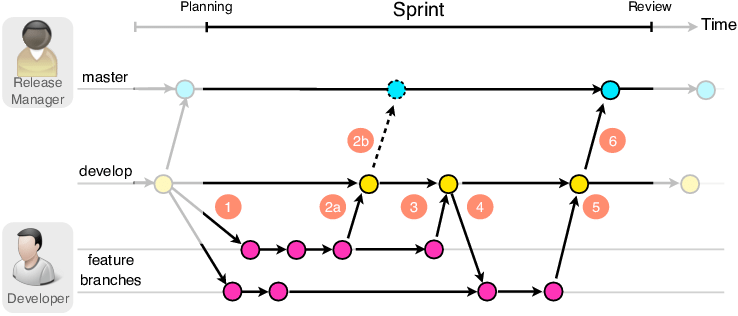

# 2024.02.18 TIL

## 📚 Git

#### Github로 협업하기 위한 과정을 간략히 소개하자면

1. Repository 생성
2. 공동작업자 초대
3. Projects 기능을 이용한 칸반 보드 설정
4. 이슈 라벨 및 템플릿 설정
5. Pull Request 템플릿 설정
6. 브랜칭 전략 설정
7. 커밋 메세지 작성 규칙 설정
8. 코드 리뷰

### 🚨 Feature 브랜치

새로운 기능 개발을 위한 feature 브랜치를 생성할 때 브랜치 이름은 다음과 같은 규칙으로 생성한다.

#### feature 브랜치는 마지막 develop 브랜치로부터 생성한다. 꼭 브랜치를 생성하기 전에 develop 브랜치를 pull 받는다.

> feature/{기능}

feature 브랜치는 작은 기능 단위로 쪼개어 최대 10개 미만의 커밋으로 구성되도록 한다. feature 브랜치가 develop 브랜치에 성공적으로 병합되었다면 feature 브랜치는 로컬과 원격에서 삭제한다.

#### feature 브랜치 생성하기

> git checkout -b feature/feature1

---

### 🚨 Commit

커밋은 기능, 타입 단위로 짧게 끊어서 커밋한다. 한번에 작업한 내용이 많더라도 커밋은 여러번에 걸쳐 구분하여 커밋한다. 그리고 커밋 타입에 따라 구분하여 커밋한다.

예를들어 리소스 추가는 리소스끼리 모아 커밋하고 버그 수정은 버그 수정만 따로 커밋하고 새로운 기능 추가는 추가된 기능만 따로 커밋한다.

커밋을 하였다면 원격 저장소에 push 하여 다른 멤버가 자신이 작업하고 있는 파일, 내용을 알 수 있도록 한다.

#### ⚡️commit 하기

```zsh
git add Assets/something.cs
git commit -m "feat: Change something"
```

#### 💡여러 줄의 커밋 메세지 작성 방법💡

"로 시작해 엔터를 눌러 여러줄의 메세지를 작성한다.<br>
"로 시작하면 다음 "가 나오기 전까지 엔터를 눌러도 명령어로 인식하지 않는다.

#### ⚡️원격 저장소에 작업중인 브랜치 원격 저장소에 push 하기

```zsh
git push origin feature/feature1
```

---

### 🚨 Commit message

#### ❗️1. Commit Message Structure

기본적으로 커밋 메세지는 아래와 같이 제목/본문/꼬리말로 구성한다.

```txt
type: subject

body (내용, 선택사항)

footer (마무리, 선택사항)
```

#### ❗️2. Commit Type

- feat: 새로운 기능 추가
- fix: 버그 수정, 기능 수정
- docs: 문서 수정
- refactor: 코드 리팩토링(변수명 수정 등)
- test: 테스트 코드, 리팩토링 테스트 코드 추가
- style: 코드 스타일 변경, 코드 자체 변경이 없는 경우
- remove: 파일 또는 코드, 리소스 제거
- resource: 이미지 리소스 등 코드와 상관없는 리소스 추가

#### ❗️Subject

- 제목은 50자를 넘기지 않고, 대문자로 작성하고 마침표를 붙이지 않는다.
- 과거 시제를 사용하지 않고 명령어로 작성한다.

#### 예시

```txt
feat : Add translation to missing strings
feat : Disable publishing
feat : Sort list context menu
feat : Resize minimize/delete handle icons so they take up the entire topbar
fix : Fix typo in cleanup.sh file
```

#### ❗️Body

- 선택사항이기 때문에 모든 커밋에 본문 내용을 작성할 필요는 없다.
- 부연 설명이 필요하거나 커밋의 이유를 설명할 경우 작성한다.
- 제목과 구분되기 위해 한칸을 띄워 작성한다.
- 각 줄은 72자를 넘기지 않는다.
- 본문은 꼭 영어로 작성할 필요는 없다

#### ❗️Footer

- 선택사항이기 때문에 모든 커밋에 꼬리말을 작성할 필요는 없다.
- 등록된 이슈 ID를 트래킹할 때 주로 사용한다.

#### ⚡️Example Commit Message

```txt
feat: Summarize changes in around 50 characters or less

More detailed explanatory text, if necessary. Wrap it to about 72
characters or so. In some contexts, the first line is treated as the
subject of the commit and the rest of the text as the body. The
blank line separating the summary from the body is critical (unless
you omit the body entirely); various tools like `log`, `shortlog`
and `rebase` can get confused if you run the two together.

Explain the problem that this commit is solving. Focus on why you
are making this change as opposed to how (the code explains that).
Are there side effects or other unintuitive consequenses of this
change? Here's the place to explain them.

Further paragraphs come after blank lines.

 - Bullet points are okay, too

 - Typically a hyphen or asterisk is used for the bullet, preceded
   by a single space, with blank lines in between, but conventions
   vary here

If you use an issue tracker, put references to them at the bottom,
like this:

Resolves: #123
See also: #456, #789
```

---

### 🚨 git stash

현재 작업중인 브랜치에서 다른 브랜치로 checkout 해야할 경우 커밋하지 않은 작업 때문에 checkout이 안될 수 있다. 이럴 때 커밋하지 않은 작업을 stash 명령어로 임시 보관하고 다른 브랜치로 checkout할 수 있다. 스택에 임시 보관한 작업들은 나중에 다시 꺼내와 마무리할 수 있다.

```zsh
git stash
git checkout develop
```

#### ❗️stash 목록 확인하기

```zsh
git stash list
```

#### ❗️stash 적용하기 (했던 작업을 다시 가져오기)

```zsh
// 가장 최근의 stash를 가져와 적용한다
$ git stash apply

// $ git stash apply [stash 이름]
```

---

### 🚨 Pull Request

하나의 feature 브랜치에서 기능 개발이 완료되었다면 바로 develop 브랜치에 merge 하여 원격 develop 브랜치에 push 하지 않고 작업중이던 브랜치를 push한 후 원격 develop 브랜치에 Pull Request를 요청한다.

---

### 실제 프로젝트에 적용하기

#### ❗️1. develop 브랜치에서 feature 브랜치를 생성한다.

```zsh
git checkout develop
git pull
git checkout -b feature/feature1
```

#### ❗️2. feature 브랜치에서 기능을 개발하고 커밋한다.

```zsh
git add files
git commit -m "feat: Add something"
```

#### ❗️3. rebase로 커밋 로그를 정리한다.

```zsh
git checkout develop
git pull
git checkout feature/feature1
git rebase develop feature/feature1
```

#### ❗️4. Pull Request를 요청한다.

```zsh
git push -f origin feature/feature1

[PR]
origin feature/feature1 -> origin develop
```

참고하기 좋은 사이트
https://wayhome25.github.io/git/2017/07/08/git-first-pull-request-story/

pull request를 위해선 아래와 같은 절차를 거친다

1. Fork<br>
   (fork한 후 clone 하는 이유는 원본레포지토리에 직접적인 변경 권한이 없는 경우, 레포지토리를 fork하면 복사본에 대해선 자신이 완전한 변경 권한을 가지게 되는 이유도 있고 fork한 레포지토리에서 변경 사항을 만든 후, 이를 원본 레포지토리에 반영하고자 하는 경우, pull request를 생성할 수 있다.)
2. clone, remote 설정<br>
   git clone을 하기전에 git init을 실행할 필요는 없다. git clone은 원격 저장소의 복사본을 로컬에 생성하면서 자동으로 새로운 git 저장소를 초기화한다.
3. branch 생성
4. 수정 작업 후 add, commit, push
5. Pull Request 생성
6. 코드리뷰, Merge Pull Request
7. Merge 이후 branch 삭제 및 동기화

---



- master: 기준이 되는 브랜치로 실제 사용자가 보게 되는 서비스가 배포되어있는 브랜치.
- develop: 개발이 활발히 이뤄지는 브랜치로 기능을 구현한 브랜치는 항상 여기에 머지된다.

Git Flow에서 가장 중요한 점은, 브랜치의 역할에 따라 무조건 지정된 브랜치에만 머지해야한다는 점이다. 기능을 구현한 브랜치는 무조건 develop 브랜치에 머지해야 하고, develop 브랜치에 있는 기능들을 출시(배포)할 때만 master 브랜치에 머지해야 한다는 것이다.
