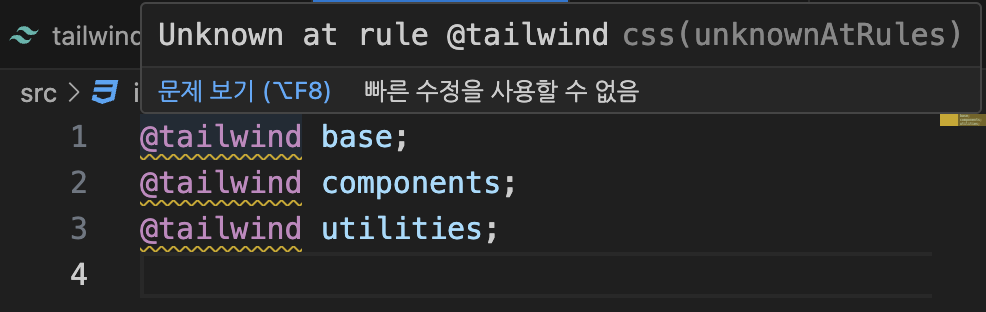

# 2024.02.21 TIL

## 📚 Clean Code JavaScript

## 분기 다루기

### 🚨 삼항 연산자 다루기

삼항 연산자를 사용할 때 케이스에 대한 일관성이 필요하다

일관성에 대한 기준을 우리가 잘 세울 수 있도록 다양한 케이스를 살펴보자.

#### 삼항연산자는 3개의 피연산자를 취한다.

#### ⚡️조건?참(식):거짓(식)

삼항연산자는 조건, 좌항 우항을 따졌을 때 3개의 피연산자를 사용하는 것이다. 이 모든 값이 필요하지 않은 경우에도 굳이 삼항연산자를 사용하는 경우가 있다.

조건을 기준으로 거짓이나 참만 필요한 경우에는 삼항연산자를 쓸 필요가 없다.

---

### 🚨 Truthy & Falsy (참 같은 값 & 거짓 같은 값)

JavaScript에서 truthy와 falsy는 조건문에서 값의 참 또는 거짓 여부를 나타내는 개념이다. 여기에는 몇 가지 중요한 점이 있다.

#### ❗️1. Truthy(참): 조건이 참으로 간주되는 값들

- true: 직접적으로 true로 평가되는 값
- 숫자: 0을 제외한 모든 숫자
- 문자열: 빈 문자열을 제외한 모든 문자열
- 객체: 빈 객체를 제외한 모든 객체
- 배열: 빈 배열을 제외한 모든 배열
- 함수: 정의된 모든 함수
- 기타: true로 간주되는 값들

#### ❗️Falsy(거짓): 조건이 거짓으로 간주되는 값들

- false: 직접적으로 false로 평가되는 값
- null
- undefined
- 0: 숫자 0
- NaN: 숫자가 아님
- 기타: false로 간주되는 값들

이러한 개념은 조건문에서 변수의 값이 참인지 거짓인지 확인할 때 매우 유용하다. 예를들어 if문에서는 조건식이 true로 평가되면 해당 블록이 실행되고, false로 평가되면 실행되지 않는다. falsy 값들은 주로 변수의 초기값을 확인하거나 함수의 반환값을 처리할 때 유용하게 사용된다.

---

### 🚨 단축 평가

논리 연산자인 &&와 ||에서 발생하는 특정한 동작 방식을 의미한다.

#### ❗️논리 AND 연산자(&&)

- 첫 번째 피연산자가 거짓으로 평가되면, 두 번째 피연산자는 평가하지 않고 바로 거짓으로 결정된다.
- 첫 번째 피연산자가 참으로 평가되면, 두 번째 피연산자를 평가하고 그 결과를 반환한다.

```js
true && false; // false
false && true; // false
true && "Hello"; // 'Hello'
false && "Hello"; // false
```

#### ❗️논리 OR 연산자(||)

- 첫 번째 피연산자가 참으로 평가되면, 두 번째 피연산자는 평가하지 않고 바로 참으로 결정된다. 이때, 첫 번째 피연산자의 값이 반환된다.
- 첫 번째 피연산자가 거짓으로 평가되면, 두 번째 피연산자를 평가하고 그 결과를 반환한다.

```js
true || false; // true
false || true; // true
true || "Hello"; // true
false || "Hello"; // 'Hello'
```

---

### 🚨 Early Return

Early Return은 함수 내부에서 조건문을 사용하여 조건을 만족할 때 함수를 즉시 종료하는 패턴을 말한다. Early Return을 사용하면 함수의 중첩된 블록을 줄이고, 코드의 가독성을 향상시키며, 오류를 줄이는 등의 장점을 얻을 수 있다.

예를들어 다음과 같은 함수가 있다고 가정해보자.

```js
function processNumber(num) {
  let result;
  if (num > 0) {
    result = "Positive";
  } else {
    result = "Negative";
  }
  return result;
}
```

위 함수는 조건문을 사용하여 입력된 숫자가 양수인지 음수인지 판별하고 결과를 반환한다. 이를 Early Return을 사용하여 리팩토링하면 다음과 같이 될 수 있다.

```js
function processNumber(num) {
  if (num > 0) {
    return "Positive";
  }
  return "Negative";
}
```

위의 두 예제는 동일한 결과를 반환하지만, 두 번째 함수는 중첩된 블록이 없으며 더 간결하고 가독성이 높다. 이런 방식으로 Early Return을 사용하면 코드를 보다 간결하고 이해하기 쉽게 만들 수 있다.

---

### 🚨 Default Case 고려하기

```js
function sum(x, y) {
  x = x || 1;
  y = y || 1;

  return x + y;
}

sum();
```

이렇게 기본값을 미리 정해놓는 것은 중요하다.

```js
function createElement(type, height, width) {
  const element = document.createElement(type || "div");

  element.style.height = height || 100;
  element.style.width = width || 100;

  return element;
}
```

---

### 🚨 명시적인 연산자 사용 지향하기

```js
if((isLogin && token) || user)
```

이런식으로 우선순위를 넣어서 사람이 보기 편하게 만드는 것이 굉장히 중요하다.

괄호를 잘 활용하여 우선순위를 지정해줘야 코드를 더 명시적이게 작성을 할 수 있다.

---

## 📚 Tailwind CSS

#### Tailwind CSS는 JavaScript 기반으로 동작하며, CSS를 생성하기 위해 JavaScript 환경에서 실행된다. 따라서 Node.js 환경이 필요하다. Node.js를 설치하고 환경을 설정한 후에는 Tailwind CSS를 사용하여 CSS 파일을 생성하고 프로젝트에 적용할 수 있다.

```js
/** @type {import('tailwindcss').Config} */
module.exports = {
  content: ["./src/**/*.{html,js}"],
  theme: {
    extend: {},
  },
  plugins: [],
};
```

여기서 contet의 내용은 파일 경로를 나타내는 패턴인데 이 패턴은 특정 디렉토리(src) 아래의 모든 html 및 javascript 파일을 대상으로 한다.

#### \*\*/: src 폴더 아래의 모든 하위 디렉토리를 가리킨다. 이는 하위 디렉토리의 깊이에 상관없이 모든 디렉토리를 포함한다.

#### \*.{html,js,}: .html 또는 .js 확장자를 가진 모든 파일을 가리킨다.


여기의 Unknown at rule @tailwind 이것을 해결하기 위해선

VSC 설정 -> unknown 검색 -> CSS>Lint: Unknown At Rules를 ignore로 바꿔주면 된다.

#### ⚡️input.css에 @tailwind 어쩌구; 같은 지시문을 추가하면 해당 CSS 파일을 Tailwind CSS가 이해하고 필요한 스타일을 생성하는데 이 때, tailwind.config.js 파일에 정의된 구성 옵션을 기반으로 Tailwind CSS가 스타일을 생성한다.

#### 개발 중에는 Tailwind CSS가 필요한 스타일을 동적으로 생성하여 사용자에게 제공하므로 별도의 컴파일 작업 없이도 스타일을 확인할 수 있다.

#### 그러나 배포 단계에서는 사용자에게 전달되는 CSS 파일의 크기를 최소화하기 위해 Tailwind CSS를 컴파일하여 최종 CSS 파일을 생성하는 것이 일반적이다. 이렇게 생성된 최종 CSS 파일은 불필요한 스타일을 제거하고 최적화된 형태로 제공되어 웹 페이지의 성능을 향상시킨다.

### ❗️ 따라서 개발 중에는 실시간으로 Tailwind CSS를 사용하여 스타일을 확인하고 테스트할 수 있으며, 배포 단계에서는 최종 CSS 파일을 생성하여 사용자에게 제공하는 것이 좋다.
