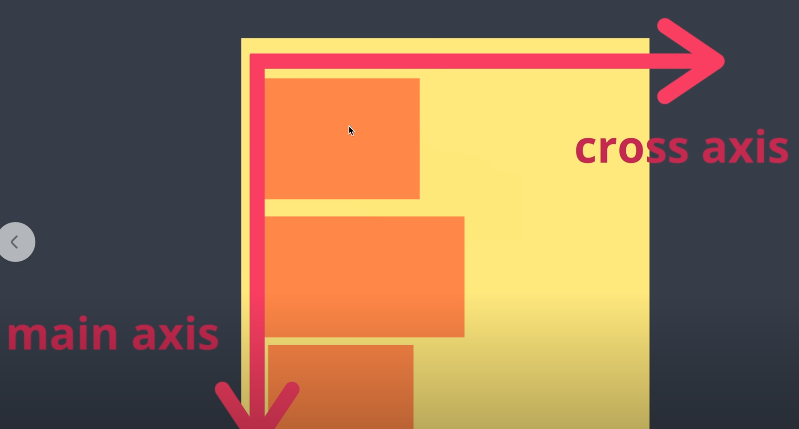

# 2024.02.24 TIL

## 📚 CSS

### 🚨 Flexbox

#### Flexbox는 CSS의 "position" 속성을 보완하여 더욱 유연하고 강력한 레이아웃을 구현하기 위해 도입된 개념이다.

기존의 position 속성은 요소를 상대적이거나 절대적으로 배치할 수 있게 해주었지만, 요소 간의 유연한 배치와 정렬에는 제한이 있었다. 이에 반해 Flexbox는 요소 간의 유연한 레이아웃을 구현할 수 있도록 설계되었다. Flexbox를 사용하면 요소를 수평 또는 수직으로 정렬하고 공간을 효율적으로 활용할 수 있으며, 반응형 및 모바일 디자인에 특히 유용하다.

Flexbox는 뷰포트나 요소의 크기가 불명확하거나 동적으로 변할 때에도 효율적으로 요소를 배치, 정렬, 분산시킬 수 있는 기능을 제공한다. Flexbox는 복수의 자식 요소인 flex item과 그 상위 부모 요소인 flex container로 구성된다.

#### ⚡️Flexbox는 주요 기능에 대한 개요를 다음과 같이 제공한다.

1. 주축과 교차축 
   Flexbox를 다루려면 주축과 교차축이라는 두 개의 축에 대한 정의를 알아야 한다. 주축은 flex-direction 속성을 사용하여 지정하며 교차축은 이에 수직인 축으로 결정된다.

2. flex 컨테이너와 flex 항목 
   Flexbox가 놓여있는 영역을 flex 컨테이너라고 부르며, flex 컨테이너 내부에 배치되는 항목을 flex 항목이라고 한다.

3. flex-direction 
   flex-direction 속성을 사용하면 flex 항목이 나열되는 방향을 변경할 수 있다.

4. flex-wrap 
   flex-wrap 속성의 값을 wrap으로 지정하면 항목이 하나의 행에 들어가지 않을 정도로 클 경우 다른 행에 배치된다.

---

### ❓ float이 flexbox 아니야?

아니다. Flexbox와 Float는 모두 CSS에서 레이아웃을 다루는 방법이지만 서로 다른 기술이다.

Float는 CSS의 레이아웃 기능 중 하나로 주로 요소를 좌우로 배치하거나 텍스트 주위로 요소를 감싸는 데 사용된다. 예를들어 이미지를 텍스트 옆에 둘 때 사용되는 것이 일반적이다. 하지만 FLoat는 주로 레이아웃을 설계할 때 예측하기 어렵고 복잡하며, 일부 경우에는 예기치 않은 결과를 초래할 수 있다. 

(예전에는 CSS의 레이아웃을 만들 수 있는 기능이 없다보니까 많은 사람들이 float을 이용해서 박스를 왼쪽에 배치하고 나머지 박스를 오른쪽에 배치하고 오른쪽에 배치된 박스 안의 아이템들을 float을 써서 또 배치하곤 했는데 이젠 flexbox가 있기 때문에 이제 float은 원래 목적인 text와 이미지들을 배치하는 용도로 쓰여지게 된다.)

반면 Flexbox는 Float보다 훨씬 강력하고 유연한 레이아웃 시스템이다. Flexbox를 사용하면 요소의 배치, 정렬 및 간격을 조정할 수 있으며 다양한 크기와 방향의 요소를 효과적으로 관리할 수 있다. 또한 Flexbox는 반응형 디자인에 매우 적합하며, 더 직관적이고 간결한 코드를 작성할 수 있다.

#### ⚡️따라서 Flexbox는 Float보다 더 선호되는 CSS 레이아웃 기술이며, 최신 웹 개발에서는 주로 Flexbox를 사용하는 것이 일반적이다.

---

Flexbox는 2가지만 이해하면 된다.

### 1. Flexbox는 Container박스에 적용되는 속성값과 각각의 아이템들에 적용할 수 있는 속성값이 존재한다.

#### ❗️container 박스

#### ❗️item

---

### 2. Flexbox는 중심축과 반대축이 있다.

내가 중심축을 수평이나 수직이냐에 두느냐에 따라서 반대축이 바뀐다.

---

#### Flexbox를 사용하려면 부모 요소에 display: flex 속성을 지정해야 한다.

#### ❗️container 속성

1. ⚡️flex-direction: Flex 아이템의 주 축(main axis)을 설정한다. 주 축은 아이템이 배치되는 방향을 나타낸다. 주로 row, row-reverse, column, column-reverse 값을 사용한다.

- row: 주 축을 수평 방향으로 설정. 왼쪽에서 오른쪽으로 아이템이 배치된다.
- row-reverse: 주 축을 수평 방향으로 설정하되, 아이템의 배치가 반대로 이루어짐.
- column: 주 축을 수직 방향으로 위에서 아래로 아이템을 배치
- column-reverse: 주 축을 수직 방향으로 설정하되, 아이템의 배치가 반대로 이루어진다.

---

2. ⚡️flex-wrap: Flex 아이템들의 줄 바꿈 여부를 설정한다. 주로 nowrap, wrap, wrap-reverse 값을 사용한다.

- nowrap: Flex 아이템들이 한 줄에 모두 배치되며, 줄 바꿈이 발생하지 않는다.
- wrap; Flex 아이템들이 여러 줄에 걸쳐 배치되며, 필요할 때 줄 바꿈이 발생한다.
- wrap-reverse: Felx 아잍메들이 여러 줄에 걸쳐 배치되지만 아이템들이 역순으로 배치된다.

---

3. ⚡️justify-content: Flex 컨테이너 내의 Flex 아이템들을 주 축(main axis)을 따라 정렬하는 방법을 설정한다. 주로 flex-start, flex-end, center, space-between, space-around, space-evenly 값을 사용한다

- flex-start: 아이템들을 컨테이너의 끝 부분에 정렬한다.

- center: 아이템들을 컨테이너의 중앙에 정렬한다.

- space-between: 첫 번째 아이템은 컨테이너의 시작 부분에, 마지막 아이템은 컨테이너의 끝 부분에 정렬되고 나머지 아이템들은 동일한 간격으로 분산 정렬된다.

- space-around: 아이템들을 균등한 간격으로 정렬하되, 컨테이너의 양 끝에는 반 간격만큼의 여백이 추가된다.

---

4. ⚡️align-items: Flex 컨테이너 내의 Flex 아이템들을 교차 축(cross axis)을 따라 정렬하는 방법을 설정한다. 주로 stretch, flex-start, flex-end, center, baseline 값을 사용한다.

- stretch: 아이템들을 교차 축을 따라 컨테이너에 맞도록 늘린다
- flex-start: 아이템들을 교차 축의 시작 부분에 정렬한다.
- flex-end: 아이템들을 교차 축의 끝 부분에 정렬한다.
- center: 아이템들을 교차 축의 중앙에 정렬한다.
- baseline: 아이템들을 텍스트 기준선을 기준으로 정렬한다.

---

#### ❗️item 속성

중요한 아이템 속성: flex-grow

Item의 증가 너비 비율을 설정한다. 숫자가 크면 더 많은 너비를 가지고 Item이 가변 너비가 아니거나, 값이 0일 경우 효과가 없다.

---

추가적으로 자바스크립트 정규표현식에 대한 블로그 작성
https://devadventure.tistory.com/entry/JavaScript-%EC%A0%95%EA%B7%9C%ED%91%9C%ED%98%84%EC%8B%9DRegular-Expression-%EC%82%AC%EC%9A%A9%EB%B2%95
