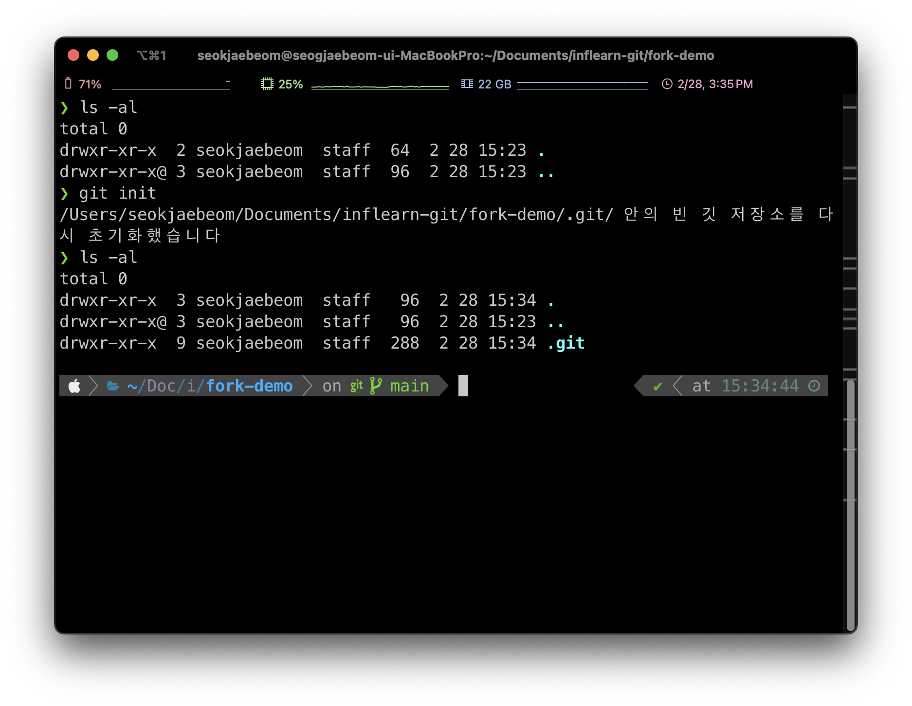

# 2024.02.28 TIL

## 📚 Git


#### ❗️Git bash
git bash는 window의 cmd, linux와 mac의 terminal과 같은 역할을 하는데 문제점이 있다. 그건 운영체제마다 명령어가 다르다는 문제점이 있는데 이를 극복한 것이 바로 Git bash다.

Git bash를 이용하면 window에서도 리눅스의 명령어를 쓸 수 있다. 따라서 mac이나 리눅스를 사용하는 경우 기존 terminal을 사용해도 무관하지만, window 유저는 git bash를 쓰는게 편리하다.
## ⛳️ CLI로 Git&GitHub 시작하기
---
### 🚨Git 초기화와 로컬 저장소
해당 폴더에서 Git으로 버전관리를 하고싶다면 원하는 폴더에서 Git 초기화를 해야한다.
```bash
git init
```
Git 초기화를 하면 .git이라는 숨겨진 폴더가 만들어지는데 이게 로컬 저장소다.

#### ❗️로컬 Git 저장소에는 어떤 내용이 저장돼?
1. 작업 디렉토리<br>
실제 파일들이 저장되는 곳이다. 여기엔 수정된 파일, 새로운 파일, 삭제된 파일 등이 포함된다.

2. 스테이징 영역<br>
커밋할 준비가 된 파일들이 여기에 추가된다. git add 명령어를 통해 파일을 스테이징 영역에 추가할 수 있다.

3. 로컬 저장소<br>
커밋된 버전들이 저장되는 곳이다. 커밋 히스토리, 브랜치 정보, 태그 등이 포함된다.

4. HEAD<br>
가장 최근의 커밋을 가리키는 포인터다. HEAD는 현재 작업중인 브랜치의 마지막 커밋을 가리킨다.

#### ⚡️ 나중에 원격 저장소에서 내 컴퓨터로 저장소를 받아오는 경우에는 로컬 저장소가 자동으로 생긴다. 버전 정보를 가져와야 하니까 저장소가 당연히 생긴다.

### ❗️한 폴더에 하나의 저장소만 유지해야 한다.
만약 a폴더 안에 b폴더가 포함되어있고 a폴더와 b폴더 각각 별도의 Git 저장소가 있고 두 폴더에서 동일한 파일을 수정하거나 추가했다면 Git 충돌이 발생할 수 있다.


---
### ❗️첫 번째 버전 만들기
#### Git 사용자 정보 등록
```bash
git config --global user.name "John Doe"
git config --global user.email johndoe@example.com
```

```bash
git add README.md
git commit -m "프로젝트 설명파일 추가"
```
#### ❗️생성한 커밋 보기
```bash
git log
```

---

#### ❗️커밋 이모저모
1. 커밋은 "의미있는 변동사항"을  묶어서 만든다.
2. 버튼 클릭 버그를 고치는데 5가지 파일을 수정했다면 그 5가지를 묶어 하나의 커밋으로 만든다.
3. 동료 개발자 또는 내가 버튼클릭버그를 고치는데 어떤 파일을 수정했는지 손쉽게 파악이 가능하다.
4. 커밋 메세지 적는게 귀찮아도 시간을 조금이라도 들여줘야 나중에 후회하지 않는다.
#### 커밋은 기차처럼 쌓인다.

---
#### ❗️만든 버전 GitHub에 올리기
#### 로컬 저장소와 원격 저장소
push라는 명령어를 사용하면 원격 저장소에 우리가 만들었던 커밋을 그대로 올릴 수 있다.

1. 내 로컬 컴퓨터의 Git 저장소가 있는 폴더에 GitHub 저장소 주소를 알려준다.
```bash
git remote add origin https://github.com/아이디/이름.git
```

2. 만든 커밋 푸시하기
```bash
git push origin master
```

---
### 🚨 다른 사람이 만든 저장소 받아오기
#### ❗️원격 저장소를 내 컴퓨터에 받아오기: 클론(clone)

원격 저장소에 A가 커밋을 올렸고 신입 개발자 B가 이 저장소를 본인의 컴퓨터에 받아오고 싶어한다.

클론(clone)을 하면 원격저장소의 코드를 내 로컬 컴퓨터에 받아올 수 있다. 로컬 저장소(.git 폴더)도 자동으로 생긴다.

그 와중에 A가 새로운 버전을 만들어 원격 저장소에 push 했다. 이 업데이트된 데이터는 풀(pull) 명령어로 받아올 수 있다.

B도 물론 원격 저장소에 push 권한이 있을 경우 커밋을 만들어서 원격 저장소로 push 할 수 있다.

```bash
git clone https://github.com/아이디/이름.git .
```

#### ❗️원격 저장소의 변경사항 내 컴퓨터에 받아오기
```bash
git pull origin master
```

---
### 🚨 가장 간단한 협업 시나리오 - 7가지 개념 리뷰

#### 1. 해커톤에 참가한 개발자 고양이는 개발자 문어와 짝이 된다.

#### 2. 고양이가 먼저 총대를 매고 프로젝트 폴더를 만든다. 먼저 컴퓨터에 Boxiting 폴더를 만들고, git init 명령어로 로컬 저장소를 생성한다.

#### 3. 고양이는 메인 페이지 제작을 맡기로 했다. VS Code에서 파일을 만들어 모두를 git add 한다음 "메인 페이지 생성"이라는 커밋을 만들었다. (git commit -m "메인 페이지 생성")

#### 4. Github에 원격 저장소를 만들어 그 주소를 로컬 저장소에 알려준 후(git remote add origin 저장소주소) 로컬 저장소에서 만든 커밋을 원격 저장소에 푸시한다(git push).

#### 5. 문어도 개발을 시작하기 위해 고양이가 올려준 원격 저장소를 본인 컴퓨터에도 받아온다.(git clone 저장소주소)

#### 6. 문어는 디테일 페이지 제작을 맡았다. Push 권한을 갖기 위해 Github 저장소에 문어 계정을 Collaborator로 추가한 후 새 커밋을 푸시한다(push).

#### 7. 문어가 새로 추가한 "디테일페이지" 커밋을 고양이 컴퓨터에 받아온다. 각자 개발한 버전(커밋)을 언제든 원격 저장소에 올리고 받아올 수 있다.

---

## ⛳️ GUI로 Git&GitHub 시작하기
---
실무에서는 GUI, CLI 방법 둘 다 쓸줄 알아야 한다. GUI가 더 개념을 잡기는 좋고 시각화가 잘 되어있어서 어떤 코드를 추가해야하고 추가를 했는지 되게 잘보인다.
### 🚨 소스트리 GUI로 Git 다지기
1. 커밋 객체에는 무엇이 저장될까?
2. 두 사람이 병렬로 커밋을 만들고 싶으면 어떡하지?
3. 두 사람이 만든 버전을 합칠 수 있나?
4. 남이 만든 오픈소스에는 어떻게 기여할 수 있지?

### 소스트리(Sourcetree)
Git을 GUI로 사용자가 더 쉽게 사용할 수 있도록 하는 프로그램이다. 코딩에 집중할 수 있도록 Git 레포지토리와 상호작용 하는 방법을 단순화한다.


### 그림으로 배우는 Git의 원리

### 🚨 Git에서의 커밋이란?
1. 변경 사항의 모음 (x) 하나의 최종 코드 모음(o)
2. 다만 기존 커밋과 비교해서 변경된 파일이 아니면 "변경되지 않았다"고만 저장해서 용량이 무겁지 않다.

### ❗️0. 맨 처음 로컬 저장소를 만들었을 때


처음 추가를 했으므로 파일의 상태는 "추적 안됨"이다.

### ❗️1. 두 파일 스테이지에 올리기(git add)


add를 하면 stage라는 공간에 올라가게 된다. 그 파일들은 stage됨 이라고 git 로컬저장소가 적어놓는다.

### ❗️2. 스테이지 사진 찍어 남기기: 커밋


커밋을 하면 방금 커밋된 애들은 file들이 수정 없음으로 다시 돌아가게 된다.

### ❗️3. 커밋을 원격 저장소에 올리기: 푸시


### ❗️4. app.js, app.css 추가


### ❗️5. app.js 수정, app.css 스테이지에 올리기


### ❗️6. 스테이지 사진 찍어 남기기: 커밋


### ❗️7. 커밋을 원격 저장소에 올리기: 푸시

 
#### 요약
Git으로 추적하는 파일은 4가지 상태를 가지고 있다. 크게 두 분류로 나뉘는데 추적 안됨과 추적됨으로 나뉘고 추적안됨은 아직 깃에 한번도 올리지 않았던 파일이고 추적됨은 git에 한번 올려서 계속 수정했다가 스테이지에 올렸다가 하는 상태다.

git은 작업공간에 있는 수정함과 추적안됨 파일을 스테이지로 올려 스테이지 됨으로 변경하고 커밋을 하면 수정 없음 상태로 돌아가서 다시 파일을 수정할 수 있다.

---