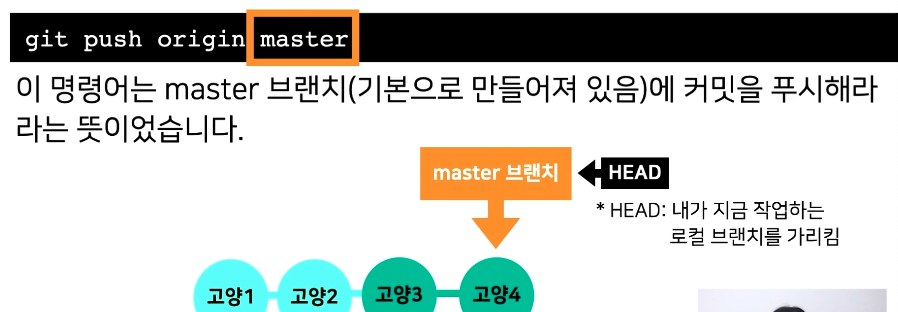
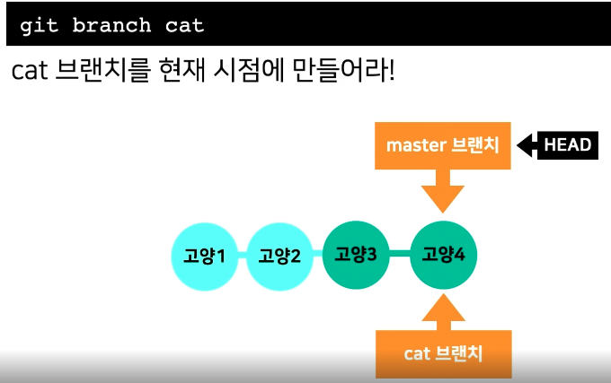
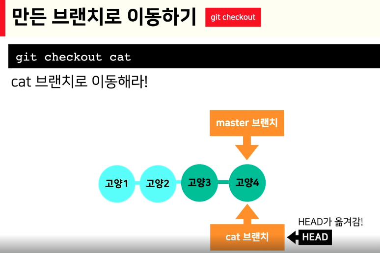
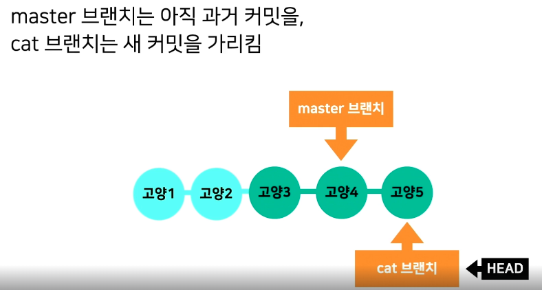
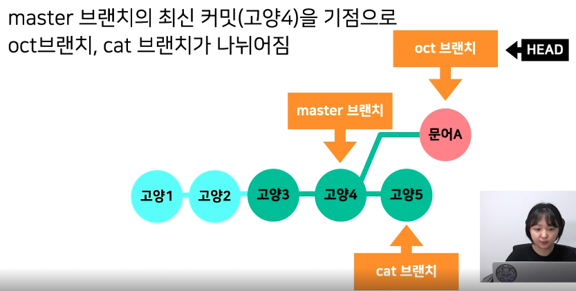
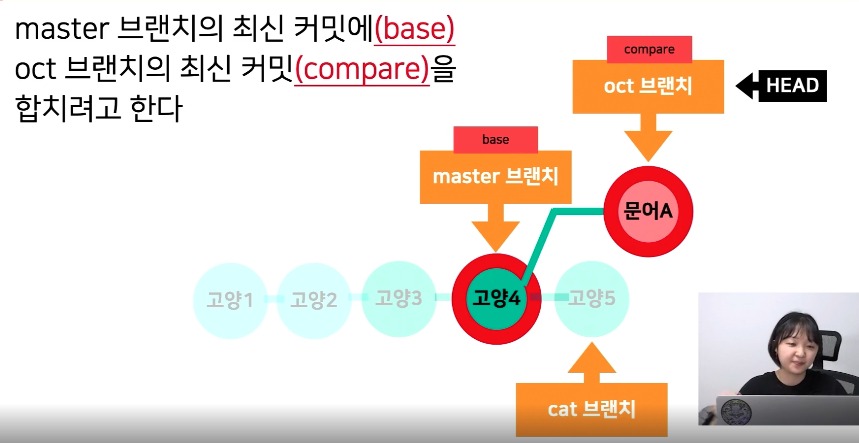
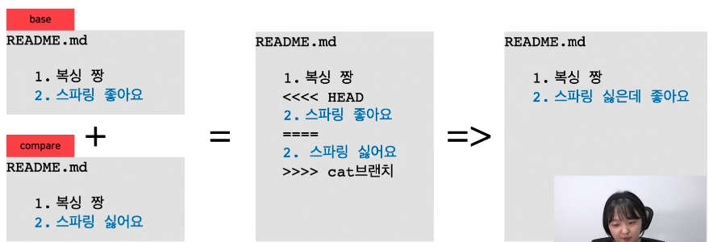
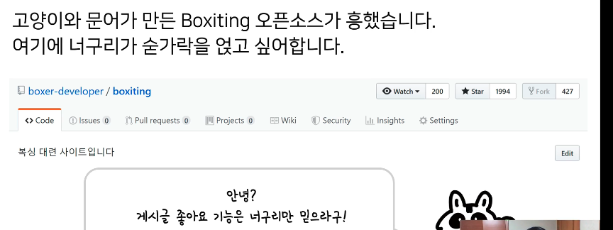
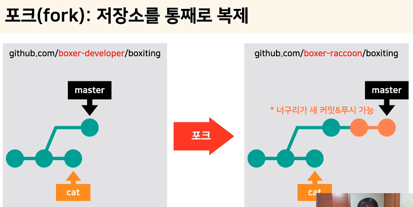
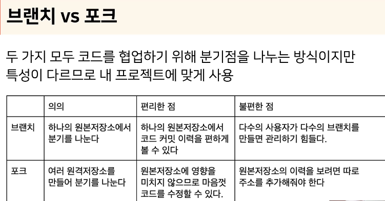

# 2024.02.29 TIL

## 📚 Git
### 🚨브랜치(branch): 평행세계 나누기
#### 사실 이미 브랜치는 있었다

master 또는 main이라고 되어있을텐데 이 명령어의 뜻은 로컬 저장소의 변경 사항을 원격 저장소의 main 브랜치로 업데이트 하는 역할을 한다.

#### ⚡️ Git에서 기본 브랜치는 main 또는 master 이다. 이 두 브랜치의 차이는 아래와 같다
#### 💡main 브랜치
- 최근 버전의 Git에서는 기본 브랜치의 이름을 main을 사용한다.
- 새로운 Git 저장소를 초기화할 때 자동으로 생성되는 브랜치다.
- 주로 프로젝트의 주요 통합 브랜치로 사용된다.

#### 💡master 브랜치
- 이전 버전의 Git에서는 기본 브랜치 이름으로 master를 사용했다.
- 최신 버전에서는 main으로 변경되었다.
- 주로 프로젝트의 주요 통합 브랜치로 사용되었다.

### ❗️따라서 이제 main이 기본 브랜치 이름으로 사용되며, master는 더 이상 권장되지 않는다. 

---
#### ❗️브랜치 만들기 (git branch)

git branch cat으로 cat 브랜치를 현재 시점에 만들었고 master 브랜치가 고양4 버전을 가리키고 있다. 여기서 동일한 버전을 가리키는 cat 브랜치를 만들었다. 

#### ❗️만든 브랜치로 이동하기 (git checkout 또는 git switch)

그 다음에 만든 브랜치로 이동하는 명령어 (head를 이동하는 명령어)다.

#### git checkout과 git switch의 차이
#### git checkout
- 이 명령은 이전에 사용되던 방식으로, 브랜치를 변경하고 파일을 복원하는 데 사용된다.
- 브랜치를 전환하거나 특정 커밋으로 이동할 때 사용한다.
- 파일을 특정 커밋으로 복원하거나 변경 내용을 취소할 때도 사용된다.
#### git switch
- Git 2.23 버전부터 도입된 명령어로, 브랜치를 전환하는 데 특화되어 있다.
- 브랜치를 변경할 때 더 직관적이고 명확한 명령어다.
- 파일이나 커밋과 관련된 작업은 처리하지 않는다.

따라서 git switch는 브랜치 전환에더 적합하며, git checkout은 브랜치 전환 외에도 다양한 작업이 사용된다.

#### ❗️만약 cat 브랜치에 커밋을 추가하면?

master 브랜치는 고양4 커밋을 가리키고 cat 브랜치는 새 커밋을 가리킨다. 

#### ❗️master로 이동하고, oct브랜치 만들고, 커밋

#### master 브랜치로 이동을 한 후 여기에 새로운 브랜치를 만들어서 커밋을 추가하면 두 개의 브랜치 상태가 갈라진다.

---
### 🚨 두 버전 합치기 (merge)
#### ❗️master(main) 브랜치의 최신 커밋에 oct 브랜치의 최신 커밋을 합치려고 한다.

#### 1. 먼저 합쳐지고 싶은 base가 될 master 브랜치로 이동
#### 2. compare 브랜치인 oct를 나와 합치고 싶다라고 명령 (git merge oct)
#### 3. 합쳐진 결과는 문어 A 커밋
문어 A는 고양4 + a 니까 둘이 합친 결과물은 당연히 문어 A. 그래서 oct랑 master 브랜치 모두 문어 A를 가리킨다.

---
### 🚨 합치다가 충돌이 났어요: 컨플릭트(conflict)

merge할 때 두 버전이 같은 곳을 수정했다면 이를 수동으로 고쳐줘야 한다.

---
### 🚨 포크(fork): 저장소 통째로 복제하기

고양이와 문어가 만든 Boxiting이라는 오픈소스가 있는데 여기에 너구리가 숟가락을 얹고 싶어한다.

오픈소스를 살펴보니 게시글 좋아요 기능이 있으면 좋을것 같다고 생각하여 좋아요 기능을 본인이 직접 코딩하여 기여하고 싶었다.

다만 boxiting 저장소의 push 권한은 고양이와 문어만 가지고 있다. **그렇다면 오픈소스에 기여를 하기 위해선 커밋 전에 반드시 collaborator 등록을 부탁해야할까?**

**그러기엔 너무 번거롭다.**

#### ❗️ 이럴 때 사용하는 기능이 fork다. fork는 저장소를 내 계정으로 통째로 복제시킨다고 생각하면 된다.

그래서 보통 작은 팀에서는 따로 원본 저장소를 fork 해서 분기를 나누지 않고 브랜치를 따서 협업을 하는 경우를 볼 수 있고 오픈소스에서는 무조건 포크 방식을 따른다. 정답은 없다.

---
### 🚨 내 코드를 머지해줘!: 풀 리퀘스트(PR)

fork한 저장소에서 기능 개발을 마쳤다. 이제 이 코드를 원본 저장소에 머지해달라고 하고싶다.

1. 머지하고 싶은 두 브랜치를 선택하고
2. 어떤 변경을 했는지 제목과 내용에 쓰면 된다.
3. 단일 저장소에서 보낼 수도 있고, 포크한 저장소에서도 보낼 수 있다.

#### 코드를 함께 작성하는 팀원이 있다면, 최대한 직접 머지하는건 피하고 모든 머지를 풀 리퀘스트를 통해서 하자.
#### 동료가 내 PR을 보고 코드를 리뷰할 수 있다.
#### 동료의 PR에 수정이 필요하면 댓글을 달아 change request를 보낼 수 있다.

#### ❗️풀 리퀘스트 실습
1. 포크한 저장소에서 원본 저장소로 풀 리퀘스트 보내기 
(중간에 pull request라는 버튼이 있는걸 볼 수 있다. )
