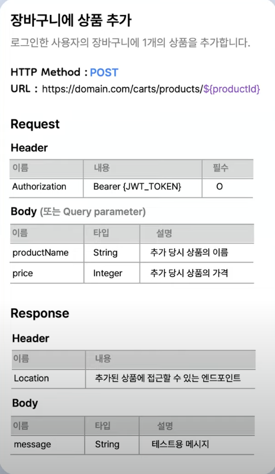

# 2024.03.02 TIL

## 📚 REST API

### 🚨API 명세서

#### ⚡️이름 및 설명

API 명세서에는 이름과 설명을 간단하게 담고 있어야 한다.

#### ⚡️기본 정보

API에 접근할 수 있는 Host 주소와 Endpoint, HTTP Method 등의 기본 정보도 포함하고 있어야 한다.

#### ⚡️요청

요청을 보낼 때 필요한 헤더, 파라미터, 바디를 모두 설명하는 내용을 담고 있어야 한다.

#### ⚡️응답

헤더와 바디에 들어가는 정보에 대해 설명한다.

근데 뭔가 허전하다. 따라서 여기에 더해 이 내용을 한 눈에 알아볼 수 있는 예시를 포함하는 것이 이해하는데 굉장히 많은 도움이 된다. 또 응답이 여러 경우로 나뉘는 경우에는 각각의 응답을 모두 예시로 들어주는것이 좋다.

---

#### ❗️API 명세를 위한 다양한 tool이 존재한다

각각의 장단점을 파악하고 본인의 상황에 맞는 가장 적당한 tool이 무엇인지 선택해야한다.

---

### 🚨협업의 자세

### ⚡️1. API 설계를 먼저 하자

프론트엔드 개발자는 API 규격을 보고 작업한다. API 명세가 나중에 나오면 API 구현 기간 동안 API 호출 부분 작업을 못하거나, 임의로 API 주소, HTTP method, 속성명을 사용하다가 모두 바꿔야 한다.

ex) 클라님, API 명세서 먼저 공유드립니다 전 이제 API 구현하러 가볼게요!

### ⚡️2. API 설계할 때 소통하자

API를 사용하는 사람 입장을 반영하자! 네이밍, 반환타입, JSON 구조, 로직 적용 책임 분배(정렬을 서버에서 할지 프론트에서 할지 등)처럼 소통을 통해 함께 설계한다면, 서로의 리소스를 낭비하지 않을 수 있다.

### ⚡️3. 업데이트를 사전에 공유하자

API 스펙이 변경되면 클라이언트 코드도 변경되어야 하므로, 업데이트할 내용을 사전에 공유하고 조율하는 과정이 필수적이다.

### ⚡️4. 상대방 입장에서 설명하자

서로 다른 관심사를 다루는 프론트엔드와 백엔드 개발자! 상대방이 가장 궁금해 할 내용을, 상대방이 이해할 수 있도록 설명해야 한다.

---

### 🚨Swagger란? Open API에 대해 알아보기

Swagger같은 API 명세를 도와주는 도구들은 스타트업에서 많이 놓치고 사용하지 않는 경우가 많다. 꼭 Swagger가 아니라도 API 명세는 팀 단위로 개발을 진행할 때 반드시 필요한 것중 하나이다. 특히 개발을 풀스택 개발로 한사람이 모두 하는게 아니라 팀 내에 다양한 개발자가 포진되어 있는 경우 반드시 필요하다.

#### Swagger API가 좋은 점은 문서 자체에 API를 테스트할 수 있는 환경이 잘 갖춰져있다.

API 명세서란 백엔드 프로그램과 프론트엔드 사이에서 정확히 어떤 방식으로 데이터를 받을지에 대한 명세를 말한다.

스웨거는 기본적으로 REST API를 채택한다.

---

### 🚨Java 용어

#### Annotation이란?

사전적 의미로는 주석이라는 뜻이지만, 자바에서 Annotation(@)은 코드 사이에 특별한 의미, 기능을 수행하도록 하는 기술이다. 프로그램 코드의 일부가 아닌 프로그램에 관한 데이터를 제공하고, 코드에 정보를 추가하는 정형화된 방법이다. 어노테이션을 사용하면 코드가 깔끔해지고 재사용이 가능하다.

- 컴파일러에게 코드 작성 문법 에러를 체크하도록 정보를 제공
- 스프트웨어 개발 툴이 빌드나 배치시 코드를 자동으로 생성할 수 있도록 정보를 제공
- 실행시(런타임시)특정 기능을 실행하도록 정보를 제공
