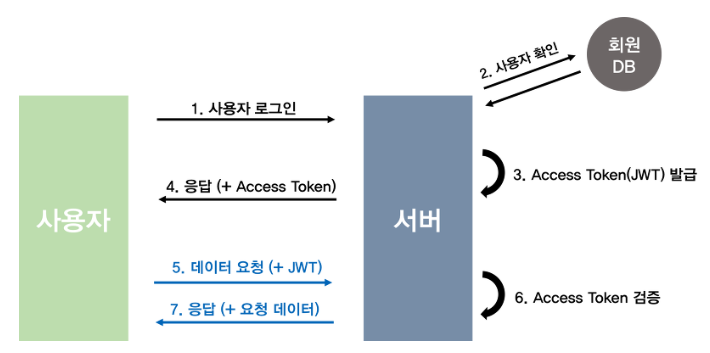
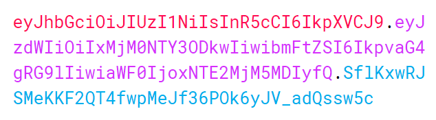
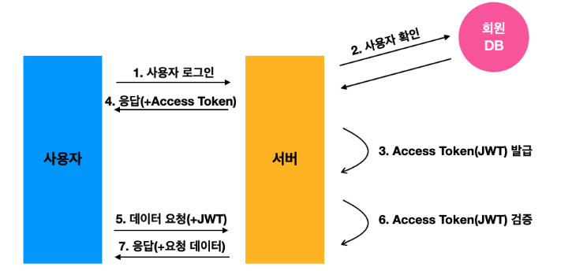
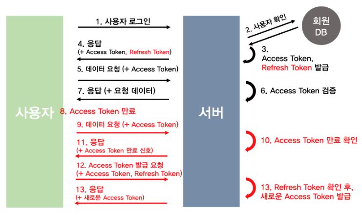

# 2024.03.04 TIL

## 📚 Authorization (인증)

#### ❓여기서 말하는 인증이란 사용자의 신원을 확인하고, 해당 사용자가 시스템에 접근할 권한이 있는지 확인하는 process

#### 세션과 쿠키의 가장 큰 차이점은 세션은 데이터베이스 서버에 저장되고 토큰은 클라이언트 측에만 저장된다.

---

HTTP는 인터넷 상에서 데이터를 주고 받기 위한 서버/클라이언트 모델을 따르는 프로토콜인데 클라이언트가 서버에게 요청을 보내면, 서버는 응답을 보냄으로써 데이터를 교환한다.

HTTP는 비연결성 및 무상태성이라는 특징을 가지고 있기 때문에 요청 처리 후 연결을 끊어버리기 때문에, 클라이언트의 상태 정보 및 현재 통신 상태가 남아있지 않다.

이런 비연결성의 단점은 서버의 자원 낭비를 줄일 수 있지만(연결 유지를 안하므로) 클라이언트를 식별할 수 없다는 단점 또한 존재한다. 로그인을 하더라도 다음 요청에서 해당 클라이언트를 기억하지 못해서, 무한 로그인을 해야 할 것이다. 심지어 브라우저 새로고침을 누를 때마다 로그인을 해야한다.

이런 문제점을 해결하기 위해 Cookie와 Session이라는 기술을 활용한다.

---

### 🚨 Session/Cookie 방식

### ❗️Cookie 🍪

#### 쿠키는 일종의 서버와 클라이언트가 대화를 하기 위한 수단이다.

- 브라우저가 서버와 연결이 되었을 때(브라우저에서 url을 입력하여 접속했을 때) 서버에서 쿠키가 생성되어 클라이언트(브라우저)에게 보내진다. 쿠키는 클라이언트의 브라우저에 작언 기록 파일로 설치되어 남는다.

서버는 클라이언트의 로그인 요청에 대한 응답을 작성할 때, 클라이언트 측에 저장하고 싶은 정보를 응답헤더의 Set-Cookie에 담는다. 이후 해당 클라이언트는 요청을 보낼 때마다 매번 저장된 쿠키를 요청 헤더의 Cookie에 담아보내고, 서버는 쿠키에 담긴 정보를 바탕으로 해당 요청의 클라이언트가 누군지 식별할 수 있다.

#### ❗️쿠키의 단점

- 보안에 취약하다. 요청 시 쿠키의 값을 그대로 보내어, 유출 및 조작당할 위험이 존재한다.
- 용량 제한이 있어, 많은 정보를 담을 수 없다.
- 웹 브라우저마다 크키에 대한 지원 형태가 다르기에, 브라우저간 공유가 불가능하다.
- 쿠키의 사이즈가 커질수록 네트워크에 부하가 심해진다.

---

### 🚨세션(Session)

#### 세션은 쿠키의 단점을 보완하기 위해 나온 개념이다.

세션은 비밀번호 등 클라이언트의 인증 정보를 쿠키가 아닌 서버 측에 저장하고 관리한다.

서버는 클라이언트의 로그인 요청에 대한 응답을 작성할 때, 인증 정보는 쿠키가 아닌 서버 측에 저장하고 관리한다.

서버는 클라이언트의 로그인 요청에 대한 응답을 작성할 때, 인증 정보는 서버에 저장하고, 클라이언트 식별자인 JSESSIONID를 쿠키에 담는다. 이후 클라이언트는 요청을 보낼 때마다 JSESSIONID 쿠키를 함께 보낸다. 그러면 서버는 JSESSIONID의 유효성을 판별해 클라이언트를 식별한다.

#### ❗️장점

- 서버가 클라이언트의 웹 브라우저에 의존하지 않아도 된다.
- 쿠키그를 포함한 요청이 외부에 노출되어도 세션 ID 자체는 유의미한 개인 정보를 담지 않는다.
- 각 사용자마다 고유한 세션 ID가 발급되기 때문에, 요청이 들어올 때마다 회원 정보를 확인할 필요가 없다.

#### ❗️단점

- 해커가 세션 ID를 중간에 탈취하여 클라이언트인 척 위장할 수 있다.
- 서버에서 세션 저장소를 사용하기 때문에 요청이 많아지면 서버에 부하가 생긴다.

---

### 🚨 JWT(Json Web Token)

#### 💡HTTP Header에 Authorization 속성으로 token을 실어서 api 권한을 인증하는 방식

사용자를 인증하고 식별하기 위한 토큰 기반 인증. JWT 기반 인증은 쿠키/세션 방식과 유사하게 JWT 토큰(Access Token)을 HTTP 헤더에 실어 서버가 클라이언트를 식별한다.

### ❗️Token

#### 인증을 위해 사용되는 암호화된 문자열

토큰은 사용자의 신원을 확인하고 권한을 부여하는 데 사용된다. 주로 웹 애플리케이션, API 인증, 단일 로그인 등에서 사용된다.

- 사용자가 인증에 성공하면 서버는 토큰을 생성해서 클라이언트로 보낸다.
- 토큰도 세션과 마찬가지로 사용자가 보내는 요청에 포함된다.
- 세션 인증에서는 서버가 세션 ID를 저장하고 클라이언트가 쿠키에 실어보낸 세션 ID와 대조해서 확인하는 반면, 토큰을 사용하면 요청을 받은 서버는 토큰이 유효한지를 확인만 하므로 세션 인증에 비해 서버 운영의 효율이 좋다.

#### ❓JWT란 무엇인가?

- JWT는 웹 표준을 따르고 있으며, JSON 객체를 사용하여 정보를 전달한다.
- 필요한 모든 정보를 한 객체에 담아서 전달하기 때문에 JWT 한 가지로 인증을 마칠 수 있다.
- 주로 로그인 과정에서 사용되며, 보안에 신경 쓸 경우 여러 방어 기술을 함께 사용할 수 있다.

  

JWT는 세션/쿠키와 함께 가장 대표적인 인증 수단이다.


JWT의 구조는 .을 기준으로 구분되어 header, payload, signature로 구성되어 있다.

#### Header: 위 3가지 정보를 암호화할 방식(해싱알고리즘)(alg), 토큰의 타입(type) 등

```json
{
  "alg": "HS256",
  "typ": "JWT"
}
```

#### Payload: 서버에서 보낼 데이터. 일반적으로 유저(클라이언트)의 고유 ID값, 유효기간 등이 포함된다. Key-Value 형식으로 이루어진 한 쌍의 정보를 Claim이라고 한다.

```json
{
  "sub": "1234567890",
  "name": "John Doe",
  "iat": 1516230922
}
```

#### Verify Signature: Base64 방식으로 인코딩한 Header, payload를 더한 뒤, 비밀키로 해싱하여 생성한다. Header 및 Payload는 단순 인코딩된 값이기 때문에 해커가 복호화하고 조작할 수 있지만, Signature는 서버 측에서 관리하는 비밀키가 유출되지 않는 이상 복호화할 수 없다. 따라서 Signature는 토큰의 위변조 여부를 확인하는데 사용된다.

```json
HMACSHA256(
	base64UrlEncode(header) + "." +
	base64UrlEncode(payload),
	secret_key
)
```

A 사용자가 토큰을 조작하여 B 사용자의 데이터를 훔치려고 한다고 가정한다. payload에 있던 A의 ID를 B의 ID로 바꿔서 다시 인코딩 후 토큰을 서버로 보낸다. 그러면 서버는 처음에 암호화 된 Verify Signature를 검사한다. 여기서 Payload는 B사용자의 정보가 들어 있으나 Verify Signature는 A의 Payload를 기반으로 암호화 되었기 때문에 유효하지 않는 토큰으로 간주하게 된다. 그래서 사용자는 SECRET KEY를 알지 못하는 이상 토큰을 조작할 수 없다는 것이다.

### ❗️토큰 인증 과정



1. 사용자가 로그인을 한다
2. 서버는 계정 정보를 읽어 사용자를 확인한 후, 사용자 고유 ID값을 부여한 후 기타 정보와 함께 Payload에 넣는다.
3. JWT의 유효기간을 설정한다.
4. 암호화할 SECRET KEY를 이용해 Access Token(JWT)을 발급한다.
5. 사용자는 Access Token을 받아 저장한 후, 인증이 필요한 요청마다 토큰을 헤더에 실어 보낸다.
6. 서버에서는 해당 토큰의 Verify Signature를 SECRET KEY로 복호화한 후, 조작 여부, 유효기간을 확인한다.
7. 검증이 완료되면, Payload를 디코딩하여 사용자의 ID에 맞는 데이터를 가져온다.

#### ❗️장점

- Header와 Payload를 가지고 Signature를 생성하므로 데이터 위변조를 막을 수 있다.
- 인증 정보에 대한 별도의 저장소가 필요 없다. (I/O 처리 필요 없음)
- JWT는 토큰에 대한 기본 정보와 전달할 정보 및 토큰이 검증됐음을 증명하는 서명 등 필요한 모든 정보를 자체적으로 지니고 있다.
- 클라이언트의 인증 정보를 저장하는 세션과 다르게, 서버는 무상태(Stateless)가 된다.
- 확장성이 우수하다.
- 토큰 기반으로 다른 로그인 시스템에 접근 및 권한 공유가 가능하다. (토큰 서버 활용)
- 토큰 기반으로 다른 로그인 시스템에 접근 및 권한 공유가 가능하다.
- OAuth의 경우 Facebook, Google 등 소셜 계정을 이용해 다른 웹서비스에서도 로그인 할 수 있다.
- 모바일 어플리케이션 환경에서도 잘 동작한다.

#### ❗️단점

- 쿠키, 세션과 다르게 JWT는 토큰의 길이가 길어, 인증 요청이 많을수록 네트워크 부하가 심해진다.
- Payload 자체는 암호화되지 않기 때문에 유저의 중요한 정보는 담을 수 없다. (패스워드 등)
- 토큰을 탈취당하면 대처하기 어렵다. 토큰은 한 번 발급되면 유효기간이 만료될 때까지 계속 사용이 가능하다.
- 특정 사용자의 접속을 강제로 만료하기 어렵다. (쿠키/세션 기반 인증은 서버 단에서 쉽게 삭제할 수 있지만 토큰은 그게 안 됨)

#### 📌 해결법

기존의 Access Token의 유효기간을 짧게 하고 Refresh Token이라는 새로운 토큰을 발급하면 Access Token을 탈취 당해도 상대적으로 피해를 줄일 수 있다.

---

### ❗️Refresh Token

Access Token(JWT)를 통한 인증 방식의 문제는 제 3자에게 탈취당할 경우 보안에 취약하다는 점이다.

유효기간이 짧은 Token의 경우 그만큼 사용자는 로그인을 자주해서 새롭게 Token을 발급받아야 하므로 불편하다.

그러나 유효기간을 늘리자면, 토큰을 탈취당했을 때 보안에 더 취약해진다.
"그러면 유효기간을 짧게 하면서 더 좋은 방법은 없을까?" 라는 고민에 의해 탄생하게 된 것이 Refresh Token이다.

클라이언트가 로그인할 때 Access Token 및 Refresh Token을 발급해주는 방법이다.
Refresh Token은 Access Token보다 만료 기한이 긴 토큰이다.
클라이언트가 요청을 보냈는데 Access Token이 만료되었을 때, Refresh Token을 이용하여 Access Token의 재발급을 요청한다.

이때 서버는 DB에 저장된 Refresh Token과 비교하여 유효하면 Access Token을 발급한다.
만약 Refresh Token도 만료된 경우라면 사용자에게 로그인을 요구한다.

이 전략을 사용하면 Access Token의 만료 기한을 짧게 설정하여 위의 짧은 만료 기한 설정 전략처럼 탈취되더라도 빠르게 만료될 수 있다. 또한 짧은 만료 기한에도 불구하고 자주 로그인을 할 필요가 없어진다. 서버가 강제로 Refresh Token을 만료시킬 수도 있다.

하지만 이렇게 완벽하게 보이는 Refresh Token 발급 방법도 단점은 있다. Refresh Token 검증을 위해 DB(혹은 별도의 저장소)에 저장해야 하고, 자원이 소요될 뿐더러 추가적인 I/O 작업이 발생한다. (JWT의 장점은 I/O 작업이 필요없는 빠른 인증 처리였다.)

### ❗️토큰 인증 과정



1. 사용자가 id, pw를 통해 로그인.
2. 서버에서는 회원 DB에서 값을 비교.
3. 사용자 인증이 되면 서버에서 Access Token, Refresh Token을 발급, 보통 회원 DB에 Refresh Token을 저장해준다.
4. 서버는 사용자에게 Access Token, Refresh Token을 보낸다.
5. 사용자는 Refresh Token을 안전한 저장소에 저장 후, Access Token을 헤더에 실어 요청을 보낸다.
6. 서버는 Access Token을 검증 후 이에 맞는 데이터를 사용자에게 보내준다.
7. 시간이 흘러 Access Token이 만료되고 사용자는 만료된 Access Token을 헤더에 실어 요청을 보낸다.
8. 서버는 만료된 토큰을 확인하고 권한없음을 신호로 보낸다. 만약 프론트단에서 API 요청 전에 토큰이 만료됐다면 바로 재발급 요청 가능
9. 사용자는 Refresh Token과 Access Token을 함께 서버로 보낸다.
10. 서버는 받은 Access Token이 조작됐는지 확인한 후 Refresh Token과 사용자의 DB에 저장되어 있던 Refresh Token을 비교한다.

#### 참고한 사이트

https://velog.io/@kingth/%EC%84%9C%EB%B2%84-%EC%9D%B8%EC%A6%9D-%EB%B0%A9%EC%8B%9D%EC%84%B8%EC%85%98%EC%BF%A0%ED%82%A4-%ED%86%A0%ED%81%B0

https://velog.io/@whitebear/%EC%BF%A0%ED%82%A4-%EC%84%B8%EC%85%98-%ED%86%A0%ED%81%B0JWT-%ED%99%95%EC%8B%A4%ED%9E%88-%EC%95%8C%EA%B3%A0-%EA%B0%80%EA%B8%B0

https://velog.io/@gusdnr814/%EB%A1%9C%EA%B7%B8%EC%9D%B8-%EC%9D%B8%EC%A6%9D-4%EA%B0%80%EC%A7%80-%EB%B0%A9%EB%B2%95
