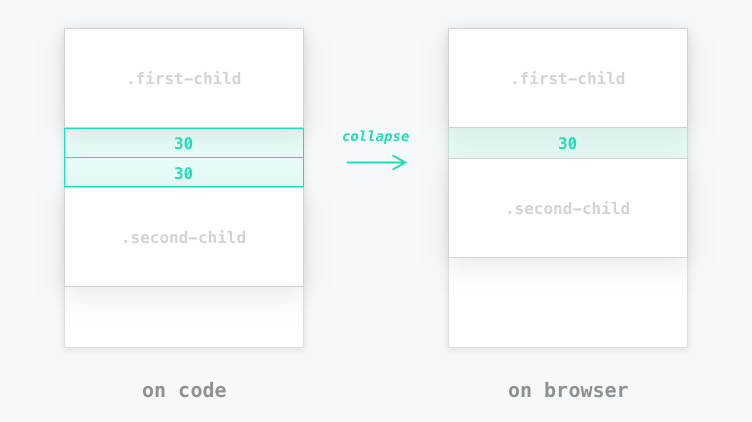
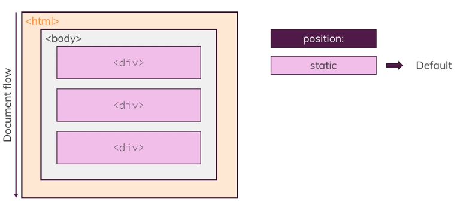
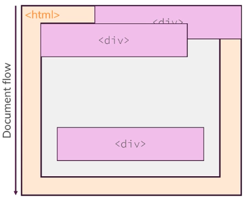

# 2024.03.05 TIL

## 📚CSS

### 🚨 박스 작업하기

- HTML의 모든 요소는 CSS 상에서 박스로 인식된다.

- body에도 margin이 있다.

### 📌 margin collapsing (마진 상쇄)

#### 어떤 두 개 이상의 블록 요소의 상하 마진이 겹칠 때 어느 한 쪽의 값만 적용하는 브라우저 나름의 렌더링 규칙이다.

두 요소가 나란히 있을 때면 둘 사이 바깥쪽 여백이 상쇄된다. 더 큰쪽이 덮어씌운다. 이것은 **버그가 아니라 의도적인 설계**이다.

따라서 이와 같은 경우에는 margin-top 혹은 margin-bottom을 이용해서 상쇄가 일어나는 일을 막는 것이 좋다.

---

### 🚨 width & height

### 📌 width

CSS의 width 속성은 HTML 요소의 너비를 제어하기 위해서 사용되는데 크게 절대값, 상대값 키워드로 설정이 가능하다.

#### ❗️절대값

px와 같은 절대 단위를 사용하여 width 속성값을 지정해주면 해당 요소는 항상 고정된 너비를 갖게 된다. 즉, 절대값으로 width 속성을 설정하면 부모 요소가 제공하는 가용 공간이나 컨텐츠의 크기와 무방하게 특정한 값으로 요소의 너비를 강제시킬 수 있다.

#### ❗️퍼센트 (항상 부모기준!!!)

HTML 요소의 너비가 부모 요소가 제공하는 가용 공간에 비례해서 커지거나 작아지게 하고 싶다면 %와 같은 상대 단위를 사용하여 width 속성값을 지정해주면 된다. 
(예를들어 가용너비가 400px인경우 width:50%면 200px)

#### 💡 블록 레벨 요소는 기본적으로 너비가 100%이다.

- 콘텐츠의 높이와 너비를 정할 때에 패딩과 border는 포함되지 않는다. 이는 content-box라는 개념인데 모든 요소에는 기본적으로 너비와 높이를 산출하는 특정 방법이 내재되어있다. 이는 여기서 설정하는 width와 height가 콘텐츠에만 국한되어있고 패딩과 테두리를 포함하는 전체 박스에 대한 값이 아니다.

#### 💡 box-sizing: border-box라고 설정하면 해결된다. 박스의 사이징을 테두리까지 포함시켜서 정한다.

#### 💡Tailwind CSS를 사용할 때는 기본적으로 body 요소의 margin을 0으로, div의 Box Sizing 속성을 border-box로 설정한다.

---

### 🚨 display 프로퍼티 이해하기

display 프로퍼티를 이용하면 요소의 동작을 바꿀 수 있다. 블록에서 인라인으로 바꾸거나 인라인에서 블록으로 두 속성 모두를 갖게 하거나 DOM에서 완전히 삭제시킬 수도 있다.

HTML에는 인라인과 블록 레벨 요소가 존재한다.

인라인은 블록레벨 요소처럼 전체 너비를 사용하지 않는다. 블록 레벨 요소는 전체 너비를 사용한다.

#### ❗️1. block

- 항상 새로운 줄에서 시작한다
- 화면 크기 전체의 가로폭을 차지하면 width:100%로 설정된다
- width, height, margin, padding 프로퍼티를 지정할 수 있다
- block 레벨 요소 내에 inline 레벨 요소를 포함할 수 있다.

#### ❗️2. inline(인라인 레벨 요소)

- 새로운 줄에서 시작하지 않고, 다른 요소와 함께 한 행에 위치한다.
- content의 너비만큼 가로폭을 차지하며, width, height, margin-top, margin-bottom 프로퍼티를 지정할 수 없다.
- inline 레벨 요소 내에 block 레벨 요소를 포함할 수 없다.

#### ❗️3. inline-block(인라인 블록 요소)

- block과 inline 레벨 요소의 특징을 모두 갖는다.
- inline 레벨 요소처럼 한 줄에 표현되면서, width, height, margin, padding 프로퍼티를 모두 정의할 수 있다.
- content의 너비만큼 가로폭을 차지한다

---

### 🚨position 프로퍼티로 외관 개선하기

position 프로퍼티는 HTML 코드에서 자동으로 static이라는 기본값이 적용된다.

이 경우 위의 사진과 같은 상황처럼 그 값에 맞게 문서가 작동된다.

그런데 이 요소들의 일반 문서 대열을 변경하고 싶을 때가 있다.

한가지 예를 들자면 첫 번째 div 태그를 오른쪽 위 즉 html 요소의 오른쪽 위에 배치한다던가 두 번째 div 요소를 body 요소의 왼쪽 위 모퉁이에 둔다던가 하는것들.

웹사이트의 어디에나 요소를 배치해야할 때가 있다. 그러기 위해선 기본값 외에 다른 값을 사용해서 position 프로퍼티를 특정해야 한다.

#### 📌 position 값

#### static(Default), absloute, relative, fixed, sticky

이 값들은 위치를 변경하고 싶다는걸 나타내지만 어떻게 위치를 바꾸고 싶은지도 특정해 주어야 한다. 즉 요소가 표시될 위치를 지정해 줘야한다.

이 요소가 다른 위치로 이동하기 만들기 위해 어디로 움직여야 할지 알려줄 수 있는데 이때 네 가지 선택지를 고려할 수 있다.

#### ⚡️top, bottom, left, right

이 프로퍼티들을 통해 요소들의 위치를 문서 대열에서 바꿀 수 있다. 이 프로퍼티들은 문서 대열에서 최초의 위치를 나타낸다.
