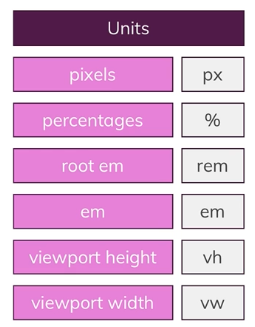

# 2024.03.06 TIL

## 📚CSS

### 🚨 배경 이미지와 이미지 이해하기

### 📌 background-size

```css
background-size: 100px;
```

각 이미지의 너비는 100px이면 100px의 이미지가 이미지의 너비에 맞게 자동으로 반복된다.

```css
background-image: url("freedom.jpg");
background-size: 100px;
background-repeat: no-repeat;
```

반복을 끄거나 제어하려면 background-repeat을 쓴다.
no-repeat으로 값을 설정하면 이미지가 반복되지 않는다.
만약 repeat-x라고 설정하면 x축에 반복해서 이미지가 출력된다.

```css
// 이미지 왜곡
background-size: 50% 100%;

background-size: auto 100%;
```

이미지 왜곡을 원치 않으면 첫 번째 값을 auto로 설정하자. 이제 너비가 자동으로 설정되고 이비지의 비율이 유지된다.

#### ❗️대다수 웹 프로젝트에서 컨테이너와 이미지가 일치할 경우는 거의 없을 것이다.

이런 방법을 쓸 떄 주의할 점은 만약 너비가 100%이고 높이가 auto이거나 정해지지 않았을 경우 이미지가 컨테이너 너비의 전체를 차지하게 된다. 이미지가 자동으로 잘린다. 이 역시도 우리가 조종할 수 있다. **자르는 방식을 통해서**

#### 📌cover

```css
background-size: cover;
```

이는 배경 이미지의 가로와 세로 비율을 유지하면서, 컨테이너의 크기에 맞게 이미지를 조절한다. 이미지가 컨테이너를 완전히 덮도록 하며, 필요한 경우 이미지를 잘라내거나 늘리기도 한다.

#### cover는 언제나 이미지가 컨테이너를 채우게 설정한다.

#### 📌contain

```css
background-size: contain;
```

contain은 전체 이미지가 컨테이너에 나타나게 만든다. contain을 사용할 때 이미지가 컨테이너 전체를 채우지 않는다. cover처럼 컨테이너 전체를 채우는게 아니라 전체 이미지를 표시하도록 한다. 따라서 컨에티너의 여백도 그대로 둔다.

contain과 cover는 유용한 사전 정의 설정이며 이미지 크기의 수동 조정 대신 자주 유용하게 쓰인다.

---

### 📌background-position

배경 이미지의 위치를 조정하는 데 사용된다.

```css
// 이미지 컨테이너의 왼쪽 가장자리와 위쪽 가장자리를 조정하는 방법
background-position: 20px 50px;
```

---

### 🚨 크기 & 단위

고정된 픽셀의 폰트 크기를 사용해서 브라우저 확대 기능을 사용하도록 하는건 그다지 좋지 않다.



#### 📌1. 이들 단위를 어떤 프로퍼티에 적용할 수 있는가?

: 단위가 있어도 어디에 적용하는지 모르면 쓸모가 없다. 따라서 각 단위에 사용하도록 생성된 프로퍼티를 알아봐야 한다.

#### 📌2. 사이즈는 어떻게 계산되는가?

: 기준점이 필요하다. rem과 em은 폰트 크기와 관련이 있다고 했고, vh와 vw는 뷰포트와 관련이 있지만 정확한 계산 방법이 어떻게 되는지 제대로 알아야 한다.

#### 📌3. 어떤 단위를 써야 하는가?

: 여러 프로퍼티가 있고 어떻게 산출하는지도 알았으니, 이제 프로퍼티에 적용할 단위를 파악해야한다.

---
