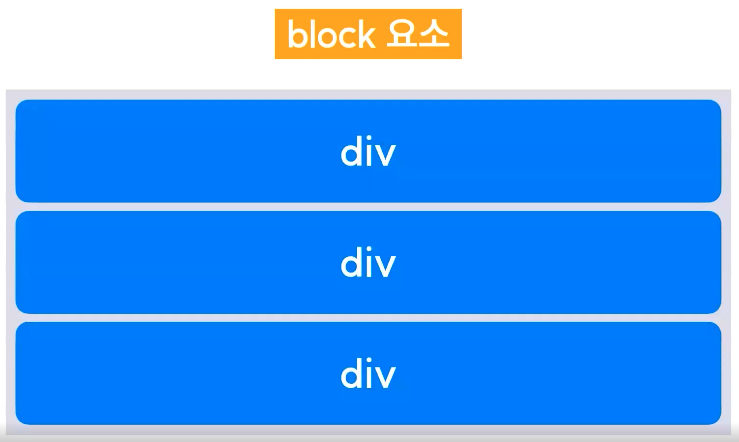
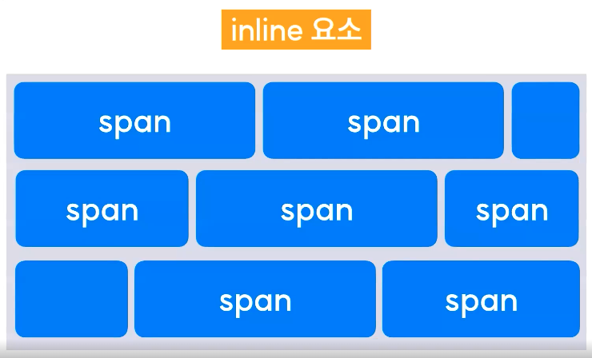
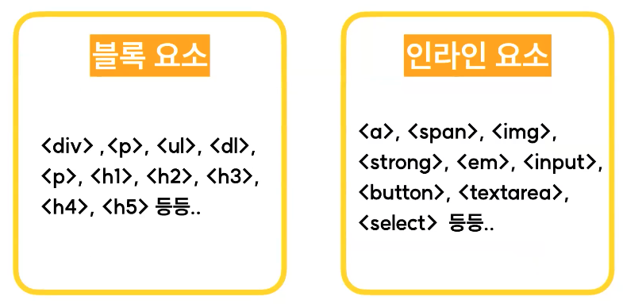

# 2024.03.09 TIL

## 📚CSS (코드캠프)

### 🚨 박스 모델

웹 브라우저에서 HTML Element를 구성할 때 각각의 요소가 차지하는 박스 공간을 정의한 모델

**모든 HTML 요소는 박스 형태로 되어있다.**

#### 📦 box-sizing 속성

#### 1. content-box

- 기본값이다.
- 요소의 크기를 해당 요소의 콘텐츠 크기만으로 계산한다. 여기에는 content, padding, border가 포함된다.
- 따라서 요소의 크기는 콘텐츠 영역의 크기에 패딩과 테두리의 크기를 더한 값이 된다.
- 마진은 요소의 크기에 영향을 미치지 않는다.

#### 2. border-box

- 요소의 크기를 해당 요소의 콘텐츠 영역과 테두리 영역을 포함한 크기로 계산한다. 여기에는 content, padding, border가 포함된다.
- 따라서 요소의 크기는 콘텐츠 영역의 크기에 패딩과 테두리의 크기를 더한 값이 된다. 즉, 요소의 크기는 테두리의 바깥쪽 경계로 정의된다.

---

### 🚨 inline, block 요소

div, p, span, h1, h2 등 수많은 HTML 태그들은 블록 요소와 인라인 요소로 분류된다.

### ❗️block 요소



- 블록 요소를 여러개 연속해서 쌓을 경우, 자동으로 다음 줄으로 넘어간다.
- 좌/우 양쪽으로 늘어나 부모 요소의 너비를 가득 채운다.

### ❗️inline 요소



- 여러개의 요소를 연속해서 입력해도 자동으로 다음 줄으로 넘어가지 않는다.
- 태그에 할당된 공간 만큼의 너비만 차지한다.

#### 💡inline / block 변경

```css
display: inline | block;
```



---
