# 2024.03.09 TIL

## 📚CSS (코드캠프)

### 🚨 CSS 레이아웃 - float와 flex

레이아웃을 배우기 위해선 선택자를 사용하는 방법에 대해서도 조금 더 자세히 알 필요가 있다.

1. 전체 선택자
2. 그룹 선택자
3. 가상 클래스 선택자

#### ❗️전체 선택자

```css
* {
  property: value;
}
```

전체선택자란 말 그대로 html 문서 내에 모든 요소들을 선택하는 선택자이다.

---

#### ❗️그룹 선택자

```css
.class1,
.class2 {
  property: value;
}
```

그룹선택자는 여러개의 선택자를 동시에 선택한 뒤 동일한 CSS 선언을 적용해주고 싶을 경우 이용할 수 있다. 원하는 선택자 여러가지를 ,를 이용해 연결하면 된다.

---

#### ❗️가상 클래스 선택자

가상이라는 단어가 주는 느낌 그대로 실제로 html 요소를 수정하지 않고 CSS만으로 가상 요소를 추가해서 조작할 수 있게 해주는 선택자이다.

```css
선택자:가상클래스 {
  property: value;
}
```

#### 📌:first-child

```css
.class:first-child {
  property: value;
}
```

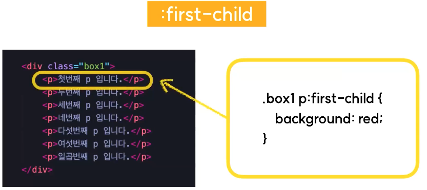

이 가상클래스 선택자는 첫 번째 자식이라는 뜻인데, 해당 요소의 형제 요소중에서 첫 번째 요소를 선택한다는 뜻이다.

#### 📌:last-child

```css
.class:last-child {
  property: value;
}
```

해당 요소의 형제 요소들 중에서 가장 마지막 번째 요소를 선택한다는 뜻이다.

#### 📌:nth-child(n)

```css
.class:nth-child(n) {
  property: value;
}
```

소괄호 안에 내가 정확하게 몇 번째 요소를 선택할 것인지 숫자로 지정할 수 있다.

```css
.class:nth-child(2n) {
  property: value;
}
```

2의 배수에 해당하는 모든 요소들을 선택해서 선언하고 싶은 경우에 이렇게도 입력이 가능하다.

#### 📌:hover

```css
.class:hover {
  property: value;
}
```

---

### 🚨 CSS 레이아웃의 흐름

### Float와 Flex 레이아웃

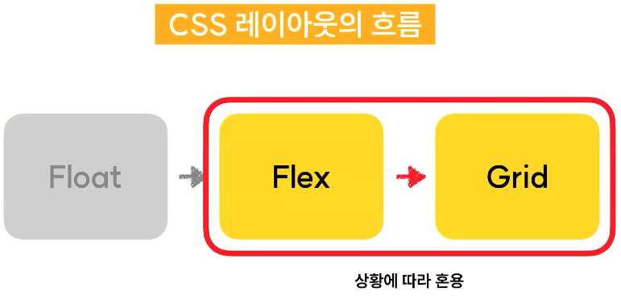

#### 📌CSS 레이아웃은 크게 나누어 3단계로 발전해왔다.

#### 1. ⚡️float

모바일 웹이라는 개념이 생기기 전 웹페이지는 오직 PC에서만 볼 수 있었던 시절부터 전통적으로 사용해왔던 레이아웃 구성 방식이다.

#### 2. ⚡️flex

flex라는 CSS 속성을 이용해서 레이아웃을 구성하는 방식이다. flex같은 경우 애초부터 레이아웃 구현을 목적으로 개발된 속성이기 때문에 float에 비해 매우 편리하게 레이아웃을 잡을 수 있다는 장점이 있다.

#### 3. ⚡️Grid

Flex와는 기본적인 구현 방식이 조금 다르지만 레이아웃 구현을 목적으로 개발된 속성이라는 점은 동일하다고 볼 수 있다.

#### 🚨이 3단계중 Float 라는 속성은 현대 웹에서는 거의 사용하지 않는다.

(Float가 가끔 필요한 곳이 있는데 그럴 때에는 사용이 되지만 전체적인 레이아웃을 잡는 목적으로는 거의 사용되지 않는다.)

Grid가 순서상 나중에 나왔기 때문에 Flex보다 더 우수한 레이아웃 방식이라고 오해할 수 있다.(Flex는 올드한 기술이고 Grid로 페이지를 구성하는게 무조건 낫다 라는 생각)

하지만 Flex와 Grid 같은 경우에 무엇이 더 낫다 못하다라고 구분하는것이 무의미하다.

#### 사실 Flex와 Grid 둘 중 한가지 개념이라도 확실하게 이해하고 있다면 다른 하나를 배우는데는 크게 어렵지 않다.

---

### 🚨float가 쓰이지 않는 이유

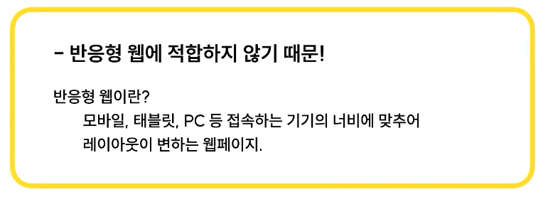
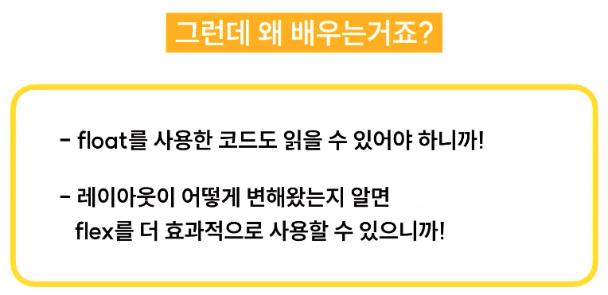

그럼에도 불구하고 배우는 이유는 float를 사용해서 구성한 코드도 읽을 수 있어야 하기 때문이다. 그리고 CSS를 심층적으로 더 공부하게 된다면 여러개의 웹사이트의 스타일 시트를 뜯어보게 될텐데 아직도 float를 이용하여 구성한 웹페이지가 종종 있다. 특히나 반응형 웹페이지를 고려하지 않고 디자인적인 요소를 살리기 위해 PC에 포커스를 두고 만들어진 웹페이지들이 주로 그렇다.

---

### 🚨 float 레이아웃

float 레이아웃을 잡기 위해 가장 중요한 두 가지 속성은 float와 clear이다.

### ❗️float란?

직역하면 띄운다 라는 의미다. CSS에서 float라는 속성이 가지고 있는 기능을 살펴보자. HTML 웹페이지 안에서 요소들이 가지고 있는 일반적인 흐름이 있다.

그런데 float 속성은 html 요소를 일반적인 흐름으로부터 벗어나서 특정한 컨테이너의 좌측 혹은 우측을 감싸는 형태로 강제 배치할 수 있도록 도와주는 속성이다.

- float: none(기본값)
- float: left
- float: right

### ❗️clear

float가 적용된 요소에 추가로 줄 수 있는 속성으로, float의 영향력을 해당 요소에 한해 해제한다.

- clear: non(기본값)
- clear: left
- clear: right
- clear: both

---

### 🚨 flex란?

- CSS 레이아웃의 꽃
- CSS 레이아웃 배치에 중점을 두고 고안되었기 때문에, 기존의 float 방식보다 훨씬 수월하고 간단하게 레이아웃을 잡을 수 있다.

#### ❗️1. 요소의 속성을 flex로 변경

```css
display: flex;
```

display 속성을 적용하면 해당요소 즉, display: flex를 적용시킨 그 요소는 flex 컨테이너가 되고 flex 컨테이너의 자식 요소들은 flex 아이템이 된다.

---

#### ❗️2. flex-direction

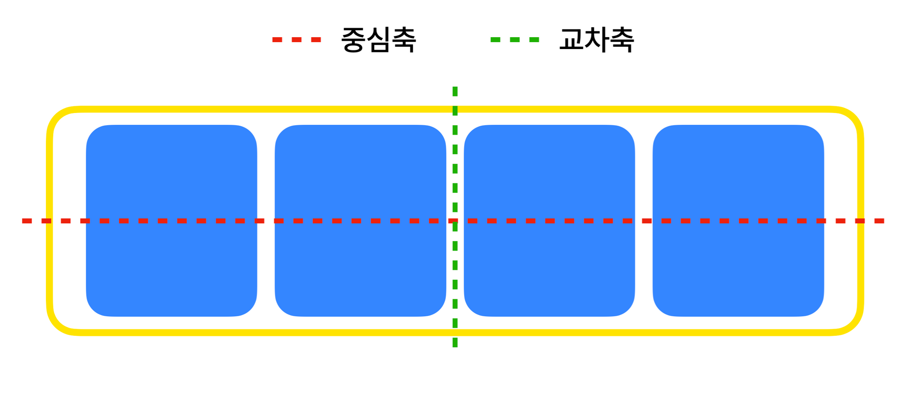

```css
flex-direction: row(기본값) |column;
```

- row: 중심축을 가로방향으로 배치한다.
- column: 중심축을 세로 방향으로 배치한다.

---

#### ❗️3. justify-content: 중심축 방향 정렬

flex-direction이 row면 가로방향의 정렬을 결정하고 column이면 세로방향의 정렬을 결정한다.

- flex-start
  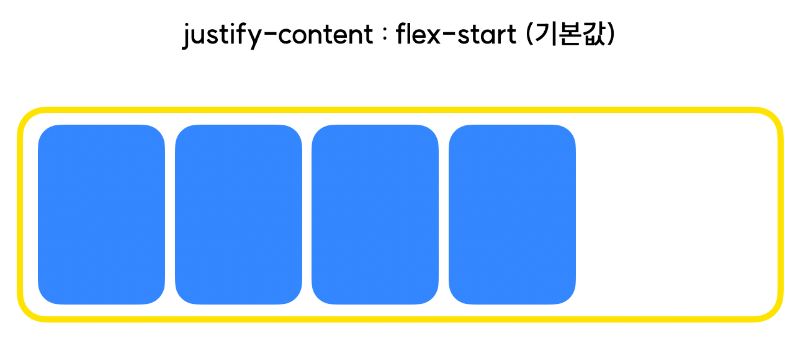

- flex-end
  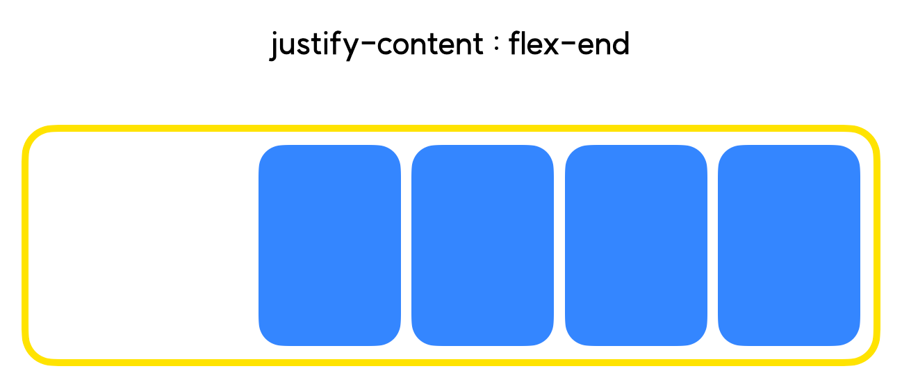

- center
  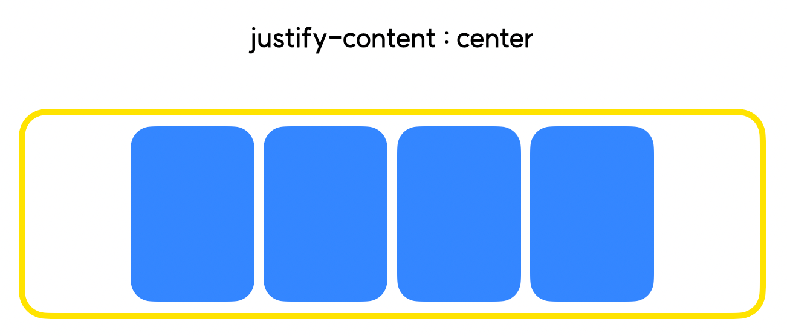

- space-between
  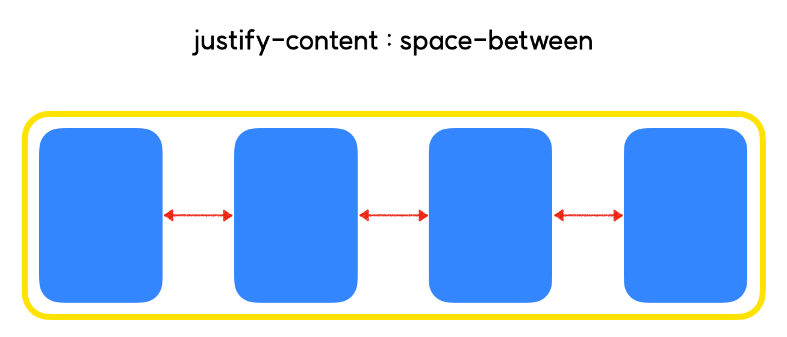

- space-around
  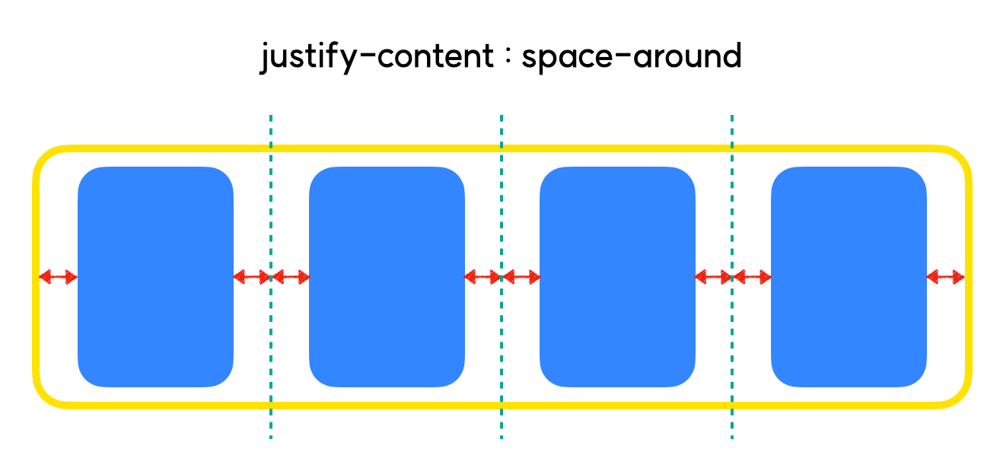

- space-evenly
  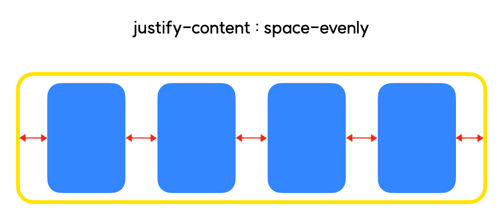

---

#### 4. ❗️align-items(교차축 방향 정렬)

#### ⛔️주의! align-items는 flex-item이 한 줄일 때 우선 적용! 두 줄 이상일 때에는 align-content라는 다른 속성을 써주어야 한다.

- stretch
  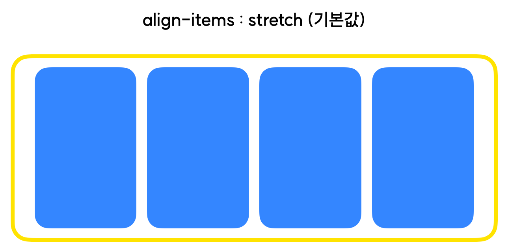

- flex-start
  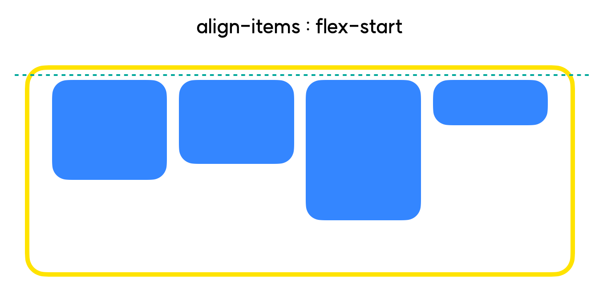

- flex-end
  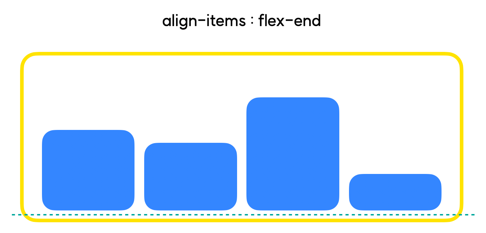

- center
  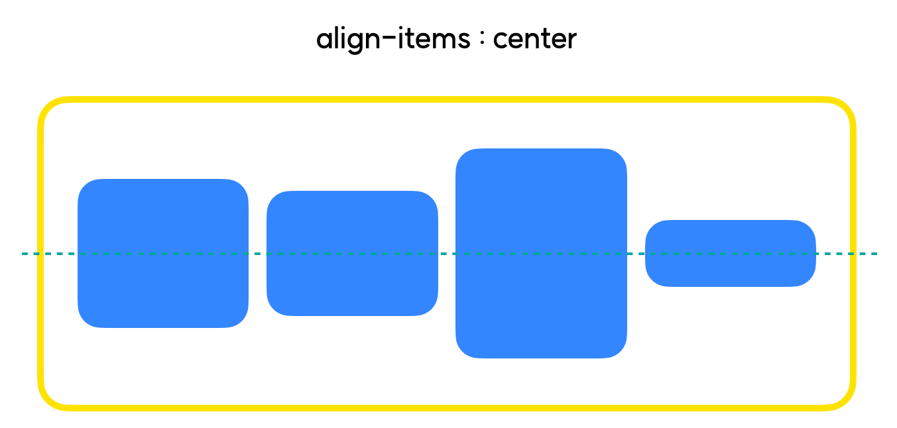

---
