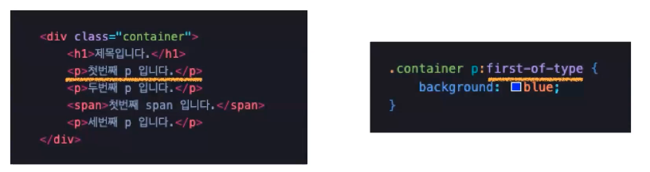
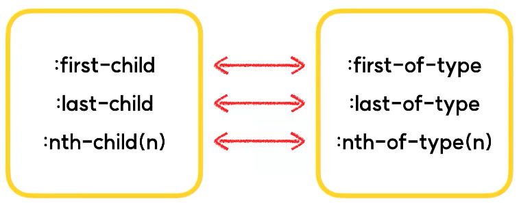
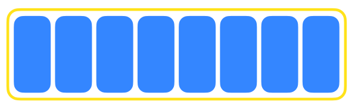
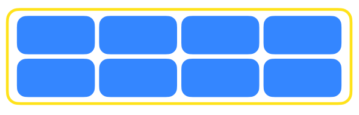
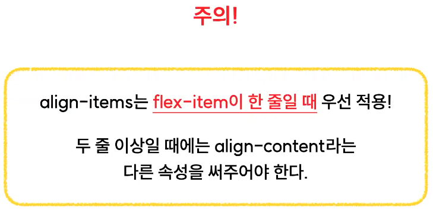
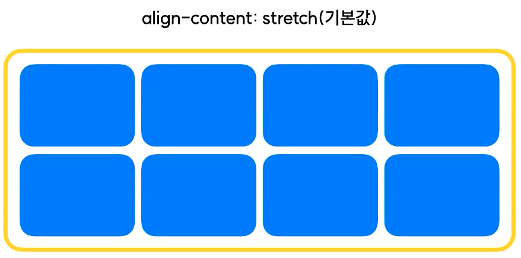
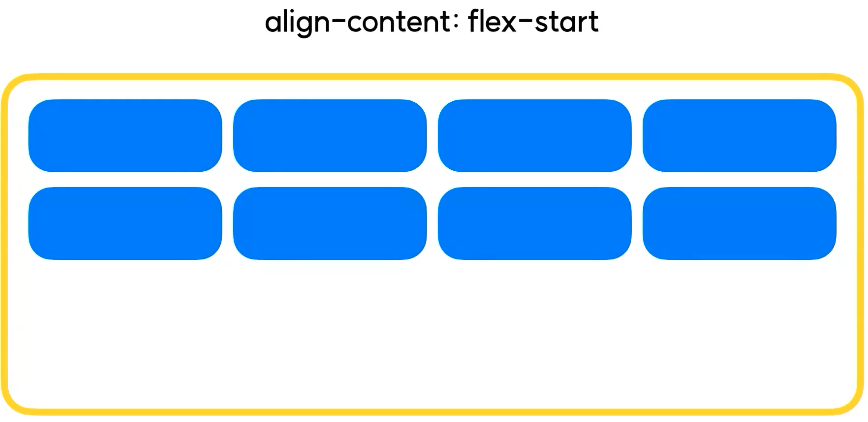
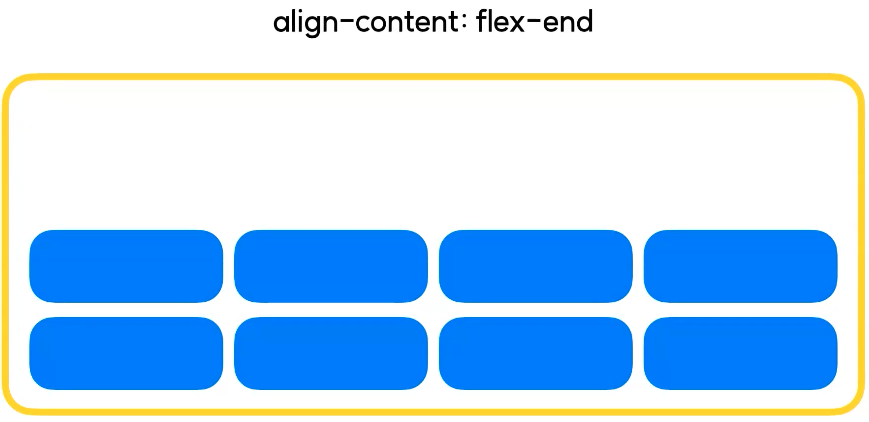
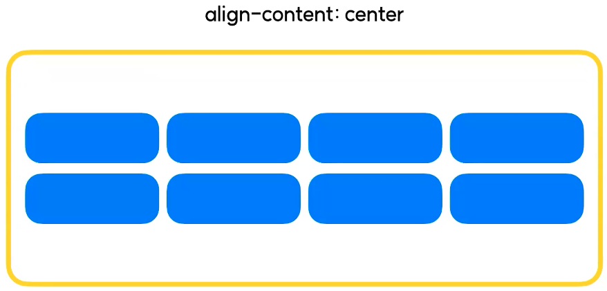

# 2024.03.09 TIL

## 📚CSS (코드캠프)

### 🚨 CSS 레이아웃 flex

### ❗️first-of-type

:first-child와 비슷해 보이지만 약간 다른 선택자다.

형제 요소중 자신의 유형과 일치하는 제일 첫 요소를 취급해낸다.

즉, first-child는 모든 형제 요소중 첫 요소라면 first-of-type은 지정해서 선택한 것과 일치하는 형제 요소 중 첫 요소이다.



가상 클래스가 적용되어 있는 태그 중에서 몇 번째인지 카운트.



---

### 🚨 :active

활성화된 요소를 선택하는 가상 클래스 선택자

활성화된 요소란? 버튼같은 것들에 적용되는 가상클래스인데, 요소의 동작이 활성화되어있는 상태를 뜻한다.

---

### 🚨 :focus

focus를 받고 있는 입력 창 등의 요소를 선택하는 가상 클래스 선택자

Tab 키 등을 이용해서 입력창의 커서가 활성화되어있는 상태

---

### 🚨 :visited

사용자가 방문한 적 있는 링크를 선택하는 가상 클래스 선택자

링크를 눌러서 해당 경로를 방문한 기록이 브라우저상에 남아 있는 링크(기본컬러 - 보라색)

---

### 🚨 가상 요소 선택자

아까까지 본건 가상 클래스 선택자고 지금은 가상 요소 선택자다.

실제로 html 요소를 수정하지 않고, css만으로 가상 요소를 추가해 선택(조작)할 수 있다.

#### ⚡️ 가상요소 선택자에는 after와 before 이렇게 두 가지 종류가 있다

---

### 🚨 Flex 아이템이 두 줄 이상 되었을 때 어떤 속성을 추가로 줄 수 있을까?

### ❗️flex-wrap

flex-item이 여러개일 때, item들의 줄바꿈을 허용할 것인지 말 것인지 결정한다.

#### 📌flex-wrap: nowrap(기본값)


item의 줄바꿈을 허용하지 않는다. 따라서 item이 아무리 많아져도 무조건 한줄에 들어가게 된다.

#### 📌flex-wrap: wrap


item의 가로 사이즈가 container의 가로 사이즐르 넘겼을 때, 자연스럽게 다음 줄로 넘어간다.



---

### ❗️align-content

여러줄이 된 flex-item의 중심 반대 축 정렬을 어떻게 할지 결정한다. 다만 align-items와의 차이는 한 줄의 아이템을 위한 속성인지 아니면 여러줄이 된 아이템을 위한 속성인지 그정도의 차이가 있다.

#### 📌align-content: stretch(기본값)



align-content의 기본값도 align-items랑 동일하게 stretch이다. 아이템의 실제 규격과 상관없이 쭉 늘어나서 컨테이너를 꽉 채우는 형태로 정렬이 된다.

#### 📌align-content: flex-start


flex-start 라는 속성값을 주게 되면 컨테이너의 시작점을 기준으로 아이템들을 정렬한다.

#### 📌align-content: flex-end



#### 📌align-content: center



이 외에도 align-content 속성에는 space 계열 정렬 속성 값들도 설정이 가능하다. 예를들어 space-between, space-around, space-evenly..

---

### 🚨 flex-flow

flex-direction과 flex-wrap을 합쳐놓은 단축 속성(유사한 성질을 가진 여러 공통속성들을 한번에 입력할 수 있도록 묶어놓은 속성)

```css
flex-flow: column wrap;
/*
flex-direction: row;
flex-wrap: wrap;
*/
```

지금까지 배운, flex 관련 속성들은 flex-container에 줄 수 있는 속성들이었다. 컨테이너 말고 flex 아이템에 줄 수 있는 속성들도 있다.

---

### 🚨 flex-item 속성들

- order: item의 순서를 지정
- flex-basis: item의 기본 사이즈를 지정
- flex-shrink, flex-grow 등등..

크게는 이렇게 4가지 정도가 있고 사실은 찾아보면 더 많은데 제일 많이 쓰는 얘들은 이정도다.

---
