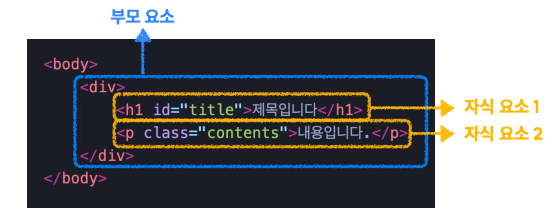
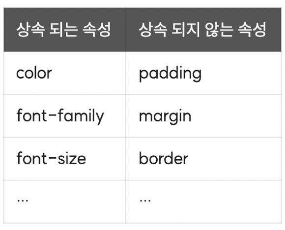
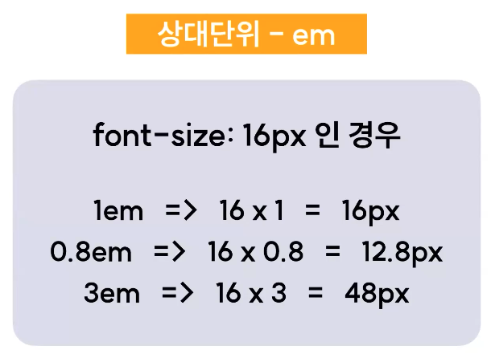
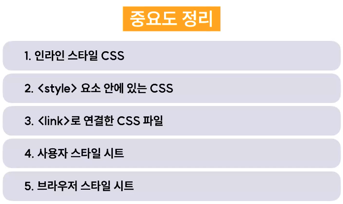
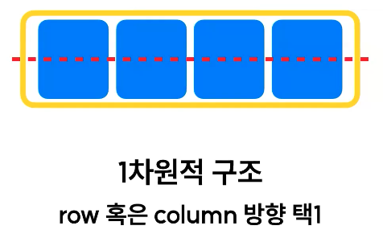
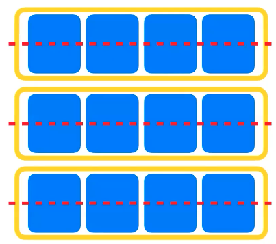
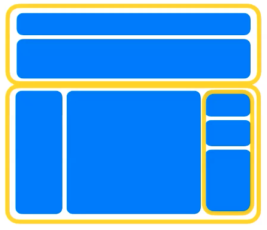
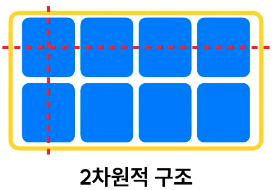

# 2024.03.13 TIL

## 📚CSS (코드캠프)

### 🚨 폰트 & 단위

### 🚨 css 상속


html 요소에는 부모, 자식 관계가 있고 기본적으로 css는 부모 요소에 지정한 속성값을 자식 요소에게도 상속해서 적용한다.

어떻게 상속이 되는지는 아래 예시를 통해 알아보자.

```html
<div class="container">
  바깥에 있는 박스입니다.
  <div class="inner-box">
    <p>안쪽에 있는 박스입니다.</p>
  </div>
</div>
```

```css
.container {
  color: red;
}
```

분명 부모 요소인 .container에만 속성을 줬는데 자식에게까지 속성이 상속되어 color: red가 적용된 모습을 볼 수 있다.

이처럼 css는 기본적으로 부모요소에 지정된 속성값이 자식요소에도 상속되어 적용된다.

#### ❗️하지만, 모든 속성이 상속되는 것은 아니다. css에는 상속되는 속성이 있고 아닌 속성이 있다.

#### 상속되는 속성과 상속되지 않는 속성


상속이 되는 속성과 아닌 속성에는 위와 같은 것들이 있는데 수많은 CSS의 상속 여부를 전부 외워야 하는건 아니다. CSS를 사용하면서 그때마다 직접 속성을 적용해보며 눈으로 익히는 것이 가장 좋은 방법이다.

---

#### ❓여러개의 상속 속성이 겹쳤을 때, 무엇이 우선 적용될까?

#### A: Cascading이라는 룰이 그 우선순위를 결정한다.

### 🚨 웹폰트

#### ❗️font-family: "폰트 이름"

```css
body {
  font-family: "맑은 고딕", sans-serif;
}
```

이런식으로 작성하면 앞에서부터 적용 우선순위를 가진다. 맑은고딕, sans-serif 순으로.

유저 컴퓨터에도 폰트 파일이 설치되어 있어야 글씨체가 제대로 보인다.

그래서 만들어진게 웹폰트이다.

#### 📌웹폰트는 웹 전용 폰트로 사용자가 로컬에 폰트를 직접 설치하지 않아도 외부에 있는 특정 서버에 위치한 폰트를 다운받아 웹페이지에 표시해준다.<br>

즉, 사용자들은 알지 못하는 다운로드 과정이 이 웹사이트 내에서 일어나고 있는 것이다. 이 웹 폰트를 적용하는 방법에는 크게 두가지가 있다.

1. 폰트 파일을 직접 다운로드 받아서 적용하는 방법: @font-face 이용
2. 외부 서비스에서 제공하는 링크를 이용하는 방법: @import 혹은 링크태그 이용

---

## 📚 폰트

#### ❗️font-size

텍스트의 크기를 지정한다. (font-size: 18px)

폰트 사이즈의 속성 값으로는 픽셀 아니면 포인트 같은 절대 단위랑 rem, em, % 같은 상대 단위가 모두 들어갈 수 있다.

---

#### ❗️font-weight

텍스트의 두께를 지정한다. (font-weight: bold)

---

#### ❗️text-decoration

텍스트에 장식용 선을 추가한다. (text-decoration: underline)

속성값들중 많이 사용되는 세가지는

- text-decoration: line-through
- text-decoration: overline
- text-decoration: underline

---

#### ❗️color

텍스트의 색을 지정한다.

- color: red;
- color: #5145d8;
- color: rgb(213,229,37)

---

#### ❗️line-height

텍스트의 행간을 설정한다.

여러 줄의 텍스트가 입력되어 있을 때 각 행 사이의 간격을 뜻한다.

---

#### ❗️letter-spacing

텍스트의 자간을 설정한다.
letter-spacing: 0.1rem

---

#### ❗️word-spacing

텍스트의 단어 간 간격을 지정한다.

---

#### ❗️text-align

block 요소나 표 안에서 텍스트의 가로 정렬 방식을 지정한다.

- text-align: left;
- text-align: center;
- text-align: right;
- text-align: justify;<br>
  (justify가 보기에 더 깔끔해보이지만 띄어쓰기의 규격이 라인마다 달라지기 때문에 장문의 경우에는 가독성이 떨어진다.)

---

#### ❗️vertical-align

인라인 요소나 표 안에서 텍스트의 세로 정렬 방식을 지정한다.

- vertical-align: top;
- vertical-align: middle;
- vertical-align: bottom;

---

#### ❗️text-indent

텍스트의 들여쓰기를 설정한다.

- text-indent: 50px;
- text-indext: 0;

---

#### ❗️text-transform

영문 텍스트의 대/소문자를 바꿀 수 있다.

---

#### ❗️overflow

콘텐츠가 커서 요소 안에서 내용을 다 보여주기 힘들 때, 어떤 방식으로 보여줄지 설정한다.
overflow: visible(기본값) | hidden | scroll | auto

---

## 단위

#### 단위는 크게 두 가지로 나뉠 수 있다.

1. 절대단위
2. 상대단위

절대단위란 말 그대로 외부 요인의 영향을 받지 않고 그 자체로 절대적인 값을 지니는 단위다.

반면 상대단위는 외부 요인의 영향을 받아서 유동적인 값을 지니는 단위다. 우리가 많이 사용하는 것들 중에서는 %가 대표적인 상대 단위라고 볼 수 있다.

### 🚨 절대단위

#### ❗️px

웹에서 가장 많이 쓰이는 절대단위는 px이다.<br>
px=pixel=화소(화면을 구성하는 가장 기본이 되는 단위)

---

#### ❗️pt (인쇄를 위한 단위)

1pt(포인트)= 1/72inch(인치)<br>
웹에서는 잘 사용하지 않는다.

---

### 🚨 상대단위

#### ❗️%

우리가 알고 있는 백분율과 동의어다. 그런데 100% 중에서 몇 퍼센트인지를 측정하려면 그 기준이 되는 값이 있어야한다.

%로 값을 매길 경우에는 부모 요소에 해당 속성 값에 비례해서 지정한 비율의 값을 적용한다는 의미가 된다.

예를들어 부모 요소가 있고 자식 요소가 있고 자식 요소에다가 width:60%를 먹였고 부모 요소에는 1000px이라는 값이 절대값이라고 했을 때, 자식 요소에 있는 60%의 기준은 부모 요소에 들어가있는 동일한 width 값이 된다.

---

#### ❗️em

#### CSS에서 굉장히 많이 쓰이는 상대단위중 하나

em은 %랑 비슷한 것 같지만 조금 다르다. 이건 스타일이 지정된 요소, 즉 내가 만약에 자식 요소에다 em을 지정했다면 부모 요소가 기준이 되는것이 아니라 본인, 내가 스타일을 지정한 그 요소의 font-size 속성 값에 비례해서 값을 결정하게 된다.



---

#### ❗️rem

이 경우에도 폰트 사이즈의 속성 값에 비례해서 값을 결정하는 것은 똑같다.

하지만 em의 경우에는 그 속서이 매겨진 스타일 요소 당사자라면 이 경우에는 **최상위 html 요소**의 폰트 사이즈 속성 값에 비레해서 값을 결정하게 된다.

---

## 📚 배경&색상

### 🚨 캐스케이딩

폭포, 종속 이라는 의미를 가지고 있고 동시에 위에서 아래로 흐르는 이미지를 상징하기도 한다.

CSS에서 캐스케이딩이란 하나의 요소에 적용되는 수많은 스타일 요소중 정확히 어떤 스타일을 선택해서 브라우저에 그릴지 결정해주는 CSS의 우선순위 적용 원리다.

#### 1. 중요도

#### 2. 구체성(명시도)

#### 3. 선언 순서

---

### ❗️중요도

해당 CSS가 선언된 위치에 따라 우선순위가 결정된다.

- 브라우저 스타일시트: 브라우저에 기본적으로 내장되어있는 디폴트 값
- 사용자 스타일시트: 사용자 폰트 지정, 고대비 모드 사용 등
- 개발자 스타일시트: 개발자가 만들어서 넣어놓은 스타일시트

3가지 종류의 스타일시트가 있다.

우선순위는 개발자 스타일시트> 사용자 스타일시트> 브라우저 스타일시트

### ❗️개발자 스타일시트 안에서도...

lin로 연결한 css 파일 < style 태그 요소 안에 있는 CSS < 인라인 스타일 CSS



---

### ❗️구체성(명시도)


---

### ❗️선언 순서

나중에 선언한 스타일이 우선 적용된다.

---

### 🚨 상대 단위 - vw/vh

요소의 규격을 viewport의 너비값과 높이값에 비례하여 결정한다.

#### 여기서 viewport란?

브라우저 안에서 실제로 화면이 그려지는 영역을 의미한다.

---

### 🚨 Grid 레이아웃

flex와 grid는 현대 웹 레이아웃의 양대산맥이다.

어느 하나가 더 우세하다거나 어느 하나가 더 절대적으로 낫다라고 표현하기가 힘들다.

flex와 grid는 서로 다른 특징을 가지고 있기 때문에 상황에 따라 혼용된다.

연습 우선순위를 따지자면 Flex가 먼저다!

### ❗️flex는...


사실 flex는 1차원적인 구조를 가진 레이아웃 시스템이다. 우리가 flex를 주게 되면 flex direction을 row 혹은 column처럼 가로 혹은 세로중에 한 방향을 선택해서 레이아웃을 쪼개줄 수 있는데


만약에 그 플렉스 레이아웃을 이용해서 웹페이지를 짠다, 그리고 거기에 2차원적인 공간을 굉장히 좀 다차원적으로 쪼개져야하는 그런 레이아웃이 구성돼있다면 1차원 레이아웃 구조를 가진 flex를 여러개 중첩시켜서 페이지를 다단으로 쪼개주고 그걸 이용해서 구성한다.



flex 레이아웃을 이용해서 복잡한 구조의 웹페이지를 만들 때는 여러번 flex를 중첩시켜서 화면을 쪼개주게 된다.

---

### ❗️grid는...



반면 grid는 2차원적인 구조를 가지고 있다. 즉, row와 column을 동시에 한 컨테이너에 설정이 가능하다는 얘기다.

하나의 컨테이너 안에 x축과 y축을 원하는 만큼 배치할 수 있고 정렬해 놓은 축, 설정해 놓은 축과 경계선들을 기준으로 그에 맞추어 아이템들을 배치해줄 수 있다.


아까와 같은 이런 형태의 레이아웃을 만든다고 가정했을 때도 그리드를 사용하면 굳이 여러번 쪼갤 필요 없이 한번에 틀을 만들어줄 수 있다.

---

### 🚨 grid 속성

#### ❗️1. 요소의 속성을 grid로 변경

```css
display: grid;
```

요소의 속성에 display: gird를 주면 그 요소는 그리드 컨테이너가 된다. 그리고 그 자식요소들은 그리드 아이템이 된다.

여기까지는 flex와 비슷하다. 그리드 아이템이 내가 설정하기에 따라 flex처럼 한 열이나 행에 제한되지 않는 다는점이 다를 뿐이다.

#### grid에는 그리드 라인과 그리드 넘버라는 개념이 있다. 열과 행을 나누는 각각의 경계들을 그리드 라인이라고 하고 각각의 라인이 몇 번쨰 라인인지를 뜻하는 숫자를 grid-number라고 부른다.
