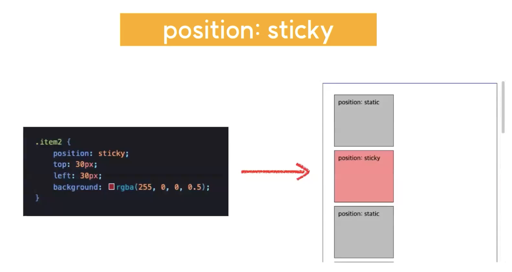

# 2024.03.14 TIL

## 📚CSS (코드캠프)

### 🚨 position

HTML 요소가 배치되는 방식을 결정하는 방식을 결정하는 속성

CSS에서 상당히 중요한 부분을 차지하고 있다. 그리고 실제로 나중에 주니어 프론트엔드 개발자가 되어 작업을 진행하다보면 레이아웃이 깨졌는데 도데체 어디서 뭐 때문에 깨졌는지 그 원인을 파악하기 힘든 경우가 많은데 그 중 상당 부분이 이 포지션의 내용을 제대로 이해하지 못했기 때문에 발생하는 에러인 경우가 굉장히 많다.

참고로 CSS의 position 속성은 block 요소든 inline 요소든 상관없이 사용할 수 있다.

---

#### position에는 총 5가지의 속성값을 줄 수 있다

### 🚨 position의 속성값

#### static(기본값)

#### relative

#### absolute

#### fixed

#### sticky

⚡️ 이 5가지 포지션의 차이를 알기 위해선 top, left, bottom, right 라는 속성에 대해서도 알고 있어야 한다.

#### top / left / bottom / right

이 4가지 속성은 각각 해당 방향 기준으로 요소의 좌표값을 변경한다.

---

### ❗️position: static (기본값)

포지션 속성을 주지 않거나 포지션 속성에 값으로 static 값을 입력해줄 경우 해당 문서는 문서상, 즉 html 구조상 원래 있어야 하는 위치에 배치된다. 결론적으로 아무런 영향도 미치지 못한다.

이때 top, left, bottom, right 속성을 이용해 인위적으로 위치를 옮겨주는 것이 불가능하다.

static은 포지션이 적용되지 않은 위치 조정이 불가능한 기본 HTML 요소의 상태라고 생각하면 된다.

이 코드 안에는 top과 left가 선언이 되어 있지만 포지션에 static이 적용되어 있지만 포지션에 static이 적용되어 있기 때문에 top과 left는 실직적으로 기능하지 않는다.(존재하지 않는 코드와 마찬가지)

---

### ❗️position: relative

이 속성을 요소에 주게되면 원래 있던 자리를 기준으로 요소의 위치를 조정할 수 있다.

만약 여기에 top, left, bottom, right 같은 다른 속성을 적용시키지 않았을 땐 static과 똑같지만 이 속성의 경우는 top, left, bottom, right를 이용해 좌표값을 조정해 줄 수 있다는 점이 static과 다른점이다.

아까와 같은 코드고 position만 relative로 변경을 해줬다.

이 때 static과는 다르게 top과 left가 적용이 되므로 결과적으로 이 요소가 기존의 위치에 있던 자리를 기준으로 위에서부터 30px 그리고 좌측에서부터 30px 옮겨지게된다.

---

### ❗️position: absolute

단어의 의미대로 웹브라우저 안에 있는 절대 좌표를 기준으로 요소의 위치를 조정할 수 있다.

아까의 **relative의 경우에는 static 상태에서 요소가 위치해 있어야 하는 자리** 즉, 원래의 자리를 기준으로 top과 left가 적용이 됐는데 **absolute는 그 기준이 절대 좌표**가 된다.

그런데 이때 절대좌표가 측정되는 기준이 또 있어야 한다.(절대좌표는 상대적으로 바뀌면 안되니까)

#### 💡절대좌표 측정 기준

1. absolute가 적용된 요소의 부모 요소들이 여러개가 있을 수 있는데 그중 position: relative가 적용된 요소를 찾아 그 박스를 그 요소의 영역을 절대 좌표의 기준으로 삼게된다. 하지만 만약에 relative가 적용된 부모 요소가 조상 중에 하나도 없다면 html의 body 전체를 기준으로 삼게된다.

---

### ❗️position: fixed

이는 스크롤과 무관하게 뷰포트를 기준으로 요소의 위치를 설정할 수 있다.

#### 💡 기준: viewport

쇼핑몰 메인 메뉴 아니면 상담 요청을 할 수 있는 퀵 버튼 같은 것들이 보통 그런 구조로 되어있다.

fixed를 이용하면 특정 요소를 그런 식으로 스크롤과 무관하게 고정시켜주는 것이 가능하다.

스크롤을 내려도 빨간색으로 표시되어 있는 fixed 박스의 위치가 변하지 않는다. 이런식으로 position: fixed를 이용하면 요소를 내가 원하는 위치, 원하는 좌표에 고정시켜줄 수 있다.

---

### ❗️position: sticky

sticky는 CSS 포지션에 상대적으로 최근에 추가된 속성 값이다. Sticky는 static이랑 Fix들을 혼합해서 사용하는 것과 비슷한 결과물을 만들어줄 수 있다.

스크롤이 내려가지 않았을 때 즉, 그 화면을 처음 띄웠을 때 화면을 새로고침 했을 때라던지 그럴 때에는 스태틱처럼 작동한다. 대신 해당 요소가 차지하고 있는 그 위치보다 아래로 스크롤이 내려갈 경우 fixed 처럼 그 박스를 지정한 좌표에 고정시킨다.

fixed는 처음부터 내가 지정한 좌표값의 박스가 고정되어 있었다면 sticky는 스크롤이 내려가기 전 최초 상태에는 static과 같은 위치 정보를 갖는다는 점이 fixed와 다르다.

옛날에는 이런 형태의 UI를 구현하기 위해선 자바스크립트를 이용해서 스크롤이 일정 지점에 도달했을 때 요소의 포지션을 static에서 fixed로 바꿔줘야 했다. 그런데 이제 sticky의 출현으로 이런 시스템의 이런 UI를 구현하기가 상당히 간단하고 편리해진것이다.

이렇게 처음엔 스태틱으로 있다가 스크롤이 내려가면 이런식으로 내가 원하는 위치에 고정되게 된다.

---

### ❗️z-index

위에서 본 것처럼 이런식으로 position 속성을 이용하면 우리는 요소의 위치를 자유자재로 옮겨줄 수 있다.

그런데 요소를 이동시키다 보면 여러개의 요소가 겹쳐지는 경우가 생긴다. 이럴 때 어떤 요소가 앞으로 나오고 또 어떤 요소가 뒤로 가야 할지를 조정해 줄 수 있는 속성도 존재한다.

일반적으로 공간이 있을 때 2차원 공간에서는 x축과 y축으로 공간을 구성하게 된다.

그런데 이걸 3차원 공간으로 확장하면 z축이 하나 더 생긴다. z인덱스의 z는 z축을 의미하는데, z축 방향에서 이 요소가 몇 번째에 위치할지를 결정해준다.

---

z-index의 기본값은 auto다. 따로 숫자를 지정해 주지 않았을 경우 그 박스는 html 요소의 기본 위치에 자리를 잡는다. 대신 거기다가 1,2,3 이런 식으로 숫자를 값으로 입력해줄 수 있는데 이런식으로 하면 내가 원하는 대로 박스의 순서를 지정해 줄 수가 있다.

그리고 숫자가 클수록 더 앞쪽으로 나오게 된다.

#### 💡position이 적용되어있지 않은 (static)경우에 z-index도 적용되지 않는다.
