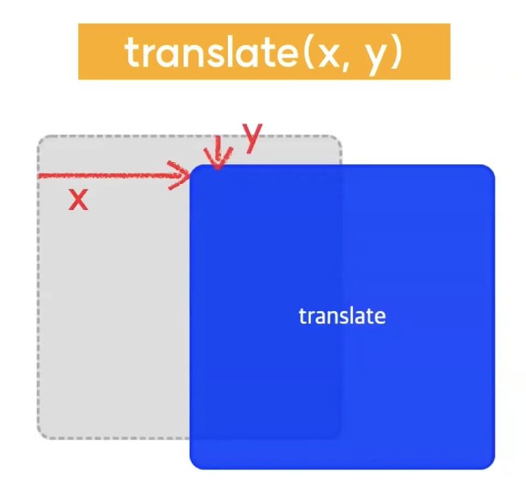
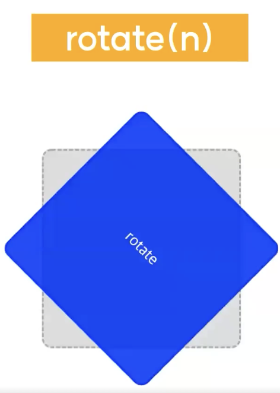

# 2024.03.14 TIL

## 📚CSS (코드캠프)

### 🚨 transition

변화, 전환이라는 의미를 가진다. CSS에는 애니메이션을 줄 수 있는 방법이 크게 두 가지가 있는데 그 둘 중에 한 방법에 바로 transition이다.

트랜지션은 CSS 속성을 이용한 변화의 전후 사이에 애니메이션을 추가해서 움직임을 부드럽게 만들어줄 수 있다.

---

### 🚨 transition-property

어떤 프로퍼티 즉 어떠 속성의 트랜지션을 적용할 것인지를 결정해주는 속성이다.

```css
transition-property: color, transform;
```

---

### 🚨 transition-duration

transition에 걸리는 시간을 지정한다.

```css
transition-duration: 0.2s;
```

---

### 🚨 transition-timing-function

transition의 속도 패턴을 지정한다.

```css
transition-duration: ease-in-out;
```

일반적으로 아래와 같은 5가지 키워드를 많이 사용한다.

1. linear: 일정한 속도로 변화한다.
2. ease: 시작할 때에는 빨라지다 느려진다.
3. ease-in: 천천히 시작했다가, 속도를 높여 끝난다.
4. ease-out: 빠른 속도로 시작했다가, 천천히 끝난다.
5. ease-in-out: 천천히 시작했다가, 정상 속도가 됐다가, 빠르게 끝난다.

---

### 🚨 transition-delay

transition 요청을 받은 후, 실제로 실행되기까지 기다려야하는 시간의 양을 지정한다.

```css
transition-delay: 2s;
```

이 딜레이는 특히나 여러 개의 트랜지션 요청을 보내면서 각각의 트랜지션의 순서를 지정해줄 해줄 때 굉장히 많이 쓰인다.

만약 순서대로 위로 튀어올라야 하는 요소들이 있다면 그런 경우에 딜레이를 이용해서 같은 트랜지션이 동시에 실행되지 않고 순차적으로 실행되도록 만들어줄 수가 있다.

---

### 🚨 transition 단축 속성

```css
transition: color 0.4s ease-in-out 1s;
```

이렇게 트랜지션 카테고리에 속한 속성들도 트랜지션 단축 속성으로 모아서 지정해줄 수 있다.

처음에는 property, duration, timing-function, delay 순으로 들어간다.

---

### 🚨 transform

변형시킨다 라는 뜻을 가지고 있다. css에서 트랜스폼 속성은 대상이 되는 요소에다 이동, 회전, 확대, 축소, 비틀기 등의 변형 효과를 줄 수 있다.

transform 속성을 잘 이용하면 html과 css 만으로도 상당히 많은 것들을 웹브라우저에 그려낼 수 있다.

---

#### transform에는 여러가지 변환함수를 속성값으로 줄 수 있다.

### 🚨 transform의 속성값

#### translate(x,y)

#### scale(x,y)

#### skew(x-angle, y-angle)

#### rotate(angle)

여기서 변환함수는 대상을 변형시켜주는 기능을 가진 함수라고 생각하면 된다.

transform에도 정말 다양한 변환 함수들이 들어갈 수 있지만 그걸 전부 다 알 필요는 사실상 없기 때문에 그중 가장 사용빈도가 높은 네 가지를 추린게 위와 같다.

---

### ❗️translate(x,y)


요소의 좌표를 움직일 수 있다. X축으로 x만큼, Y축으로 y만큼 이동시킨다.

```css
transform: translate(20px, 25%);
```

만약 () 안에 값이 콤마로 연결된 두개가 아니라 하나의 값만 입력이 되는 경우에는 x와 y의 동일한 값이 입력된 것과 마찬가지로 간주된다.

---

그러면 x축이나 y축 중에 한 방향으로만 움직이고 싶은데 그럴 때는 어떻게 하면 되나요?

### ❗️translateX(n)

요소의 X축 좌표를 n만큼 움직일 수 있다.

```css
transform: translateX(20px);
```

---

### ❗️scale(x,y)

scale은 크기 혹은 규모 이런걸 의미한다. 이 scale 이라는 변환함수는 배수로 측정이 되는데 여기다가 숫자로 값을 입력해줄 수 있는데 1을 기준으로 기준 요소의 몇배로 축소 혹은 확대하고 싶은지를 입력하면 된다.

```css
/* X축으로 x만큼, Y축으로 y만큼, 요소를 축소 혹은 확대한다. */
transform: scale(0.75, 1.1);
```

---

### ❗️skew(x, y)

기울임을 위한 변환 함수다. X축으로 x도만큼, Y축으로 y도 만큼 요소를 기울인다.

```css
transform: skey(15deg, 10deg);
```

### ❗️skewX(x)

얘도 마찬가지로 X축 방향으로만 변형하고 싶거나 y축 방향으로만 변형하고싶을 때에는 skewX혹은 skewY를 쓰면 된다.

---

### ❗️rotate(n)


요소를 n만큼 회전시킨다.

```css
transform: rotate(45deg);
```

안의 매개변수로는 각도를 입력해줄 수 있는데 대상 요소를 내가 지정한 각도만큼 회전시켜주는 역할을 한다.
그리고 이때 회전방향은 시계방향으로 돌아간다.

만약 반시계방향으로 주고싶다면 음수값을 주면된다.

```css
transform: rotate(-45deg);
```

---
