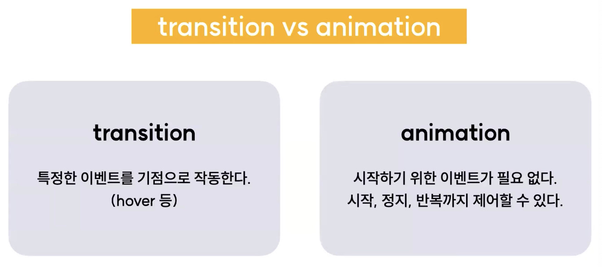
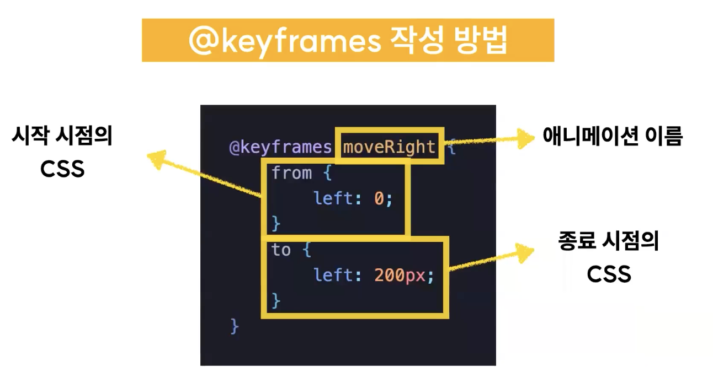

# 2024.03.16 TIL

## 📚CSS (코드캠프)

### 🚨 transform 중첩 적용

트랜스폼은 변환함수를 중첩 적용시키는 것이 가능한 속성이다.

한 요소에 transform이라는 속성을 주면 거기다가 변환함수를 한 가지만 줄 수 있는게 아니다. 예를들어 translate를 주면서 동시에 rotate를 주는 것이 가능하다.

예를들어 transform을 이용해서 요소를 75도 회전시키고, 그다음 y축 방향으로 120px 이동시키려면 어떤 식으로 코드를 작성해야할까?

```css
transform: rotate(75deg) translateY(120px);
```

이렇게 적어주면 된다.

그러면 두 번째 퀴즈<br>
요소를 x축 방향으로 30도, y축 방향으로 10도 기울이고 45도 회전시키려면?

```css
transform: skew(30deg, 10deg) rotate(45deg);
```

그러면 세 번째 퀴즈<br>
요소를 y축 방향으로 0.75 축소시키고 x축 방향으로 20도 기울이려면?

```css
transform: scaleY(0.75) skewX(20deg);
```

---

### 🚨 transform + transition

transform은 사실 transform 단독으로 사용할 때에도 정말 많은 것을 만들 수 있지만 tarnsform을 transition 혹은 애니메이션과 함께 사용하면 더 다채로운 애니메이션 효과를 만들어줄 수 있다.<br>(좀 더 동적인 UI 구성에 최적화된 기능이라고 볼 수 있다.)

---

### 🚨 animation

애니메이션이란? 여러 이미지를 연결해서 자연스럽게 움직이는 것처럼 보이게 만드는 기법이다.

우리는 이미 애니메이션을 만든적이 있다. 어떤 이벤트 트리거에 의해 transition 변화를 주듯이. 그 전후 관계를 부드럽게 이어주는 작업을 했다.

### ❗️CSS를 이용해서 애니메이션을 만드는 두 가지 방법

#### 1. transition 속성 활용

#### 2. animation 속성과 keyframe 활용

---



transition은 이벤트 즉, 트리거가 있어야지만 트랜지션을 부여해줄 수 있다.

반면 애니메엿느이 경우 시작하기 위한 이벤트가 필요 없다. 그리고 애니메이션 속성을 이용해서 어떤 작동의 시작, 정지 그리고 반복까지 다 제어할 수 있다.

#### ❗️Q: 그러면 애니메이션이 더 구체적으로 동작을 제어할 수 있으니까 더 좋은거 아닌가?

#### ❗️A: 그렇게 생각할 수 있다. 그런데 애니메이션 속성은 keyframe으로 일단 먼저 애니메이션을 정의해야 하고 그리고 애니메이션 속성을 이용해 정의한 애니메이션을 불러와 제어해줘야한다. 즉 하나의 동작을 만들기 위해 최소한 키프레임 하나 그리고 애니메이션 속성 하나 두 번의 선언이 필요하다. 근데 그마저도 최소한의 경우고 키프레임의 경우 애니메이션의 시작과 종료 지점까지 정의해 주어야 동작하기 때문에 transition보다 훨씬 사용하기 복잡하다.

그래서 개발자들은 보통 CSS로 애니메이션을 만들 때 이렇게 한다.

1. transition으로 만들 수 있는 것은 transition 안에서 해결한다.
2. trnasition으로는 만들 수 없는 애니메이션을 animation과 keyframes로 만든다.

---

### 🚨 keyframes

CSS 애니메이션을 사용하려면 keyframes 그리고 애니메이션이 필요하다고 했다.

keyframes가 뭘까?

#### 💡keyframes 앞에는 낯선 골뱅이 기호가 붙는데 이 @keyframes란 바로 css 애니메이션의 시작, 중간, 끝 등의 중간 상태를 정의해 줄 수 있는 기능이다.



이 keyframes는 from에서부터 to로 변경이 되는 하나의 애니메이션 동작을 정의해 놓은 것이라고 보면 된다.

#### from이랑 to 대신에 0%, 50%, 100% 같은 진행도 표기도 가능하다. 이런 식으로 진행도 표기를 하게 되면 0%랑 100% 사이에 있는 그런 중간 지점에 해당하는 진행도 상황에서도 CSS 변화를 별도로 넣어줄 수 있다.

---

### ❗️@keyframes를 요소에 적용하려면

이렇게 만들어놓은 keyframes를 요소에 적용하려면 animation이라는 속성을 이용하면 된다.

---
