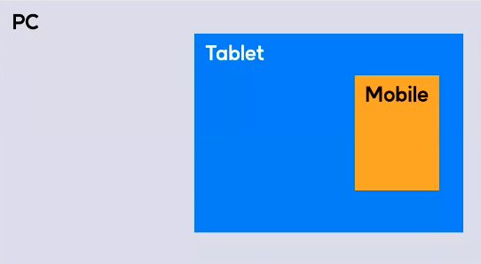
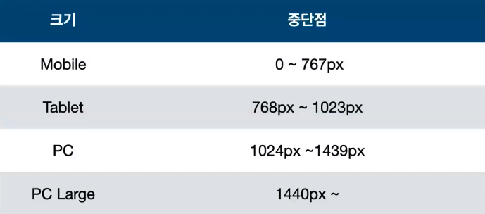
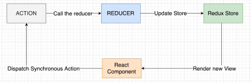

# 2024.03.17 TIL

## 📚CSS (코드캠프)

### 🚨 반응형 웹

사람들은 정말 다양한 전자기기 즉 디바이스를 통해서 웹페이지에 접속을 한다.

접속하는 기기 종류에 따라서 다른 레이아웃의 페이지를 보여주려면 어떻게 해야할까?

1. 아예 스마트폰 접속시와 데스크탑 접속 시에 다른 URL로 연결하도록 만들어주는 방법이 있다. 이런건 사실 옛날 방식이다.

2. 어떤 기기로 접속을 해도 URL은 동일하지만 실제로 사용자가 보는 페이지는 기기의 사이즈에 반응해서 서로 다르게 뜨도록 만들어줄 수 있다. 이것을 바로 반응형 웹이라고 한다.

---

### 🚨 미디어 쿼리

미디어 쿼리란? 뷰포트의 너비에 따라 웹 사이트의 스타일 시트를 수정할 수 있다.

```css
@media screen and (max-width: 500px) {
  //스크린의 viewport 너비가 500px 이하일 경우
  // 적용시킬 스타일 시트
}
```

키프레임처럼 맨 앞에 골뱅이가 들어가고 그 뒤에 미디어라는 단어가 붙는다. @media를 바로 미디어 쿼리라고 부른다. 그리고 이 뒤에 붙어있는 항목들은 전부 조건문이다.

조건들이 만족될 경우 중괄호 안에 있는 스타일 시트를 적용을 시키게 된다.

---

### 🚨breakPoint

breakPoint에 대해 설명하기 위해선 먼저 뷰포트에 대해 이야기를 해야 한다.


브라우저에서 보이는 부분을 뷰포트라고 말한다. 당연하겠지만 뷰포트는 디바이스마다 규격이 다 다르다.

#### 💡break point란 반응형 웹사이트 작업의 기준이 되는 중단점을 말한다.

간단히 말해서 PC / 태블릿 / 모바일의 기준이 되는 규격 분기 라고 할 수 있다.



---

### 🚨 반응형에서 자주 쓰이는 속성

### ❗️max-width & max-height

해당 요소의 최대 너비 or 최대 높이를 설정한다.

---

## 📚 Redux

Redux는 자바스크립트 애플리케이션을 위한 상태 관리 라이브러리이다.



---

### 🚨action (JavaScript 객체)

#### ⚡️스토어로 정보를 전달하는 유일한 방법

액션은 일어난 사건을 설명하는 객체로, 애플리케이션의 상태를 변경하려는 의도를 나타낸다. 액션은 간단한 자바스크립트 객체다. 여기엔 우리가 수행하는 작업의 유형을 지정하는 type 속성이 있으며 속성으로 리덕스 저장소의 일부 데이터를 보내는데 사용되는 payload 속성을 가질 수 있다.

Redux에서 모든 상태 업데이트는 액션을 통해 트리거된다. 액션은 애플리케이션에서 일어난 이벤트에 대한 정보를 Redux 스토어로 전달하는 메신저 역할을 하고 스토어는 그 액션에 따라 상태를 업데이트한다.

```json
{ "type": "FETCH_USER_SUCCESS", response: { "id": 3, "name": "Marry" } }
{"type": "ADD_TODO", text: "Read the Redux docs."}
```

타입에 어떠한 타입을 사용할 것인지, 그리고 payload 속성도 가질 수 있다.

---

### 🚨 Reducer

#### ⚡️상태를 변경하는 유일한 방법

#### 애플리케이션의 상태를 업데이트하는 함수 (순수 함수)

리듀서는 애플리케이션의 상태를 업데이트하는 함수다. 리듀서는 순수 함수로, 초기 상태와 액션타입을 받아 상태를 업데이트하고 새로운 상태를 반환한다. 리듀서 함수는 애플리케이션의 이전 상태와 디스패치된 액션을 받아, 다음 상태를 계산하고 새 객체를 반환한다.

```js
function reducer(state = initialState, action) {
  // 로직 및 계산
  return newState;
}
```

#### 순수함수의 특징

1. 부작용이 없어야 한다. 함수 내부에서 외부 상태를 변경하거나 외부 자원에 의존하지 않아야 한다. 즉, 함수 내부에서 네트워크 호출, 데이터베이스 쿼리, DOM 조작 등의 부작용이 발생하면 안된다.
2. 동일한 입력에 대해 항상 동일한 출력을 반환해야 한다. 같은 인자를 주면 항상 같은 결과를 반환해야 한다. 외부 상태에 의존하지 않고 인자로 주어진 값만을 기반으로 결과를 계산해야 한다.

---

### 🚨 Redux Store

#### ⚡️애플리케이션의 전체 상태 트리를 보유하는 객체

내부 상태를 변경하는 유일한 방법은 해당 상태에 대한 Action을 전달(Dispatch)하는 것이다. 이 액션은 리듀서 함수를 트리거하여 새로운 상태를 계산한다. Redux 스토어는 클래스가 아니다. 몇 가지 메소드가 있는 객체일 뿐이다.

---

### 🚨 리덕스 미들웨어

리덕스 미들웨어는 액션을 dispatch하고 리듀서에 도달하는 순간 사이에 사전에 지정된 작업을 실행할 수 있게 해주는 중간자이다.

미들웨어는 로깅(로그 남기기), 충돌 보고, 비동기 API 통신, 라우팅 등을 위해 사용된다.

Redux 미들웨어는 모든 디스패치된 액션을 가로채서 액션에 대한 변경을 만들거나 액션을 취소할 수 있다. 미들웨어는 고차 함수(다른 함수를 반환하는 함수)를 작성하여 일부 로직을 감싸는 사용자 정의 미들웨어 함수를 생성할 수 있다.

따라서 Redux 미들웨어는 애플리케이션의 액션 처리 과정에 추가적인 로직을 삽입하거나 변경하는 데 사용되는 중요한 도구다.

---

### 🚨 redux Thunk

리덕스를 사용하는 앱에서 비동기 작업을 할 때 많이 사용하는 방법이 redux Thunk다. 이는 Redux 미들웨어중 하나다. 따라서 함수를 반환하는 액션 크리에이터를 허용하여, 액션 디스패치와 리듀서에 도달하는 사이에 비동기 로직을 삽입할 수 있다. 리덕스를 개발한 사람이 만들었다고 한다.

Thunk 용어는 일부 지연된 작업을 수행하는 코드 조각을 의미하는 프로그래밍 용어다.

#### ❓비동기 작업을 해야 할 때는?

여러 경우가 있지만 서버에 요청을 보내서 데이터를 가져올 때 주로 비동기 요청을 보낸다.

---

### 🚨 redux toolkit

리덕스 툴킷은 리덕스 로직을 작성하기 위한 공식 권장 접근 방식이다. Redux 코어를 둘러싸고 있으며 리덕스 앱을 빌드하는 데 필수적이라고 생각하는 패키지와 기능이 포함되어 있다. 리덕스 툴킷은 대부분의 리덕스 작업을 단순화하고 일반적인 실수를 방지하고 리덕스 애플리케이션을 더 쉽게 작성할 수 있도록 한다.
