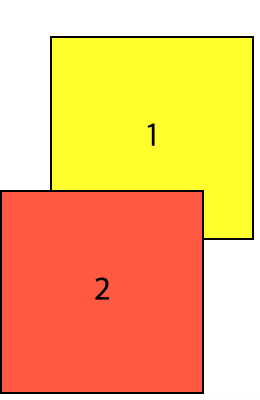

# 2024.03.17 TIL

## 📚CSS

### 🚨 z-index

position 속성이 static인 요소에는 z-index 속성이 아무 효력을 내지 못한다. 왜냐하면 position 속성이 static인 요소는 z-index 속성이 auto, 즉 0으로 고정되어 있기 때문이다.

---

### 🚨 stacking context: z-index가 비교되는 범위

z-index와 관련해서 흔히들 오해하는 것은 z-index가 HTML 문서 전체 범윙서 비교된다고 생각하는 것이다. 사실 z-index는 특정 범위 내에서 비교되며, 이것을 CSS에서는 stacking context라고 부른다.

예를들어 첫 번째 상자의 z-index를 100이라고 설정하고 두 번째 상자의 z-index를 2로 설정하면 당연히 첫 번째 상자가 두 번째 상자 앞으로 올라온다. 여기서 첫 번째 상자를 다른 div 요소로 감싸고, 그 감싸는 div 요소의 z-index를 한번 1로 줘보자.

```html
<div class="wrapper">
  <div class="first box">1</div>
</div>
<div class="second box">2</div>
```

```css
.first.box {
  z-index: 100;
  background: yellow;
  position: relative;
  top: 50px;
  left: 50px;
}

.second.box {
  z-index: 2;
  background: tomato;
  position: relative;
}

.box {
  width: 200px;
  height: 200px;
  border: 2px solid;
  font-size: 2rem;
  text-align: center;
  line-height: 200px;
}
```



이러면 정말 신기하게도 두 번째 상자가 첫 번째 상자 앞으로 올라오는 것을 볼 수 있다. 어떻게 z-index 값이 무려 100인 첫 번째 상자가 z-index 값이 겨우 2인 두 번째 상자의 뒤로 가지??

이것은 stacking context 때문인데 이 두 상자의 z-index 값이 서로 다른 범위에서 비교되기 때문이다.

첫 번째 상자는 z-index 값이 1인 div 요소에 감싸져 있기 때문에 두 번째 상자의 z-index 값과 직접 비교되지 않는다. 따라서 첫 번째 상자의 z-index 값이 아무리 크더라도 부모인 요소의 외부에 있는 다른 요소의 z-index 값과 경쟁할 수가 없는 것

부모 요소에 설정된 z-index 값이 자식 요소의 z-index 값 앞에 붙어있다고 상상하면 좀 더 이해가 쉬움.

```html
<!-- z-index: 1 -->
<div class="wrapper">
  <!-- z-index: 1.100 -->
  <div class="first box">1</div>
</div>
<!-- z-index: 2 -->
<div class="second box">2</div>
```
