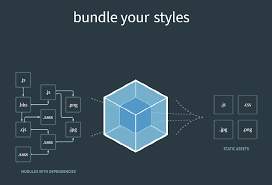

# 2024.03.21 TIL

## 📚 React

### 🚨 브라우저가 그려지는 원리 및 가상돔

리액트의 주요 특징 중 하나는 가상돔을 사용한다는 것이다.

가상돔을 왜 사용할까?

그러기 위해선 웹페이지가 빌드되는 과정을 살펴봐야하는데 브라우저가 서버에서 페이지에 대한 HTML 응답을 받고 화면에 표시하기 전에 여러 단계가 있다.

웹브라우저가 HTML 문서를 읽고 스타일을 입히고 뷰포트에 표시하는 과정을 Critical Render Path라고 하는데

1. 렌더 엔진이 문서를 읽어들여서 그것들을 파싱하고 어떤 내용을 페이지에 렌더링할지 결정한다. DOM tree 생성

2. DOM과 CSS를 결합하고 화면에 표시되는 모든 콘텐츠 및 스타일 정보를 포함한다.

3. 레이아웃 단계에서 브라우저가 페이지에 표시되는 각 요소의 크기와 위치를 계산하는 단계이다.

4. 실제 화면에 그린다.

여러 단계를 거쳐서 화면에 그려주게 되는데

#### ⚡️ 여기서 문제점은 어떤 인터렉션에 의해 DOM에 변화가 발생하면 그때마다 Render Tree가 재생성된다. 즉, 모든 요소들의 스타일을 다시 계산하므로 성능상의 이슈가 발생할 수 있다.

인터렉션이 적은 웹이면 괜찮지만 인터렉션이 많다면 작은 변화로 인해 위에 필요한 과정들을 계속 거치게 되니 불필요하게 DOM을 조작하는 비용이 너무 크다.

이런 문제로 나오게 된것이 가상돔이다. **가상돔은 실제 DOM을 메모리에 복사해준 것**으로 생각하면 된다.

---

### 🚨 가상돔 작동 원리

데이터가 바뀌면 가상돔에 렌더링되고 이전에 생긴 가상돔과 비교해서 바뀐 부분만 실제 돔에 적용을 시켜준다. 바뀐 부분을 찾는 과정을 Diffing이라고 부르며, 바뀐 부분만 실제 돔에 적용시켜주는 것을 재조정이라고 부른다.

#### ❗️따라서 Virtual DOM은 두 개의 Virtual DOM 트리가 필요하다. 현재의 Virtual DOM과 새로운 Virtual DOM을 비교하여 차이점을 찾아내고 변경사항을 실제 DOM에 반영하여 UI가 업데이트 된다.

---

### 🚨 Webpack

웹팩은 오픈 소스 자바스크립트 모듈 번들러로써 여러개로 나누어져 있는 파일들을 하나의 자바스크립트 코드로 압축하고 최적화하는 라이브러리다.

#### ❗️웹팩 장점

1. 여러 파일의 자바스크립트 코드를 압축하여 최적화할 수 있기 때문에 로딩에 대한 네트워크 비용을 줄일 수 있다.
2. 모듈 단위로 개발이 가능하여, 가독성과 유지보수가 쉽다.

---

### 🚨 Babel

바벨은 최신 자바스크립트 문법을 지원하지 않는 브라우저들을 위해 최신 자바스크립트 문법을 구형 브라우저에서도 돌아갈 수 있게 변환 시켜주는 라이브러리다.

---
