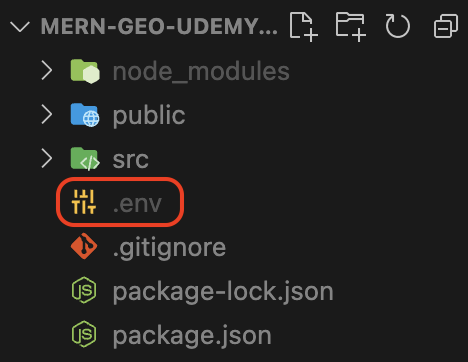

# 2024.03.23 TIL

## 📚 React

### 🚨 .env 파일로 API KEY 관리하기

구글이나 네이버, 카카오 등에서 제공하는 API를 활용해 프로젝트를 진행하면 public/index.html에 script 태그를 넣어줄 때가 있다. 보통 src에 API 키를 입력하게 되는데, 하드 코딩을 하게되면 보안상의 위험이 있기 때문에 API키 관리법에 대한 보편적인 방법을 알아보자.

---

### 🚨 .env 파일 생성



최상위 폴더에 .env 파일을 생성한다.

.env 파일은 "환경 변수 파일"을 의미하는데 이 파일은 애플리케이션을 실행할 때 특정 값을 전달하고 싶은 변수들이 기록되어 있다. 이 파일은 보안과 유지보수에 용이하기 때문에, 미리 정의된 값을 애플리케이션에서 확용하고 싶을 때 이 .env 파일을 활용한다.

예를들어 데이터베이스 연결 정보나 API 키와 같은 민감한 정보를 코드에 직접 작성하는 대신 .env 파일에 저장하고, 이를 애플리케이션에서 불러와 사용할 수 있다.

.env 파일은 일반적으로 프로젝트의 루트 디렉토리에 위치하며 ,각 줄에는 KEY=VALUE 형식으로 환경변수가 기록된다.

```json
DB_HOST=localhost
DB_USER=root
DB_PASS=1234
```

React에서는 환경변수 설정시 변수명에 **REACT*APP*** 접두어가 꼭 필요하다고 한다. 예약어이니 함부로 사용하지 않도록 주의하자! 이걸 붙여주지 않으면 리액트 앱에서는 변수를 불러오지 않는 것으로 확인된다.

```json
REACT_APP_DB_HOST=localhost
REACT_APP_DB_USER=root
REACT_APP_DB_PASS=1234
```

---

### 🚨 주의사항

1. 따옴표로 감사지 않는다. 줄 끝에 ,나 ;를 붙이지 않는다.
2. 루트 경로에 있는지 확인한다.
3. 중요!! 프론트 서버를 재시작한다.

#### ❗️.gitignore

꼭 gitignore에 포함시켜 노출되지 않도록 주의한다.

```gitignore
.env
.env.local
.env.development.local
.env.test.local
.env.production.local
```

---

### ❗️접근

원래 리액트는 라이브러리나 컴포넌트 사용시 import를 꼭 해줘야 하지만, .env에 등록된 변수는 별도의 import가 필요하지 않다.
따로 설치해야할 모듈은 없고 process.env.REACT*APP*...로 전역어디서든 접근할 수 있다.

```js
const notionToken = process.env.REACT_APP_NOTION_TOKEN;
const notionDatabaseID = process.env.REACT_APP_NOTION_DATABASE_ID;
```
