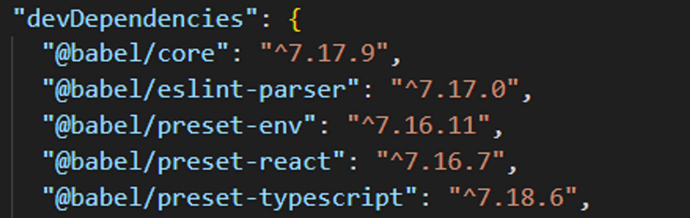
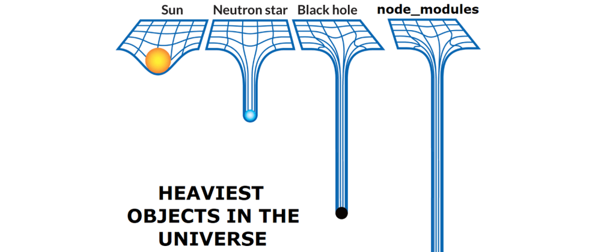
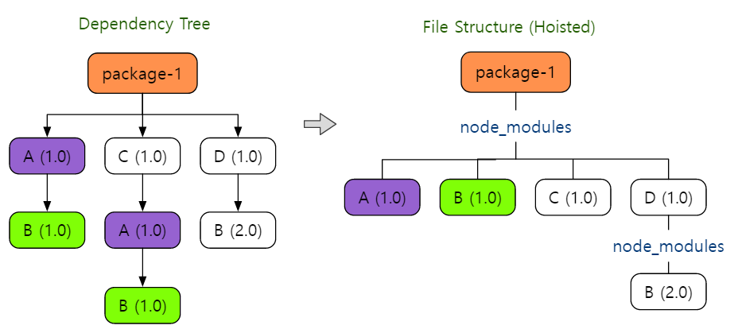

# 2024.04.04 TIL

## 📚 npm & yarn & yarn berry

npm, yarn 그리고 yarn berry는 모두 자바스크립트 프로젝트의 의존성 관리를 위한 패키지 매니저다.

### 🚨 npm

#### 📌1. 일관적이지 않은 패키지 버전

노드 모듈들은 기본적으로 시멘틱 버저닝이라는 기법을 사용하여 사용하는 모듈들의 버전을 나타낼 것을 권장한다. 시멘틱 버저닝이란 간단히 말해 1.2.3 처럼 버전을 세 가지 숫자가 들어갈 수 있는 자리로 구분하고, 각각의 자리에 현재 버전이 이전 버전과 어떤 관계가 있는지 암시하도록 하는 방법이다.

예를들어 첫 번째 자리에 들어가는 숫자가 다르면, 두 버전은 이전 버전과 호환되지 않는 완전히 새로운 메이저 버전이라는 의미다.

위 사진을 보면 캐럿 기호(^)가 들어가 있는데, 이는 가장 앞 숫자인 메이저 버전을 제외한 두 자리 버전까지는 변경을 하용할 수 있다는 의미다. 현재 사진 속 바벨 코어의 버전이 ^7.17.19이므로 메이저 버전인 7이 변경되지 않는 범위에서는 모듈의 버정니 바뀌는 것을 허용한다. 7.17.10버전이나, 7.18.0버전 등이 모두 사용될 수 있다고 볼 수 있다.

이때 npm install 명령어를 통해 모듈들을 설치하면 해당 메이저 버전 중 최신 버전을 다운받게 된다. 빌드에 따라 유연하게 버전을 선택할 수 있다는 장점도 있지만, 이럴 경우 사용하는 모듈간의 버전 불일치로 인해 문제가 발생할 수도 있다. 서로 다른 환경에서 하나의 프로젝트를 개발 한다는건 어떤 문제가 발생할지 모르는 잠재적인 위험을 안고 가는 것과 같다.

---

#### 📌2. 고정되지 않은 설치 순서

개발자의 환경에 따라 모듈들의 설치 순서가 변경된다. 만들어진 프로젝트에서 모듈을 추가로 설치하게 될 경우, 그 뒤에 npm i 명령어를 통해 처음부터 설치하는 사람과 모듈 설치 순서가 달라질 수 있다. npm은 모듈 이름을 사전 순서대로 정렬하여 순차적으로 설치한다. 서로 다른 환경이 만들어지기 때문에 좋은 징조라고 보기 어렵다.

---

#### 📌3. 순차적인 설치로 인한 긴 소요시간

npm은 모듈들을 한 번에 하나씩만 순차적으로 설치한다. 설치해야하는 모듈이 많으면 많을수록 총 설치 시간이 길어지는데 첫 모듈 설치 시간이 길어지면 빌드 및 배포 시간에도 부정적인 영향을 끼치게 된다.

---

### 🚨 yarn

2016년 10월에 출시하여 npm 문제들을 해결함과 동시에, 여러가지 기능들을 함께 탑재하여 등장했다.

#### 📌1. 버전 고정 파일 yarn.lock 파일 포함 (요즘 npm에도 package-lock.son 존재함)

yarn은 사용할 모듈의 버전을 지정하기 위해 프로젝트에 .lock 파일을 포함하는데 정확한 버전을 지정하고 고정하기 때문에 다른 사용자가 프로젝트를 개발할 때 항상 같은 버전의 모듈을 사용할 수 있도록 보장한다. 이 파일 덕분에 기존 npm의 일관적이지 않은 패키지 버전 문제를 해결할 수 있다.

package-lock.json 파일이 없던 초기 npm의 문제는 yarn과 yarn.lock 파일을 통해 해결되었다. 이전에는 npm에서 의존성을 관리할 때 일관성이 없는 패키지 버전 문제가 발생했다.

---

#### 📌2. 설치 확인을 위한 checksum 사용

yarn은 패키지가 제대로 설치되었는지 확인하기 위해 checksum을 사용한다. yarn.lock 파일을 확인해보면 resolved 주소 뒤에 해시값이 추가 되어있는 것을 확인할 수 있다. 이 해시값이 바로 checksum인데, 설치가 제대로 되지 않은 경우를 대비해 패키지 파일의 무결성을 확인하는 안전장치가 추가된 것은 긍정적인 일이다.

---

#### 📌3. 속도

yarn의 장점은 역시 속도다. yarn은 캐시를 사용하여 한 번 다운로드 한 패키지라면 그 다음부터는 빠른 속도로 설치할 수 있다. 인터넷이 연결되지 않은 환경에서도 설치가 가능하다. 또한 병렬 다운로드를 지원하여 순차적으로 설치해야하는 npm과 달리 모듈들을 한꺼번에 설치해버린다.

---

### 💡npm과 yarn의 현재

시간이 지나고, 버전이 올라가면서 많은 부분이 개선되었다. 현재는 버전 고정을 위한 package-lock 파일도 자동으로 추가되고, 속도면에서도 yarn과 큰 차이가 없는 수준까지 따라왔다. node_modules 또한 이제 결정적인 트리 구조로 만들 수 있게 되었다.

yarn 또한 시간이 지나며 많이 발전하였고, 사용자가 많아지고 기능들이 추가되며 yarn 생태계 자체도 차츰 안정되어 갔다.

---

### 🚨npm과 yarn의 문제점

#### 1. 유령 의존성

npm의 node_modules 폴더는 큰 용량을 자랑하기로 유명하다.

수 많은 패키지들과 그 패키지가 의존하는 모듈들을 전부 설치해버린다면 무거운 node_modules 폴더가 탄생해버린다. npm은 이 무거운 폴더를 경량화시키기 위해 호이스팅을 도입하고 있다. npm은 속도 문제를 개선하기 위해 호이스팅 등 최적화 알고리즘을 도입하였으나 부작용으로 유령 의존성이라는 문제를 새로 낳아버렸다.

용량을 줄이는 가장 간단한 방법은 중복을 제거하는 것입니다. npm과 yarn은 node_modules 내부의 중복된 패키지를 최소화하기 위해 각 패키지가 의존하고 있는 패키지들을 최상단으로 끌어올려 버립니다. 이렇게 되면 프로젝트가 의존하고 있는 패키지의 내부에 존재하던 각각의 node_modules에 있는 중복된 패키지가 최상단에 하나만 존재하게 되어 불필요한 중복을 제거할 수 있게 된다.

하지만 직접 설치하지 않고, 간접 설치한 종속성에 개발자가 접근할 수 있게 되는 상황이 벌어지기도 한다. 존재하지 않는 종속성에 의존하는 코드가 발생할 수 있다는 뜻이다. 이를 유령 의존성 이라고 한다.
내가 설치한 패키지가 의존하고 있다는 이유로 그 패키지까지 슬쩍 불러올 수 있게 된. 마치 유령처럼 나는 설치한 적이 없지만, 그 패키지는 최상단에 존재 하고 있습니다. 이러한 현상을 유령 의존성이라고 부른다.

yarn berry에서는 이런 식의 호이스팅 동작이 일어나지 않도록 nohoist 옵션이 기본적으로 활성화 되어 있다.

---

### 🚀 yarn berry

yarn v2 이상의 modern version yarn을 이르는 명칭이다.
기존의 yarn v1은 yarn classic 이라고 부르게 되었다.

#### 📌1. Plug'n'Play(pnp)

yarn berry가 제공하는 새로운 패키지 관리 시스템이다.

기존의 무거웠던 node_modules 대신, 패키지들에 대한 정보는 .zip 파일로 압축하여 .yarn/cache 폴더에 저장하고 이를 찾기 위한 정보를 .pnp.cjs 파일에 생성 후 의존성 트리 정보를 단일 파일에 저장한다. 이를 인터페이스 링커(Interface Linker)라고 한다.

.pnp.cjs는 의존성 트리를 중첩된 맵으로 표현하는데, 기존 Node가 파일시스템에 접근하여 직접 I/O를 실행하던 require문의 비효율을 자료구조를 메모리에 올리는 방식으로 탐색을 최적화한 것이다.

다만 .yarnrc.yml의 링커 설정을 pnp가 아닌 node-modules 로 하게 된다면 기존처럼 node_modules를 설치하여 의존성을 관리하게된다. 하지만 이렇게 사용하면 앞서 설명한 pnp의 장점을 활용하지 못한다.

PnP전략으로 무거웠던 node_modules를 획기적으로 제거하고 옮긴 덕분에 이를 이용해 의존성까지 github에 올릴 수 있게 됐다.
