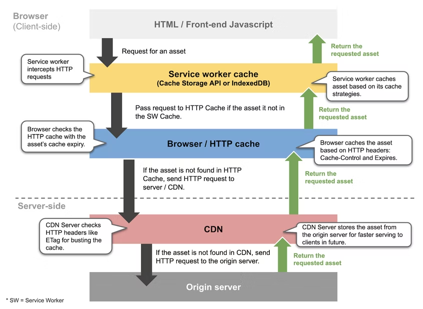

# 2024.04.11 TIL

## 📚 웹 캐시

캐시는 데이터에 빠르게 접근하기 위해 자주 사용되는 데이터나 값을 미리 복사해 놓는 임시 장소이다.

#### 🚨 캐시를 적용하기 좋은 데이터

- 자주 참조되는 데이터
- 자주 변경되지 않는 데이터
- 동일한 입력에 대해 동일한 출력을 보장하는 데이터

---

프론트엔드에서는
서버에 요청을 보내고 응답을 받아 화면을 렌더링하는 경우가 많다.

네트워크를 통해 서버에 데이터를 요청하게 되면, 해당 서버가 응답을 반환할 때까지 페이지가 로드되지 않는다.

페이지 로딩에 필요한 html, css, js, 이미지 등의 정적 리소스를 캐싱하여 사용하게되면, 요청을 보내는 네트워크 요청 횟수를 줄일 수 있을 뿐만 아니라 서버 응답을 기다려야 할 필요도 없기 떄문에 사용자에게 빠르게 화면을 보여줄 수 있다.

#### 이러한 개념을 웹 캐싱이라고 한다.

일반적으로 브라우저에서 리소스를 요청하게 되면, 다음과 같은 순서로 캐시가 동작한다.

브라우저 단에서 HTTP 요청을 보내게 되면, 해당 요청을 바로 서버로 전송하지 않고 캐시된 데이터가 있는지 확인한다.

캐시는 차례대로
서비스 워커 캐시 → 브라우저 캐시 → CDN(or 프록시 서버 캐시)
순으로 참조되며, 모든 캐시에 유효한 응답(데이터)이 없을 경우에는 서버에 요청을 보내서 응답을 받게 된다.
