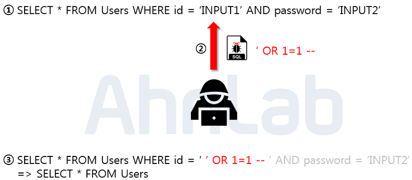

# 2024.04.13 TIL

## 📚 SQL Injection

보안이 취약한 웹 페이지들은 악의적인 해커들로 인해 정보가 유출될 수 있다. 다양한 공격방법 중에 가장 쉬운 공격이면서, 취약점으로 손꼽힐 수 있는 SQL Injection에 대해 알아보자.

---

Injection의 뜻은 삽입한다는 뜻인데 즉, 개발자가 만들어놓은 SQL 쿼리 문에 서비스 사용자의 데이터 입력값이 삽입된 후 악의적으로 활용되는 기법이다. 이때 서비스 사용자란 정상적인 사용자가 아닌 해커들이 악의적으로 넣는 입력 데이터다.

서비스 사용자의 입력값이 서버측에서 코드로 입력되어 실행되는 코드 인젝션 공격 기법중 하나이다.

#### 💡sql injection은 말 그대로 웹사이트의 보안상 허점을 이용해 특정 sql 쿼리문을 전송하여 공격자(해커)가 원하는 데이터베이스의 중요한 정보를 가져오는 해킹 기법을 말한다.

---

### 🚨SQL Injection의 원리와 동작과정

위의 사진에서 보이는 쿼리문은 일반적으로 로그인 시 많이 사용되는 SQL 구문인데, 해당 구문에서 ㅇ비력값에 대한 검증이 없음을 확인하고, 악의적인 사용자가 임의의 SQL 구문을 주입했다. 주입된 내용은 'OR 1=1 --로 WHERE 절에 있는 싱글쿼터를 닫아주기 위한 싱글 쿼터와 OR 1=1라는 구문을 이용해 WHERE절을 모두 참으로 만들고, --를 넣어줌으로 뒤의 구문을 모두 주석 처리 해주었다.

매우 간단한 구문이지만, 결론적으로 Users 테이블에 있는 모든 정보를 조회하게 됨으로 써 가장 먼저 만들어진 계정으로 로그인에 성공하게 된다. 보통은 관리자 계정을 맨 처음 만들기 때문에 관리자 계정에 로그인 할 수 있게 된다. 관리자 계정을 탈취한 악의적인 사용자는 관리자의 권한을 이용해 또 다른 2차 피해를 발생시킬 수 있게 된다.
