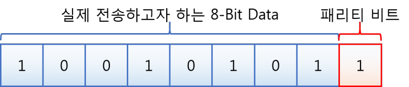

# 2024.04.15 TIL

## 📚 패리티 비트

패리티 비트는 시리얼 통신에서 송수신되는 데이터의 오류를 검출하기 위해 사용되는 일종의 오류 식별자다.

패리티비트란 정보의 전달 과정에서 우류가 생겼는지를 검사하기 위한 추가된 비트인데, 전송하고자 하는 데이터의 끝에 1비트를 더하여 전송하는 방법으로 2가지 종류의 패리티 비트(홀수, 짝수)가 있다. 패리티비트는 오류 검출 부호에서 가장 간단한 형태로 쓰인다.

---

### 🚨 짝수 패리티와 홀수 패리티란 무엇인가?

- Data + 짝수 패리티= 1의 개수 짝수개
- Data + 홀수 패리티= 1의 개수 홀수개

8-Bit Data에 추가적으로 붙게되는 패리티 비트를 짝수가 되도록 패리티 비트를 정하는 것인데, 이를테면 데이터 비트에서 1의 개수가 홀수이면 패리티 비트를 1로 정한다. 위의 그림에서는 데이터의 각 비트의 값 중 1의 개수가 이미 짝수이므로 짝수 패리티 비트의 값이 0으로 설정된다. 홀수는 반대!
