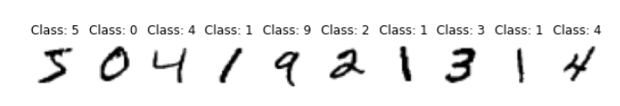

# 2024.04.19 TIL

## 📚 python

### 🚨 MNIST 데이터 셋

MNIST 데이터는 손글씨 숫자 이미지들이 모여있는 데이터로, 컴퓨터 비전 데이터라고도 한다.

다음과 같은 손글씨가 이미지로 구성되어 있다.

이 데이터는 눈으로 봤을 떄는 그냥 손글씨 숫자이지만, 각 이미지의 숫자가 무엇인지에 대한 라벨이 붙어있다. 인공신경망에서 라벨은 중요한 역할을 한다. 인공신경망 함수를 통해 출력된 값과 비교하여 상관관계를 따져보 과정이 학습에서 중요한 부분이기 때문이다.

MNIST 이미지는 28\*28 크기의 이미지다.
