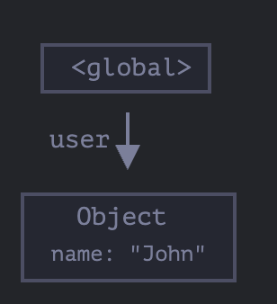
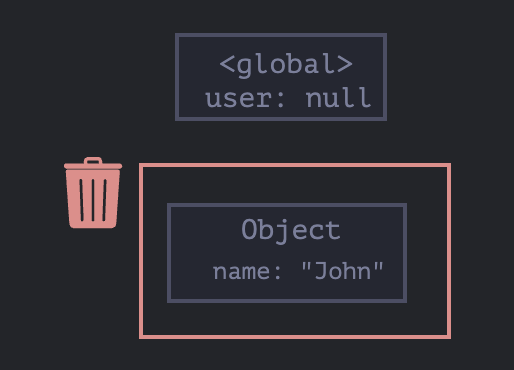
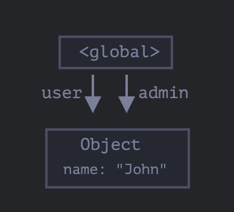
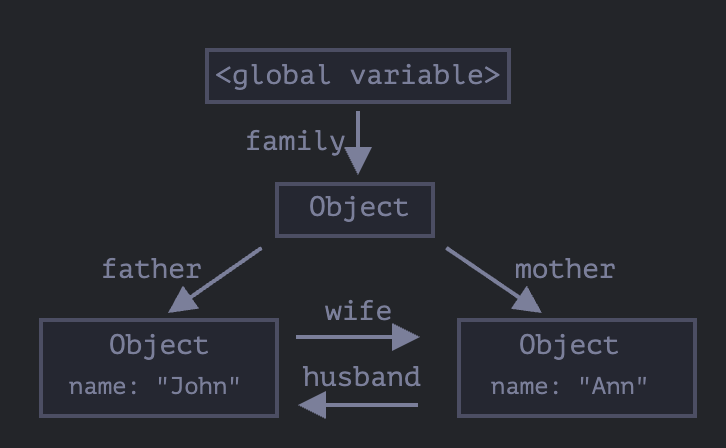
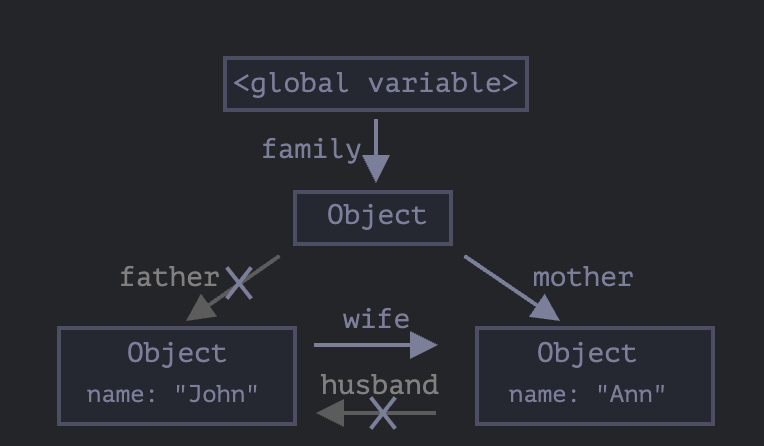
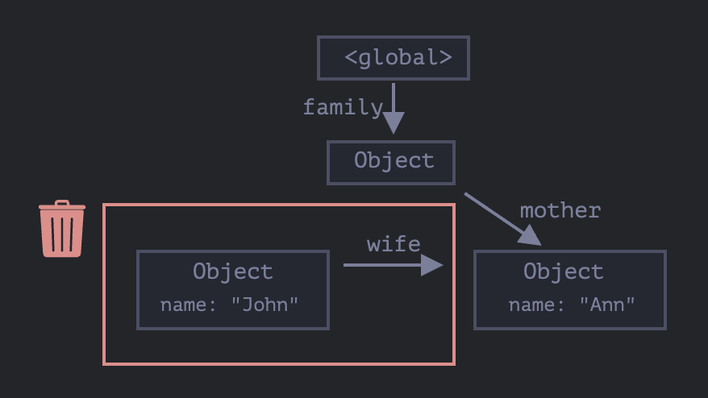
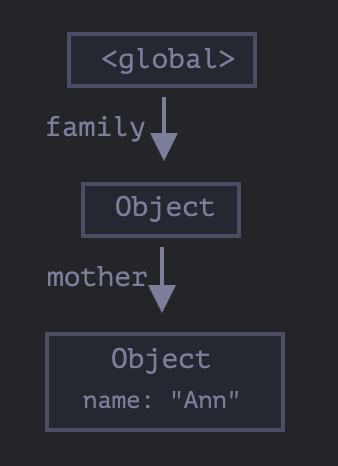
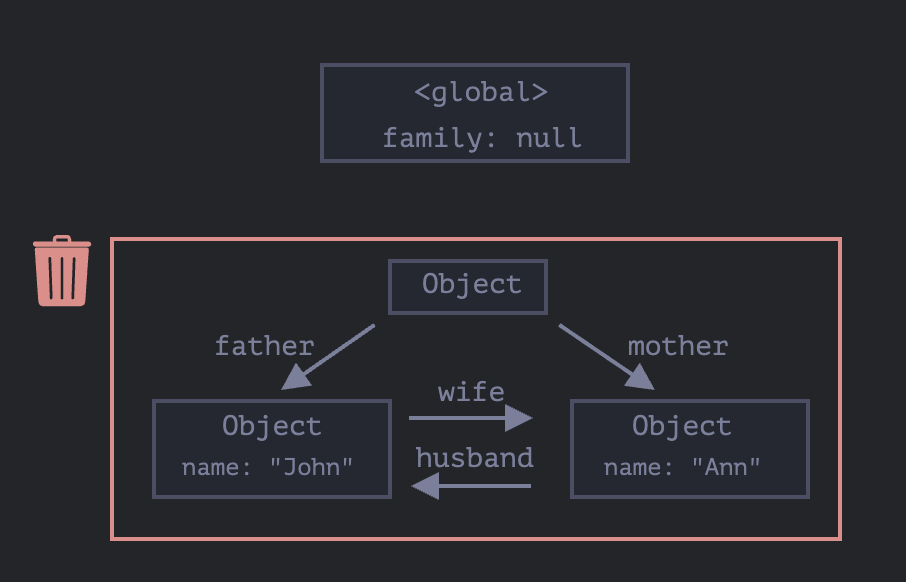
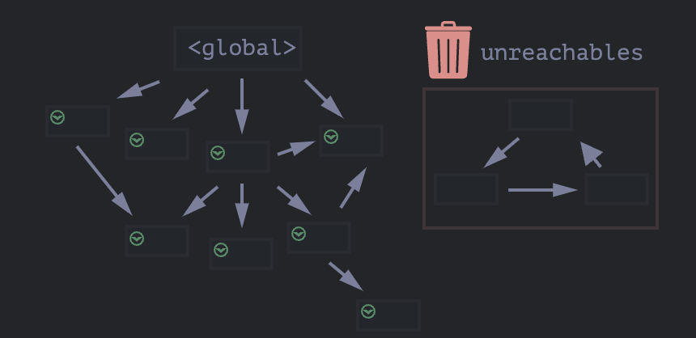

# 2024.04.21 TIL

## 📚 JavaScript

### 🚨 가비지 컬렉션

자바스크립트는 눈에 보이지 않는 곳에서 메모리 관리를 수행한다.

원시값, 객체, 함수 등 우리가 만드는 모든 것은 메모리를 차지한다. 그렇다면 더는 쓸모없어지게 된 것들은 어떻게 처리될까?<br>
자바스크립트 엔진이 어떻게 필요 없는 것을 찾아내 삭제하는지 알아보자.

---

### 🚨 가비지 컬렉션 기준

자바스크립트는 도달 가능성(reachability)라는 개념을 사용해 메모리 관리를 수행한다.

도달가능한 값은 쉽게 말해 어떻게든 접근하거나 사용할 수 있는 값을 의미한다. 도달 가능한 값은 메모리에서 삭제되지 않는다.

#### 📌아래 적는 목록들은 그 태생부터 도달 가능하기 때문에, 명백한 이유 없이는 삭제되지 않는다.

- 현재 함수의 지역 변수와 매개변수
- 중첩 함수의 체인에 있는 함수에서 사용되는 변수와 매개변수
- 전역 변수
- 기타 등등
  이런 값은 루트(root)라고 부른다.

루트가 참조하는 값이나 체이닝으로 루트에서 참조할 수 있는 값은 도달 가능한 값이 된다.

전역 변수에 객체가 저장되어있다고 가정해보자. 이 객체의 프로퍼티가 또다른 객체를 참조하고 있다면 프로퍼티가 참조하는 객체는 도달 가능한 값이 된다. 이 객체가 참조하는 다른 모든 것들도 도달가능하다고 여겨진다.

#### ⚡️ 자바스크립트 엔진 내에선 가바지 컬렉터가 끊임없이 동작한다. 가비지 컬렉터는 모든 객체를 모니터링하고, 도달할 수 없는 객체는 삭제한다.

---

### ❗️ 간단한 예시

```js
// user엔 객체 참조 값이 저장된 다.
let user = {
  name: "John",
};
```



이 그림에서 화살표는 객체 참조를 나타낸다. 전역 변수 "user"는 {name: "john"}이라는 객체를 참조한다. John의 프로퍼티 name은 원시값을 저장하고 있기 때문에 객체 안에 표현했다.

```js
user = null;
```

이렇게 user의 값을 다른 값으로 덮어쓰면 참조(화살표)가 사라진다.


이제 John은 도달할 수 없는 상태가 되었다. John에 접근할 방법도, John을 참조하는 것도 모두 사라졌다. 가비지 컬렉터는 이제 John에 저장된 데이터를 삭제하고, John을 메모리에서 삭제한다.

---

### ❗️ 참조 두개

참조를 user에서 admin으로 복사했다고 가정해보자.

```js
// user엔 객체 참조 값이 저장된다.
ㅣet user= {
    name: "John"
}

let admin= user;
```



그리고 위에서 한 것처럼 user의 값을 다른 값으로 덮어써보자.

```js
user = null;
```

전역변수 admin을 통하면 여전히 객체 John에 접근할 수 있기 때문에 John은 메모리에서 삭제되지 않는다. 이 상태에서 admin을 다른값(null 등)으로 덮어쓰면 John은 메모리에서 삭제될 수 있다.

---

### ❗️연결된 객체

이제 가족관계를 나타내는 복잡한 예시를 살펴보자.

```js
function marry(man, woman) {
  woman.husband = man;
  man.wife = woman;

  return {
    father: man,
    mother: woman,
  };
}

let family = marry(
  {
    name: "John",
  },
  {
    name: "Ann",
  }
);
```

함수 marry는 매개변수로 받은 두 객체를 서로 참조하게 하면서 결혼을 시키고, 두 객체를 포함하는 새로운 객체를 반환한다.

메모리 구조는 아래와 같이 나타낼 수 있다.


지금은 모든 객체가 도달 가능한 상태다. 이제 참조 두개를 지워보자

```js
delete family.father;
delete family.mother.husband;
```



삭제한 두개의 참조중 하나만 지웠다면, 모든 객체가 여전히 도달 가능한 상태였을거다.

하지만 참조 두개를 지우면 John으로 들어오는 참조(화살표)는 모두 사라져 John은 도달 가능한 상태에서 벗어난다.



외부로 나가는 참조는 도달 가능한 상태에 영향을 주지 않는다. 외부에서 들어오는 참조만이 도달 가능한 상태에 영향을 준다.

John은 이제 도달 가능한 상태가 아니기 때문에 메모리에서 제거된다. John에 저장된 데이터(프로퍼티)역시 메모리에서 사라진다.

가비지 컬렉션 후 메모리 구조는 아래와 같다.


---

### 🚨 도달할 수 없는 섬

객체들이 연결되어 섬 같은 구조를 만드는데, 이 섬에 도달할 방법이 없는 경우, 섬을 구성하는 객체 전부가 메모리에서 삭제된다.

근원 객체 family가 아무것도 참조하지 않도록 해보자.

```js
family = null;
```

이제 메모리 내부 상태는 다음과 같아진다.


family 객체와 루트의 연결이 사라지면 루트 객체를 참조하는것이 아무것도 없게 되므로 섬 전체가 도달할 수 없는 상태가 되고, 섬을 구성하는 객체 전부가 메모리에서 제거된다.

---

### 🚨 내부 알고리즘

'mark-and-sweep’이라 불리는 가비지 컬렉션 기본 알고리즘에 대해 알아보자.

'가비지 컬렉션’은 대개 다음 단계를 거쳐 수행된다.

가비지 컬렉터는 루트(root) 정보를 수집하고 이를 ‘mark(기억)’ 한다.
루트가 참조하고 있는 모든 객체를 방문하고 이것들을 ‘mark’ 한다.
mark 된 모든 객체에 방문하고 그 객체들이 참조하는 객체도 mark 한다. 한번 방문한 객체는 전부 mark 하기 때문에 같은 객체를 다시 방문하는 일은 없다다.
루트에서 도달 가능한 모든 객체를 방문할 때까지 위 과정을 반복한다.
mark 되지 않은 모든 객체를 메모리에서 삭제한다.

