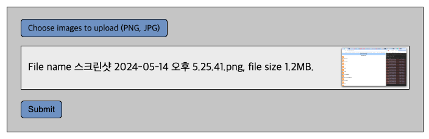

# 2024.05.16 TIL

## 📚 HTML

### 🚨 \<input type="file">

- file 타입의 input 태그를 다루는 법

file 유형의 \<input> 요소에는 저장 장치의 파일을 하나 혹은 여러 개 선택할 수 있다. 그 후, 양식을 제출해 서버로 전송하거나, File API를 사용한 JavaScript 코드로 조작할 수 있다.

```html
<label for="avatar">Choose a profile picture:</label>

<input type="file" id="avatar" name="avatar" accept="image/png, image/jpeg" />
```

위처럼 \<label> 태그와 for 태그를 함께 써주면 라벨 태그를 클릭해도 input 태그를 클릭하는 효과를 줄 수 있다.

#### 💡accept

파일 입력 칸이 허용할 파일 유형을 나타내는 문자열로, 쉼표로 구분한 고유 파일 유형 지정자의 목록이다.

#### 💡multiple

multiple 불리언 특성을 지정한 경우 사용자가 파일 선택 창에서 복수의 파일을 선택할 수 있다.

---

### 🚨 선택한 파일의 정보 가져오기

요소의 HTMLInputElement.files 속성은 선택한 파일 목록을 FileList 객체로 반환한다. FileList는 배열처럼 행동하므로, length 속성을 사용해 현재 선택한 파일의 수를 알 수 있다.

#### ❗️각각의 File 객체는 다음과 같은 정보를 가진다.

- name: 파일 이름
- lastModified: 파일을 마지막으로 수정한 시각을 나타내는 숫자
- size: 파일의 크기를 바이트 단위로 나타낸 값

```txt
<input type="file"> 로 선택한 원본 파일의 실제 경로는 명확한 보안상 문제로 인해 알 수 없습니다. 대신 앞에 C:\fakepath\ 를 붙인 파일 이름을 경로로 보여줍니다. 하필 이런 모습이 된 것에는 역사적인 이유가 있지만 이 동작은 모든 최신 브라우저에서 지원하고 있으며, 사실 명세에도 포함되어 있습니다.
```

---

### 🚨 예제

```html
<label for="image_uploads">Choose images to upload (PNG, JPG)</label>
<input
  type="file"
  id="image_uploads"
  name="image_uploads"
  accept=".jpg, .jpeg, .png"
  multiple
/>
```

```js
input.addEventListener("change", updateImageDisplay);
```

#### updateImageDisplay() 함수를 호출하면 다음 작업을 수행하게 된다.

```js
function updateImageDisplay() {
  while (preview.firstChild) {
    preview.removeChild(preview.firstChild);
  }

  const curFiles = input.files;
  if (curFiles.length === 0) {
    const para = document.createElement("p");
    para.textContent = "No files currently selected for upload";
    preview.appendChild(para);
  } else {
    const list = document.createElement("ol");
    preview.appendChild(list);

    for (const file of curFiles) {
      const listItem = document.createElement("li");
      const para = document.createElement("p");
      if (validFileType(file)) {
        para.textContent = `File name ${file.name}, file size ${returnFileSize(
          file.size
        )}.`;
        const image = document.createElement("img");
        image.src = URL.createObjectURL(file);

        listItem.appendChild(image);
        listItem.appendChild(para);
      } else {
        para.textContent = `File name ${file.name}: Not a valid file type. Update your selection.`;
        listItem.appendChild(para);
      }

      list.appendChild(listItem);
    }
  }
}
```


이런식으로 결과가 보여진다.
