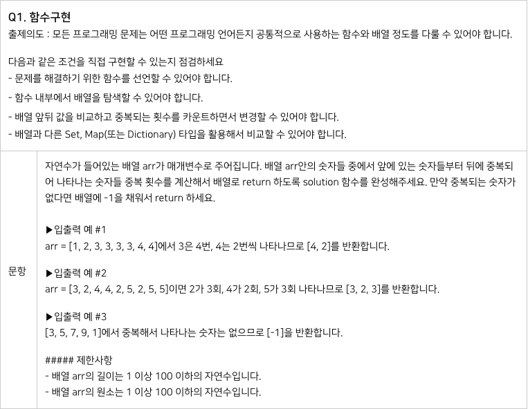

# 2024.06.13 TIL

## 📚 Map과 Set을 이용한 알고리즘 풀이


(네이버 부스트캠프 8기 코딩테스트)

### ❗️내가 작성한 코드

#### 나는 Map 자료구조에 익숙치 않아 Set을 사용했는데 중복된 요소들의 개수를 세기 위해선 Map을 사용하여 각 숫자의 빈도수를 세는 것이 더 간단하고 직관적이다.

```js
function solution(arr) {
  let set = new Set(arr);
  let newArr = [...set].sort((a, b) => a - b);
  newArr = newArr.map((item, index) => {
    return [item, 0];
  });

  for (let num of arr) {
    let idx = newArr.findIndex((item) => {
      return item[0] == num;
    });
    newArr[idx][1]++;
  }

  let answer = [];
  newArr.forEach((item) => {
    if (item[1] >= 2) {
      answer.push(item[1]);
    }
  });

  return answer.length ? answer : [-1];
}
```

내가 푼 방식은

1. new Set()의 셋 생성자 함수에 매개변수로 전달받은 배열을 주어 중복을 제거한다.
2. 그리고 중복을 제거한 newArr을 오름차순 정렬한 후 2차원 배열로 만들어 각각의 요소에 빈도수를 위해 0으로 초기화된 값을 넣어준다.
3. 그리고 매개변수로 받은 배열을 반복문으로 돌면서 인덱스를 찾고 그 인덱스에 해당하는 요소의 빈도수를 1 증가시켜준다.
4. 그리고 중복된 요소만 갯수를 출력하는것이므로 2이상인것만 출력.

---

### ❗️Map을 이용한 방식

```js
function solution(arr) {
  let countMap = new Map();

  // 각 숫자의 빈도수를 센다.
  for (let num of arr) {
    if (countMap.has(num)) {
      countMap.set(num, countMap.get(num) + 1);
    } else {
      countMap.set(num, 1);
    }
  }

  // 빈도수가 2 이상인 숫자들의 빈도수를 결과 배열에 추가한다.
  let result = [];
  for (let [key, value] of countMap.entries()) {
    if (value >= 2) {
      result.push(value);
    }
  }

  // 중복되는 숫자가 없으면 [-1] 반환
  return result.length ? result : [-1];
}

// 테스트 예제
console.log(solution([1, 2, 3, 3, 3, 3, 4, 4])); // [4, 2]
console.log(solution([3, 2, 4, 4, 2, 5, 2, 5, 5])); // [3, 2, 3]
console.log(solution([3, 5, 7, 9, 1])); // [-1]
```
