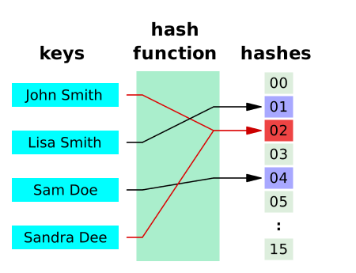

# 2024.06.28 TIL

## 📚 해시맵(HashMap) - JavaScript

해시맵이란 키(Key)와 값(value)쌍을 저장하는 자료구조이다. 각 키는 고유하며, 키를 사용하여 해당하는 값을 빠르게 검색할 수 있다.

- hash Function을 통해 빠른 탐색이 가능 -> O(1)

### ❗️ 자바스크립트에서 "해시맵"이라는 용어는 보통 Map() 객체를 의미한다.

Map 객체는 키-값 쌍을 저장하며, 키는 원시값이나 객체 등 어떤 값도 될 수 있다. 해시맵은 해시 함수를 사용하여 키를 해시 코드로 변환한 후, 이를 기반으로 데이터를 저장하고 검색한다. 자바스크립트의 Map 객체는 이러한 해시맵의 개념을 구현한 자료구조다.

---

### 🚨 Map 객체의 특징

#### 1. 키-값 쌍 저장

- Map은 키와 값을 한 쌍으로 저장한다. 키는 유일해야 하며, 어떤 데이터 타입도 될 수 있다.

#### 2. 순서 보장

- Map 객체는 삽입된 순서대로 요소를 반복할 때 유지한다. 이는 객체와의 주요 차이점 중 하나다.

#### 3. 메서드

- set(key, value): 키와 값을 Map에 추가한다.
- get(key): 주어진 키에 해당하는 값을 반환한다. 키가 존재하지 않으면 undefined를 반환한다.
- has(key): 주어진 키가 Map에 존재하는지 여부를 확인한다.
- delete(key): 주어진 키와 그에 해당하는 값을 Map에서 제거한다.
- clear(): Map의 모든 요소를 제거한다.
- size: Map에 있는 키-값 쌍의 수를 반환한다.

---

### ❗️Object를 사용한 해시맵

자바스크립트의 일반 객체({})는 간단한 해시맵으로 사용될 수 있다. 키는 문자열이나 심볼이 되며, 값을 저장하고 검색하는데 사용된다. 다만, 키가 문자열 또는 심볼로 제한되어 있다는 점과, 객체의 프로토타입 상속으로 인해 예상치 못한 키 충돌이 발생할 수 있다는 단점이 있다.
